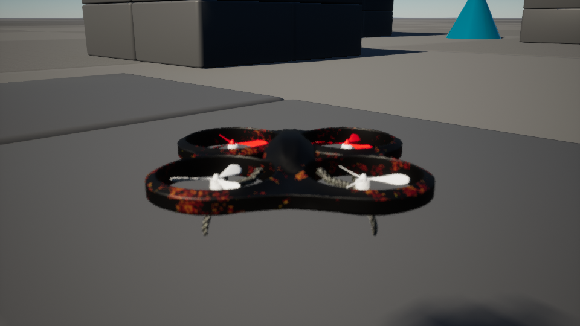
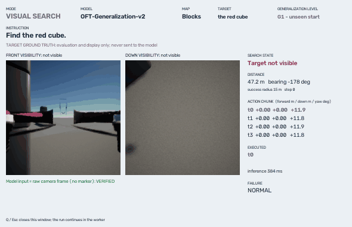
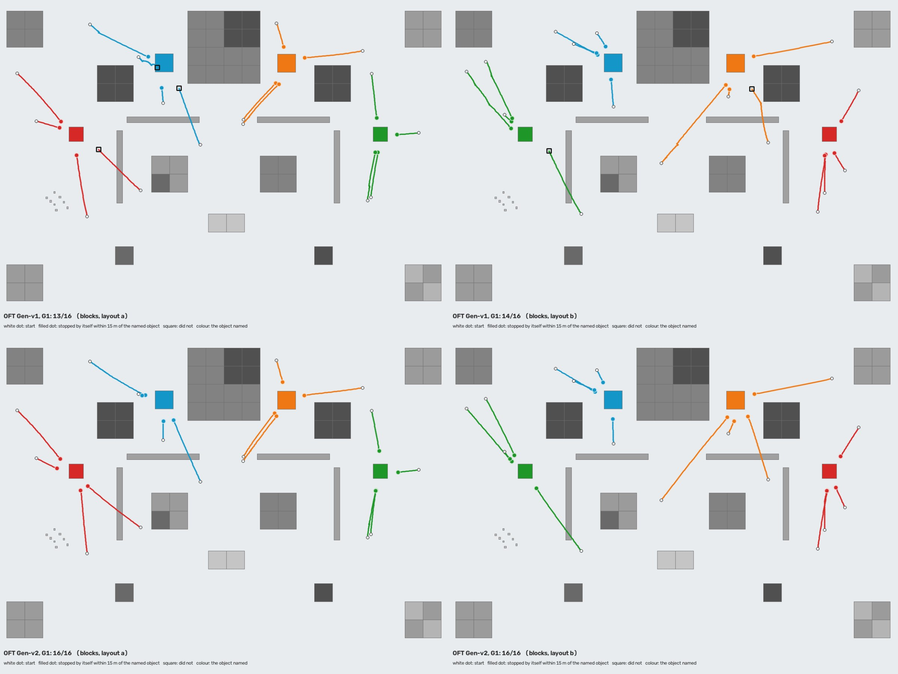
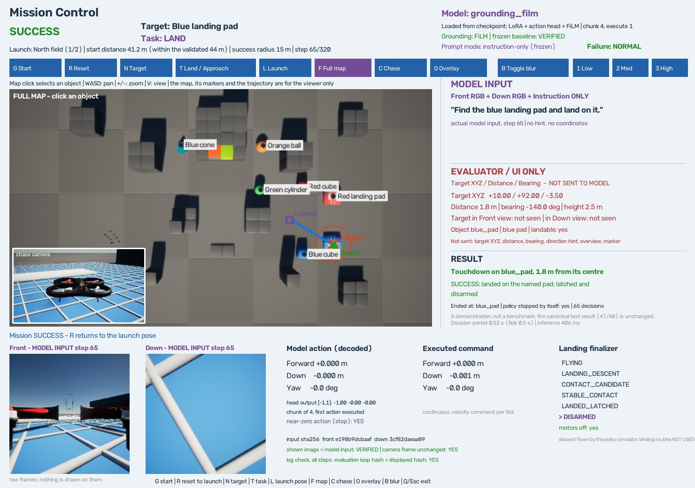
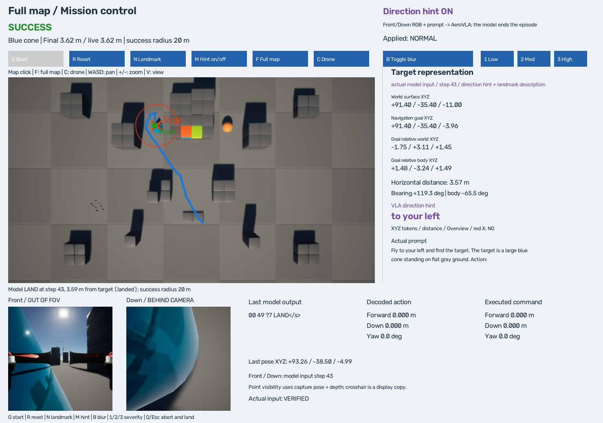
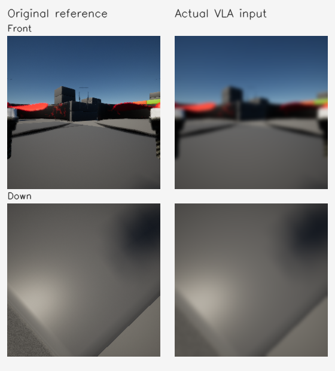
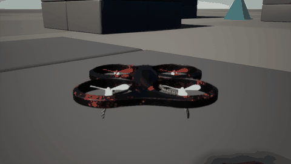
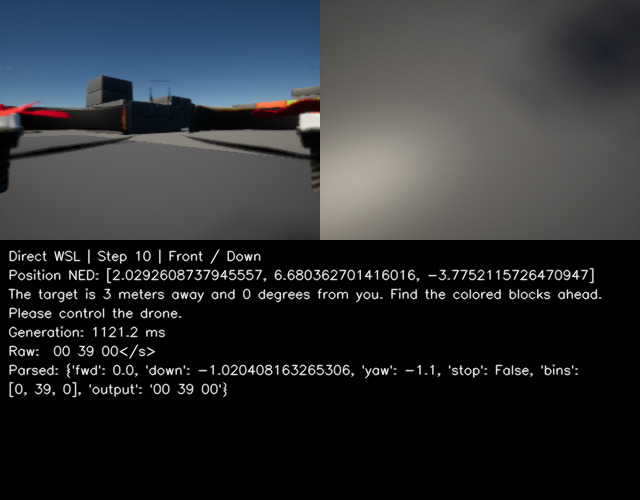
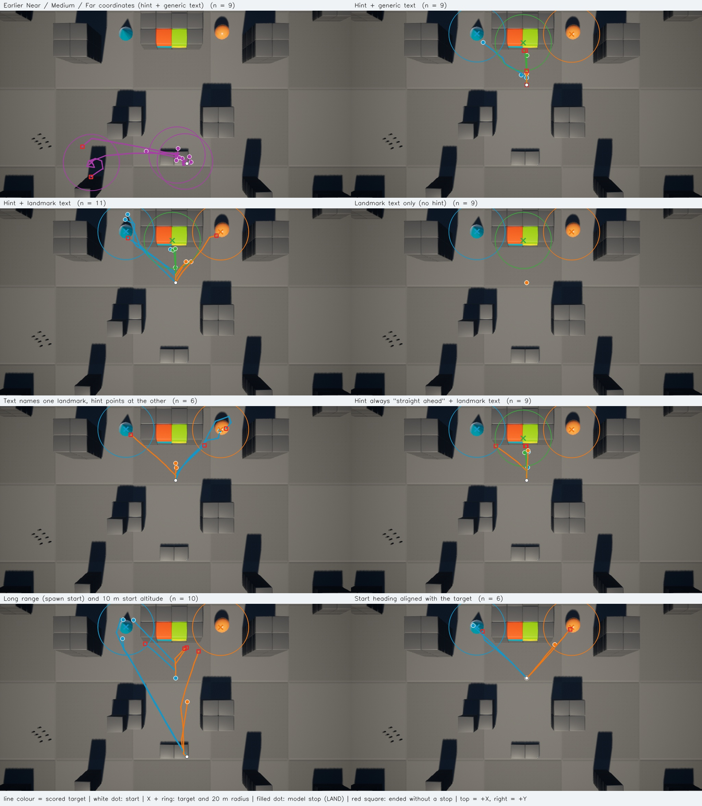

# Failure-Aware UAV VLA

**Project AirSim의 가상 드론을 Vision-Language-Action 모델(AeroVLA)로 조종하고, 영상 흐림 같은 장애를 직접 넣어 보는 오픈소스소프트웨어 과목 텀프로젝트입니다.** 지금은 "모델이 무엇을 할 수 있고 무엇을 못 하는지"를 실제 비행으로 측정하는 단계이고, 장애 감지와 복구는 그다음입니다.



## 한눈에 보기

| 기능 | 상태 | 실행 |
|---|---|---|
| Front/Down 영상 → AeroVLA → 드론 이동 (closed loop) | 동작 | `.\scripts\run_blur_demo.ps1` |
| Gaussian Blur를 실제 모델 입력에 주입 | 동작 | 같은 창에서 B, 1/2/3 |
| 맵에서 목표를 골라 보내기 (방향 힌트 사용) | 동작. 20m 안 정지는 조건에 따라 0–60% | `.\scripts\run_mission_demo.ps1` |
| 문장만 주고 찾아가기 (방향 힌트 없음) | AeroVLA-OFT로 동작. 처음 보는 시작 32/32, 학습하지 않은 장면 18/20. 처음 보는 물체는 약함 | `.\scripts\run_visual_search_demo.ps1` |
| 맵에서 물체를 골라 문장으로 보내기 (착륙 또는 접근) | 동작. 동결한 baseline을 직접 조작해 보는 시연 | `.\scripts\run_grounding_film_mission_demo.ps1` |
| Gaussian Blur가 baseline을 어디서 얼마나 무너뜨리는지 측정 (Clean / Low / Medium / High) | 완료. 48개 시작에서 성공 46 → 40 → 24 → 8. Blur에 강하지 않음 | [결과](docs/failure_gaussian_blur.md) |
| 장애 자동 감지·복구 | 아직 없음 | - |

모델과 simulator는 저장소에 없습니다. 준비 방법은 [setup](docs/setup.md)에 있습니다.

## Demo

### 1. 문장만 주고 찾아가기 — Visual Search



`Find the red cube.` 한 문장과 Front/Down 영상만 받은 **AeroVLA-OFT**의 실제 비행입니다. 목표는 벽 뒤에 있어 처음에는 보이지 않습니다. 앞이 막혀 있으면 올라가고, 오른쪽으로 돌며 찾고, 보이면 그쪽으로 접근해 10.5m 앞에서 스스로 멈춥니다. 목표 좌표와 방향 힌트는 모델에 들어가지 않습니다. 십자 표시는 화면용 복사본에만 있고, 모델 입력이 카메라 원본과 같은지 hash로 확인해 표시합니다. 이 시작 위치는 학습에 쓰지 않은 것입니다.

```powershell
.\scripts\run_visual_search_demo.ps1 -Model oft -Checkpoint outputs/aerovla_oft/checkpoints/generalization_v2 -Level G1 -Target red_cube
.\scripts\run_visual_search_demo.ps1 -Model oft -Checkpoint outputs/aerovla_oft/checkpoints/generalization_v2 -Level G3 -Target orange_ball   # 학습하지 않은 장면
.\scripts\run_visual_search_demo.ps1 -Model baseline   # 기존 AeroVLA
```

**AeroVLA-OFT**는 AeroVLA adapter를 고정한 채 OpenVLA-OFT 방식의 head를 얹은 것입니다. 한 번의 forward로 연속값 행동 4개를 내고 그중 1개를 실행합니다(판단 주기 0.5초, 기존 AeroVLA는 6.4초). teacher가 비행한 episode로 RTX 5070 12GB에서 LoRA만 학습했습니다. 세 번 학습했고, 매번 학습에 쓰지 않은 고정된 시작 상태에서 평가했습니다.

| 평가 (학습에 쓰지 않은 시작 상태) | 기존 AeroVLA | Pilot (72 episode) | Gen-v1 (292) | Gen-v2 (445) |
|---|---:|---:|---:|---:|
| G1. 본 맵·본 물체, 처음 보는 시작 | 1/16 | 4/32 | 27/32 | **32/32** |
| G3. 학습하지 않은 장면(Yard), 본 물체 | - | 6/10 | 19/20 | 18/20 |
| G2. 처음 보는 물체 (yellow pyramid) | - | 0/6 | 9/12 | 11/12 |
| G4. Yard + 처음 보는 물체 | - | - | 2/6 | 4/6 |
| 학습에 없던 문장 (`Locate`, `Search for`, …) | - | - | 21/24 | 24/24 |
| 충돌 | 1/16 | 3/32 | 0/130 | 0/130 |



G1의 실제 궤적입니다. 위는 Gen-v1, 아래는 Gen-v2이고, 채운 점은 15m 안에서 스스로 멈춘 곳, 네모는 실패입니다.

- **Pilot은 자기 구역 밖에서는 못 했습니다.** 자기 장면과 문장으로도 처음 보는 시작에서는 5/16입니다. 시작 위치·방향·거리·고도와 물체를 넓힌 데이터(Gen-v1)로 27/32가 됐습니다.
- **Gen-v1의 실패는 목표를 못 찾아서가 아니었습니다.** 처음에 안 보이던 목표 73개를 모두 찾았고, 실패는 높은 곳에서 일찍 멈추거나 목표 앞에서 계속 올라가서 생겼습니다. 그 부분의 데이터만 더한 Gen-v2에서 이 실패가 8회에서 0회가 됐습니다.
- **문장을 따릅니다.** 같은 자리에서 다른 물체를 지시하면 가까이 보이는 물체로 가지 않습니다(20회 중 2회만 그 물체에 멈춤).
- **읽을 때 주의할 점.** Yard는 같은 simulator 안에 만든 다른 장면이지 다른 환경이 아닙니다. Gen-v2는 같은 평가 set의 실패를 보고 고친 것이라 새 추정치가 아닙니다. 처음 보는 물체와 44m 이상 먼 시작은 아직 약합니다.
- **새 장거리 평가(40–90m, 새 seed 36회)에서 Gen-v2는 27/36입니다.** 학습한 장면에서는 70–90m도 6/6이지만 Yard의 56m 이상은 4/12입니다. 목표는 매번 시야에 들어왔고, 실패는 그 목표를 지나치며 계속 회전한 경우입니다. 학습은 하지 않았습니다.

**Gen-v3** — 목표는 "Find the blue landing pad and land on it."입니다. 색이나 형태가 같은 다른 물체가 있는 장면에서 지시한 물체를 고르고, 찾아가서, 위에서 맞추고, 내려앉는 것까지를 같은 구조(Front/Down RGB와 문장, 전진·하강·yaw)로 학습했습니다. 평가 앞에 둔 gate를 아직 통과하지 못해, 새 held-out 장면(Depot)의 156개 시작은 비행하지 않았습니다.

- ✅ 문장으로 지시한 물체 찾기 — Gen-v1·v2에서 held-out으로 확인
- ✅ 시작 위치와 장면이 바뀌어도 — Gen-v2에서 확인(먼 시작은 부분적)
- ◻ 색·형태가 같은 물체 사이의 정확한 선택 — 검증 시작에서 색은 구분, 같은 색 다른 형태는 44m 이하에서만. held-out 미측정
- ◻ 지시한 pad에 착륙 — 검증 시작 18회 중 touchdown 16회, 규칙 전체 14회. held-out 미측정

**Canonical clean baseline (44m 이하), 첫 시도 — 미통과** — Failure-Aware 실험의 clean 기준을 "Find the blue landing pad and land on it.", 시작 44m 이하로 정하고, 착륙의 끝(안정 접촉 확인, latch, disarm)을 저수준 Landing Finalizer로 옮겼습니다. 학습은 하지 않고 Gen-v3의 두 번째 checkpoint를 그대로 새 검증 시작 36개에서 비행했습니다. Gate는 통과하지 못했습니다(30/36, 다른 물체에서 끝난 비행 3회·기준 2회 이하). 그래서 모델·실행기·설정을 동결하지 않았고, 따로 만든 test 시작 48개는 비행하지 않았습니다.

**Gen-v3c (hard-negative 보정) — gate 미통과** — 위 검증에서 남은 병목은 하나였습니다: 지시한 것과 색이나 형태가 같은 물체가 먼저 보이면 그쪽으로 가는 것. 그 장면을 일부러 만든 96 episode를 더해 Gen-v3의 두 번째 checkpoint를 짧게 보정하고(구조는 그대로), 착륙의 "서 있음" 판정을 접촉과 위치로 읽게 고쳤습니다(evaluator v2). Pilot 12회는 통과했지만(11/12), 새 검증 36회에서는 33/36에 다른 물체에서 끝난 비행이 다시 3회(기준 2회 이하)여서 gate를 통과하지 못했습니다. Test 시작 48개는 여전히 비행하지 않았습니다.

**Canonical clean baseline (44m 이하) — 통과** — 구조 실험 하나(FiLM: 문장으로 시각 feature의 채널을 조절)를 Gen-v3c의 data 그대로 학습한 checkpoint가, 새 검증 gate(34/36)를 넘고 봉인해 둔 test 시작 48개를 한 번에 **47/48**로 통과했습니다(착륙 36/36, 다른 물체 1회, 충돌 0). 다만 같은 일정을 FiLM 없이 돌린 대조 실험도 pilot 기준을 지켰기 때문에, 이 개선이 FiLM 덕이라는 근거는 없습니다. 같은 data로 더 오래 학습한 것이 pilot의 실패를 고쳤습니다.

- ✅ 문장으로 지시한 물체 찾기(visual search) — Gen-v1·v2에서 held-out으로 확인
- ✅ 문장으로 목표 고르기 — canonical test에서 47/48이 지시한 물체에서 끝남. 색이나 형태가 같은 물체가 먼저 보이는 시작은 16/17. 가장 약한 곳이라는 점은 그대로(검증에서는 같은 종류의 시작이 두 번 비행 합계 34회 중 5회 틀림)
- ✅ 문장에 따라 접근 또는 착륙 — canonical test 48/48이 시킨 대로 끝남. approach를 시켰는데 내려앉은 비행 0
- ✅ 안정 접촉 finalizer를 포함한 물리적 착륙 — canonical test 착륙 36/36(touchdown, 안정 착륙, latch, disarm). approach 12회에서 켜진 적 없음
- ✅ 44m 이하 canonical clean baseline — 새 검증 gate와 canonical test 통과. Test는 학습 장면(Field·Lot) 안의 새 배치이고, 새 장면(Depot 156개)은 아직 봉인
- ⚠️ 44m를 넘는 시작에서 같은 색 물체 사이의 선택 — 열린 한계. Canonical 범위 밖의 별도 과제
- ⚠️ Gaussian Blur — robustness characterization 완료(Clean / Low / Medium / High). 같은 48개 시작에서 46 → 40 → 24 → 8. 충돌이나 다른 물체 선택은 늘지 않고, 정책이 공중에서 스스로 멈춘다. High에서는 착륙 36회 중 하강을 시작한 비행이 없다. 감지·복구는 아직 없다 ([문서](docs/failure_gaussian_blur.md))

같은 자세에서 문장만 바꾸면 끝이 달라집니다: [착륙](outputs/examples/gen_v3/land.gif) · [접근 후 공중 정지](outputs/examples/gen_v3/approach.gif) · [60m 밖에서 찾아 착륙](outputs/examples/gen_v3/mission_land.gif) · [실패: 먼 파란 목표 앞에서 망설임](outputs/examples/gen_v3/failure_far_blue.gif)

GIF: [탐색](outputs/examples/generalization/search_g1.gif) · [놓친 뒤 다시 찾기](outputs/examples/generalization/reacquire_g1.gif) · [Yard](outputs/examples/generalization/yard_g3.gif) · [Gen-v1의 실패](outputs/examples/generalization/failure_g1_v1.gif)와 [같은 시작에서의 Gen-v2](outputs/examples/generalization/fixed_g1_v2.gif) · [pilot 단계의 비행](outputs/examples/visual_search_oft.gif)

문서: [pilot — 구조와 학습 가능성](docs/aerovla_oft.md) · [Gen-v1 — 시작 위치·물체·장면 일반화](docs/aerovla_oft_generalization.md) · [Gen-v2 — 실패 분류와 전환 데이터 보강](docs/aerovla_oft_gen_v2.md) · [장거리 held-out 평가](docs/aerovla_oft_long_range.md) · [Gen-v3 — grounding과 착륙(진행 중)](docs/aerovla_oft_gen_v3.md) · [Canonical clean baseline — 44m 이하와 Landing Finalizer](docs/canonical_clean_baseline.md) · [Gen-v3c — hard-negative 보정과 evaluator v2](docs/gen_v3c_hard_negative_grounding.md) · [구조 실험과 canonical baseline 통과 — FiLM, 대조 실험, test 48](docs/language_vision_grounding_architecture.md) · [먼 거리의 같은 색 구분(열린 문제)](docs/long_range_same_color_grounding.md)

### 2. 맵에서 물체를 골라 문장으로 보내기 — Interactive grounding_film Mission Control



```powershell
.\scripts\run_grounding_film_mission_demo.ps1
```

기존 Mission Control 화면에서 동결한 baseline(`grounding_film`)에 미션을 줍니다. 물체를 고르고(지도 클릭 또는 **N**), **T**로 LAND / APPROACH를 정하고, **G**로 시작합니다.

- **Map/target ground truth is visible to the human evaluator but is not sent to the VLA policy.** 모델은 Front RGB, Down RGB, 문장 하나만 받습니다. 목표 좌표, 거리, 방향은 화면과 판정에만 쓰입니다.
- 비행은 canonical 평가의 loop 그대로입니다. 하강은 모델이 하고, 끝은 Landing Finalizer가 맡습니다. Simulator의 착륙 routine은 쓰지 않습니다.
- 같은 pad, 같은 자세에서 문장만 바꿔 볼 수 있습니다: G(착륙) → **R** → **T** → G([공중 정지](outputs/examples/grounding_film_mission/approach.jpg)).
- **시연이지 평가가 아닙니다.** 수동 확인 13회 중 10회 성공, 2회 실패, 1회는 중단입니다. 최종 배치의 여섯 시나리오는 모두 지시대로 끝났고, 실패는 blue cone 접근 두 번입니다(색 블록 벽을 정면으로 본 첫 배치, 그리고 110m 밖 건물 뒤의 cone). Canonical test의 47/48은 그대로입니다.

[구조, 조작, 수동 확인 기록](docs/grounding_film_interactive_demo.md)

### 3. 맵에서 목표를 골라 보내기 — Coordinate Goal Mode



```powershell
.\scripts\run_mission_demo.ps1
```

맵의 평평한 지점이나 landmark를 클릭하고 **G**로 시작합니다. 이 모드는 목표 좌표로 계산한 방향 문장(`Fly forward-left and find the target. …`)을 모델에 줍니다. 모델이 LAND를 내면 착륙하고, 그 지점이 목표 20m 안이면 성공입니다.

| 키 | 기능 |
|---|---|
| 맵 클릭 / N | 목표 선택 / landmark 차례로 선택 |
| G / R | 시작 / 끝난 미션 초기화 |
| M | prompt 모드: 방향 힌트 + 설명 → 설명만 → 지시문만 |
| B, 1/2/3 | Gaussian Blur ON/OFF, 강도 |
| Q / Esc | 중단하고 착륙 |

- 기본은 멈추지 않고 이어서 나는 **연속 비행**입니다. `-Flight step`을 붙이면 판단마다 멈춥니다.
- 블록 위를 클릭하면 드론은 목표 45m 안에서 그 면보다 6m 위로 올라갑니다.

[조작과 화면 설명](docs/mission_demo.md)

### 4. 장애 주입 — Gaussian Blur

> 동결한 baseline에 대한 정량 측정은 [Gaussian Blur Robustness Characterization](docs/failure_gaussian_blur.md)에 있습니다. Interactive Mission Control(`run_grounding_film_mission_demo.ps1`)에서도 **B**, **1/2/3**으로 같은 blur를 켜 볼 수 있습니다. 아래는 기존 AeroVLA closed loop의 blur 데모입니다.



```powershell
.\scripts\run_blur_demo.ps1
```

왼쪽은 원본, 오른쪽은 실제 모델 입력입니다. 관찰 창에서 **B**로 켜고 끄고 **1/2/3**으로 강도를 바꿉니다. [관찰 창](outputs/examples/gaussian_blur_observer.png)에는 prompt, 모델 출력, 실행 명령이 함께 나옵니다. 자동 감지와 복구는 아직 없습니다. [안내](docs/gaussian_blur_demo.md)

### 4. 드론과 모델 입력

| | |
|---|---|
|  |  |
| 관찰 카메라로 본 드론. 화면을 보여주기 위한 scripted 비행입니다 | AeroVLA가 실제로 받은 Front/Down 영상과 그때의 출력 |

모델 없이 영상 흐림과 조종 편향을 넣어 본 초기 시연은 [control_drift.png](outputs/examples/control_drift.png)에 있습니다.

## 측정 결과

모두 Project AirSim Blocks 맵에서의 실제 비행입니다. 같은 조건도 실행마다 결과가 갈리므로 성공률이 아니라 관찰 기록으로 읽어야 합니다.



| 질문 | 결과 | 문서 |
|---|---|---|
| 방향 힌트가 있으면 목표로 가는가 | 35회 중 33회 접근, 12회는 20m 안에서 스스로 정지 | [Model Self-Evaluation](docs/model_evaluation.md) |
| 방향 힌트를 빼면 | 13회 모두 첫 step에 LAND | 같은 문서 |
| 설명과 힌트가 다른 물체를 가리키면 | 힌트 쪽으로 감 | 같은 문서 |
| 블록 위 목표 ([그림](outputs/examples/model_evaluation_roof.jpg)) | 42m 거리에서 위로 접근하면 6/6, 97m 출발점에서는 0/9 | [해당 절](docs/model_evaluation.md#2-블록-위-목표) |
| 말로만 시키면 (기존 AeroVLA) | 지시한 물체 20m 안 정지 0/6 | [해당 절](docs/model_evaluation.md#3-지시문만으로-찾아가기) |
| 미션이 `invalid_action`으로 끝나던 이유 | 숫자 토큰 하나가 원본 OpenVLA의 action 토큰으로 바뀜. 디코더를 고친 뒤 0회 | [해당 절](docs/model_evaluation.md#1-invalid-출력은-토큰-하나가-바뀐-이동-명령이었다) |
| 연속 비행의 효과 | 정지 시간 18–21% → 5–8%. 벽 충돌은 더 잦았음(10회 중 5회 대 8회 중 1회) | [연속 비행](docs/model_evaluation.md#연속-비행) |
| 힌트 없이 찾게 학습시킬 수 있는가 | 이 맵에서는 가능. pilot은 자기 구역에서 23/24 | [AeroVLA-OFT](docs/aerovla_oft.md) |
| 그 모델은 시작 위치를 외운 것인가 | pilot은 그렇다(처음 보는 시작 4/32). 데이터를 넓힌 Gen-v1은 27/32, 학습하지 않은 장면 19/20 | [일반화](docs/aerovla_oft_generalization.md) |
| 남은 실패는 못 찾아서인가, 찾은 뒤인가 | 찾은 뒤. 찾기는 73/73. 전환 데이터를 더한 Gen-v2는 32/32 | [Gen-v2](docs/aerovla_oft_gen_v2.md) |
| 문장으로 착륙까지 시킬 수 있는가 | 검증 시작에서는 지시한 pad에 16/18 touchdown, approach를 시키면 내려앉지 않음(0/18). held-out은 아직 | [Gen-v3](docs/aerovla_oft_gen_v3.md) |
| 범위를 44m 이하로 줄이고 착륙의 끝을 실행기로 옮기면 clean 기준이 서는가 | 아직 아니다. 검증 30/36으로 gate 미통과. 남은 것은 착륙이 아니라 목표 선택(다른 물체에서 끝남 3회) | [Canonical clean baseline](docs/canonical_clean_baseline.md) |
| "먼저 보이는 비슷한 물체"를 데이터로 가르치면 목표 선택이 안정되는가 | 아니다. Hard-negative 96 episode 보정 뒤 pilot 11/12, 새 검증 33/36. 그 조건의 오류는 15회 중 3회로 gate 미통과 | [Gen-v3c](docs/gen_v3c_hard_negative_grounding.md) |
| 그 실패는 문장이 시각 표현을 약하게 조건화해서인가 | 확인되지 않음. FiLM을 넣은 checkpoint는 pilot 32/32, 검증 34/36, canonical test 47/48로 통과했지만, FiLM 없이 같은 만큼 더 학습한 대조도 pilot 기준을 지킴(30/32) | [구조 실험](docs/language_vision_grounding_architecture.md) |
| 탐색 방향을 섞어 가르치면 | 탐색이 사라짐(탐색 frame의 yaw 예측 +0.88 → +0.07). 영상 한 장만 보는 정책이라서 | [해당 절](docs/aerovla_oft_generalization.md#teacher) |

## System Architecture

```text
                      ┌─ Coordinate Goal Mode ──────────────────────────────┐
Project AirSim        │ Front + Down RGB + "Fly {방향} and find the target" │
(Windows)             │        → AeroVLA NF4 → 숫자 3개 또는 LAND            │
   │  Front / Down    └─────────────────────────────────────────────────────┘
   ├────────────────►
   │                  ┌─ Visual Search Mode ────────────────────────────────┐
   │                  │ Front + Down RGB + "Find the blue cone."            │
   │                  │        → AeroVLA-OFT → 연속값 행동 4개, 1개 실행      │
   │                  └─────────────────────────────────────────────────────┘
   ◄──────────────── Action Adapter ← forward / down / yaw        (WSL2)
```

simulator는 Windows에서, 모델은 WSL2 Ubuntu에서 실행하고 직접 통신합니다. 두 모드는 서로 독립이고 기존 AeroVLA baseline은 그대로 남아 있습니다.

## Environment

RTX 5070 12GB / Windows + WSL2 / Project AirSim Blocks / OpenVLA-7B + AeroVLA LoRA / NF4 + BF16 compute.

- 기존 AeroVLA: 추론 약 1.0초, 판단 한 번 약 4.5–6.3초, GPU peak 9.76GiB ([baseline](docs/baseline.md))
- AeroVLA-OFT: 추론 약 0.4초(simulator와 함께), 학습 peak 9.8GiB, 학습 39분(pilot) – 140분(Gen-v2)

## Repository Structure

```text
src/integration/     모델 loader, 카메라·행동 변환, 실행기
src/mission/         지도 좌표, landmark, 미션 상태와 판정
src/failures/        Gaussian Blur와 control protocol
src/visual_search/   Visual Search episode, 맵 정의와 기하, 시작 상태 계획, teacher 정책
src/aerovla_oft/     AeroVLA-OFT 모델과 행동·chunk 규칙
scripts/             launcher(.ps1), 계획·평가·학습·요약·동결 스크립트
configs/             비행·미션 한도, landmark, 평가 protocol, OFT 설정
configs/maps/        맵 파일(장애물, 물체, layout). 고정된 held-out 시작 상태는 configs/generalization_test_spawns.json
configs/mission/     Interactive Mission Control의 지도(물체 배치, launch 자세)
configs/failures/    장애 실험의 고정 조건(Gaussian Blur 강도, 비행 순서, repeat subset)
tests/               simulator 없이 도는 테스트 (Python 309개 + PowerShell 4개)
docs/                아래 문서
outputs/examples/    README에 쓰는 실제 화면과 GIF
outputs/generalization/  동결한 결과 표와 실패 분류 (원자료는 로컬에만)
outputs/failures/        장애 실험의 표, 실행 기록, 예시 그림 (비행 원자료는 로컬에만)
```

## 문서

| 문서 | 내용 |
|---|---|
| [setup](docs/setup.md) | 환경 준비와 실행 순서 |
| [baseline](docs/baseline.md) | 초기 closed loop 측정 |
| [gaussian_blur_demo](docs/gaussian_blur_demo.md) | Blur 주입 데모 |
| [mission_demo](docs/mission_demo.md) · [full_map_grounding](docs/full_map_grounding.md) | 미션 데모 조작, 지도와 Inspector |
| [grounding_film_interactive_demo](docs/grounding_film_interactive_demo.md) | 동결한 baseline으로 나는 Interactive Mission Control: 구조, 모델에 들어가는 것과 아닌 것, 장면과 launch 자세, 조작, 수동 확인 기록, 한계 |
| [model_evaluation](docs/model_evaluation.md) | 하네스 수정, 69회 평가, 연속 비행, 디코더, 블록 위 목표, 지시문 |
| [aerovla_oft](docs/aerovla_oft.md) | Visual Search Mode와 AeroVLA-OFT pilot |
| [aerovla_oft_generalization](docs/aerovla_oft_generalization.md) | 맵 정의, held-out 시작 상태, teacher, Gen-v1의 G0–G4 결과와 대조 시험 |
| [aerovla_oft_gen_v2](docs/aerovla_oft_gen_v2.md) | Gen-v1 결과 동결, 실패 분류, 전환 데이터 보강, Gen-v1 대 Gen-v2 |
| [aerovla_oft_long_range](docs/aerovla_oft_long_range.md) | 새 장거리 held-out set, 단계별 결과, 장면·물체별 분리, 다음 변경 |
| [aerovla_oft_gen_v3](docs/aerovla_oft_gen_v3.md) | distractor가 있는 장면, 착륙 teacher와 착륙 규칙, 평가 gate, 두 차례 학습, 검증·회귀 결과, 남은 병목 |
| [canonical_clean_baseline](docs/canonical_clean_baseline.md) | 44m 이하 canonical mission, Landing Finalizer, VLA·실행기·평가의 책임 구분, 착륙을 읽는 세 가지, 새 검증·test set, gate 결과와 실패 분류 |
| [gen_v3c_hard_negative_grounding](docs/gen_v3c_hard_negative_grounding.md) | Evaluator v2(위치로 읽는 안정 착륙), hard-negative data와 배치, 보정 학습, pilot, 새 검증 set의 gate 결과, 목표 선택 진단, 다음 후보 |
| [language_vision_grounding_architecture](docs/language_vision_grounding_architecture.md) | 시각 경로 audit, FiLM과 cross-attention 모듈, 같은 시작을 두 번씩 비행하는 pilot, 대조 실험, 새 검증 gate, 동결, canonical test 48의 결과 |
| [long_range_same_color_grounding](docs/long_range_same_color_grounding.md) | 44m를 넘는 시작에서 같은 색 물체를 고르는 문제: 관측, canonical 범위에서 뺀 이유, 나중에 시도할 후보 |
| [failure_gaussian_blur](docs/failure_gaussian_blur.md) | Gaussian Blur 특성화: 고정한 조건과 순서, 주입 위치와 확인, 강도별·단계별 결과, 실패 분류, 착륙·탐색·목표 선택, paired 비교와 repeat, 선명도 통계, 지연, 다음 단계 |
| [experiments](docs/experiments.md) | 날짜별 실험 요약 |
| [failure_plan](docs/failure_plan.md) | 이후 넣을 장애 후보 |

## 한계

- **simulator 하나에서 본 결과입니다.** Blocks 맵과 그 안에 만든 두 번째 장면(Yard), 물체 다섯 개, 조건당 수 회에서 수십 회입니다.
- **Coordinate Goal Mode의 방향 힌트는 목표 좌표에서 나옵니다.** 카메라만으로 얻는 정보가 아닙니다.
- **AeroVLA-OFT는 teacher를 흉내 낸 것입니다.** 탐색은 기억 없는 한 방향 회전이고, 처음 보는 물체와 먼 거리 시작에서 약합니다. LAND와 착륙은 넣지 않았습니다. Gen-v2의 숫자는 같은 평가 set을 보고 고친 뒤의 것입니다.
- **장애물 회피가 없습니다.** 충돌하면 simulator가 기체를 고정해 그 비행은 끝납니다.
- **모델 전체 fine-tuning, TravelUAV benchmark는 하지 않았습니다.** 학습은 LoRA pilot뿐입니다.
- 모델 weight, checkpoint, dataset, simulator, raw 로그는 Git에 넣지 않습니다.

## Roadmap

- [x] Project AirSim setup, AeroVLA NF4 inference, live closed loop
- [x] Gaussian Blur input injection with interactive controls
- [x] Interactive target selection and mission runner
- [x] Upstream-equivalent action execution, model-decided landing
- [x] Model self-evaluation with landmarks and prompt ablations
- [x] Continuous flight, grammar-constrained decoding, roof approach
- [x] Visual Search Mode and the AeroVLA-OFT pilot
- [x] Visual search from unseen starts and in a held-out scene (Gen-v1), failure taxonomy and transition data (Gen-v2)
- [x] Interactive Mission Control flown by the frozen AeroVLA-OFT baseline (qualitative demonstration)
- [x] Gaussian Blur robustness characterization of the frozen baseline (Clean / Low / Medium / High, paired on the canonical starts)
- [ ] Front-only / Down-only blur ablation, then blur detection and recovery, evaluated on new starts
- [ ] Unseen-object grounding, turn rate of the executor
- [ ] Additional failure types
- [ ] Failure detection and basic recovery

다음은 **Visual Search의 일반화 확인**입니다. 시작 구역과 거리를 넓힌 데이터로 다시 학습해, 학습 범위 밖에서의 결과(현재 2/6)가 오르는지 봅니다. 그 뒤에 Visual Search에 Blur를 넣어 봅니다.
