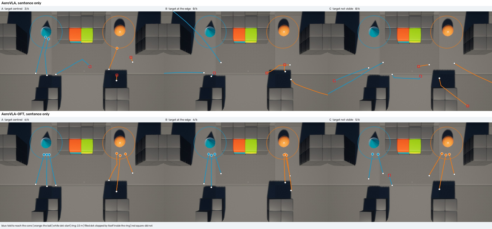
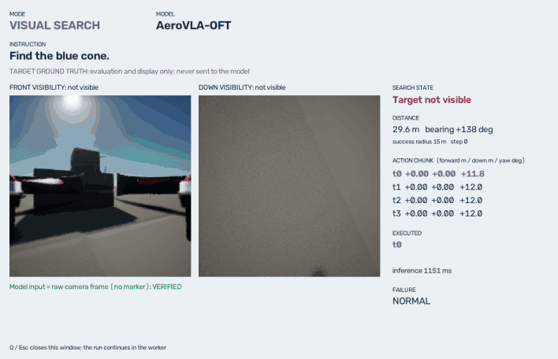
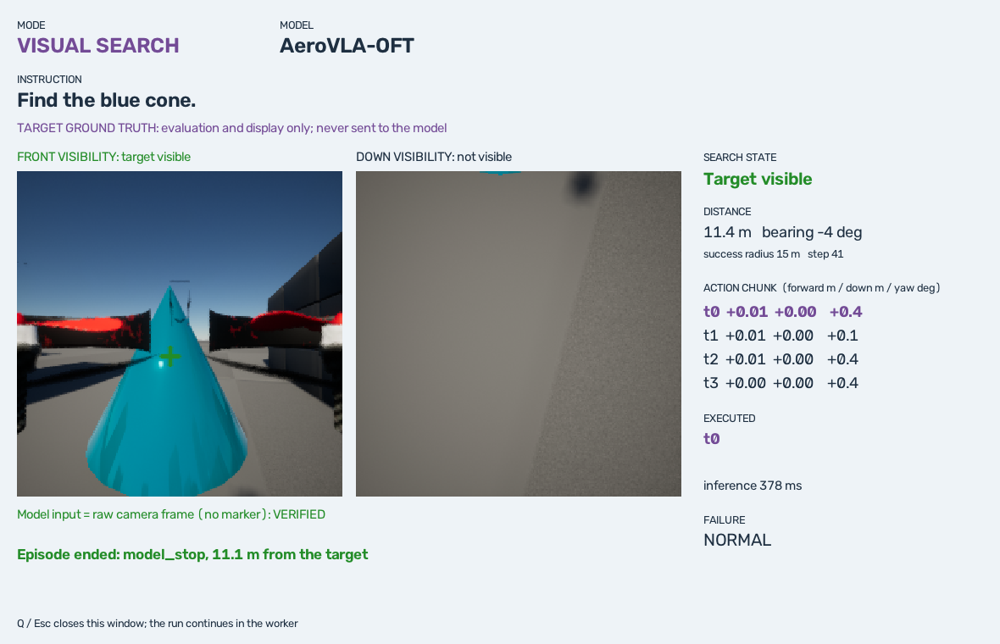

# AeroVLA-OFT — Visual Search와 짧은 연속 행동 chunk

2026-10-07 실행. 브랜치 `feat/aerovla-oft-visual-search`. 기존 AeroVLA baseline, Coordinate Goal Mode, Blur 데모는 그대로 두고 그 옆에 추가했다.

**요약**

- **기존 AeroVLA는 문장만으로는 목표를 찾지 못한다.** 목표가 정면에 보이면 6회 중 3회 근처에서 멈췄지만, 가장자리에 보이면 0/6, 안 보이면 0/6이었다. 안 보이는 6회에서 목표가 시야에 들어온 적이 한 번도 없다.
- **AeroVLA-OFT 구조는 UAV 3DoF 행동에 맞게 얹을 수 있고 12GB에서 학습된다.** NF4 + 새 LoRA + head, batch 1에서 최대 9.8GiB였다. pilot 학습은 39분이다.
- **이 맵에서 탐색 행동이 생겼다.** 같은 시작 조건에서 AeroVLA-OFT는 A 6/6, B 6/6, C 5/6, D 6/6이다. 모델 입력은 Front/Down과 문장 하나뿐이다.
- **움직임이 잘게 이어진다.** 판단 주기가 6.3초에서 0.52초로, 판단 한 번의 heading 변화 최댓값이 76°에서 13°로 줄었다.
- **일반화는 확인되지 않았다.** 학습에 없던 위치(58m)에서 시작하면 2/6이다. 맵 하나, 물체 두 개, 72 episode로 teacher를 흉내 낸 결과다.
- **이후:** 시작 위치·물체·장면을 나눠 본 [일반화 평가(Gen-v1)](aerovla_oft_generalization.md)와, 남은 실패를 분류해 전환 데이터를 보강한 [Gen-v2](aerovla_oft_gen_v2.md)가 이어진다. 이 문서의 pilot checkpoint와 결과는 그대로 비교 기준으로 남아 있다.

## 왜 하는가

- **방향 힌트 없이는 찾아가지 못한다.** 지금까지의 미션은 목표 좌표로 계산한 "forward-right" 같은 문장을 매 step 모델에 넣는다. 문장과 영상만으로 목표를 찾는 능력은 [앞선 평가](model_evaluation.md#3-지시문만으로-찾아가기)에서 0/6이었다.
- **판단 한 번이 느리다.** 기존 AeroVLA는 행동을 토큰 9개로 한 글자씩 생성해 판단마다 약 1초가 걸린다. 모델이 낸 거리를 자르는 처리는 이미 없앴고(최대 5m 그대로 실행), 끊겨 보이는 원인은 이 추론 시간과 step 사이의 정지다.

OpenVLA-OFT의 방식(한 번의 forward로 연속값 행동 여러 개를 내는 head)을 AeroVLA 위에 얹고, 방향 힌트 없는 데이터로 탐색 행동을 학습시켜 두 문제를 함께 본다. OpenVLA-OFT의 조작용 checkpoint는 쓰지 않는다.

## 기존 AeroVLA (공식 코드 확인)

[공식 저장소](https://github.com/XuPeng23/AeroVLA) commit `2c5ae09`의 `src/train_aerovla.py`, `src/aerovla_dataset.py`, `src/model_wrapper/aerovla_wrapper_ui.py`와 Hugging Face `XuPeng23/AerialVLA`의 `aerovla_train_dataset.json`, `adapter_config.json`을 읽은 결과다.

| 항목 | 내용 |
|---|---|
| Base | `openvla/openvla-7b`, 학습은 BF16 |
| Images | Front, Down을 각각 224×224로 줄여 위아래로 붙인 224×448 한 장. OpenVLA processor가 이를 다시 224×224로 만들어 DINOv2 + SigLIP에 넣는다(patch 256개) |
| Language | `<image>\nFly {방향}and find the target. {물체 설명}\nAction: `. 방향 문장은 데이터 JSON의 `instruction`에 이미 들어 있다 |
| State | 없음. 추론 때 기체 자세는 방향 문장을 계산하는 데만 쓴다 |
| Action dimension | 3: forward 0–5m, down -5–5m, yaw -1.1–1.1rad. 5 frame 뒤까지의 변위다(`000000.png`, `000005.png`, …) |
| Action normalization | 축마다 고정 min/max로 자르고 99개 bin으로 양자화 |
| Action prediction | 텍스트 생성. `"32 24 18"`처럼 두 자리 숫자 세 개. 마지막 두 step에는 ` LAND`를 붙인다 |
| Stop | 출력에 `LAND`가 있거나 세 값이 모두 0에 가까우면 정지 |
| Training loss | 다음 토큰 cross-entropy. prompt 부분은 loss에서 제외 |
| LoRA modules | rank 64, alpha 128, dropout 0.05. LLM의 `q/k/v/o_proj`, `gate/up/down_proj`. `projector`는 통째로 학습해 저장(`modules_to_save`) |
| Optimizer 설정 | lr 2e-4, cosine, batch 2 × accumulation 8, 5 epoch, gradient checkpointing |
| Dataset schema | JSON 배열. `traj_rel_dir`, `img_name`, `instruction`, `label{fwd,down,yaw}`, `is_last_step`, `is_penultimate`. 영상은 `<traj>/frontcamera/`, `<traj>/downcamera/` |

## OpenVLA-OFT (공식 코드 확인)

[공식 저장소](https://github.com/moojink/openvla-oft) commit `e4287e9`의 `prismatic/extern/hf/modeling_prismatic.py`, `prismatic/models/action_heads.py`, `projectors.py`, `film_vit_wrapper.py`, `vla-scripts/finetune.py`, `prismatic/vla/datasets/rlds/traj_transforms.py`, `constants.py`를 읽었다.

| OFT 구성 요소 | 공식 구현 | AeroVLA 적용 |
|---|---|---|
| Parallel decoding | prompt 뒤에 `chunk × action_dim`개의 빈 action embedding(0)과 종료 토큰을 붙여 한 번 forward하고 그 위치의 마지막 hidden state를 쓴다 | **그대로 적용** |
| Continuous action + L1 head | chunk step마다 `action_dim`개 hidden state를 이어 붙여 MLP-ResNet(2 block)에 넣고 L1 loss | **수정해 적용.** hidden 크기 4096 → 1024 (12GB, 작은 데이터) |
| Action chunking | LIBERO 8, ALOHA 25, Bridge 5. episode 끝을 넘는 미래 행동은 마지막 행동을 반복(`chunk_act_obs`) | **수정해 적용.** K = 4, 끝 처리는 동일 |
| Action normalization | 데이터 통계로 [-1, 1] (`bounds` 또는 `bounds_q99`) | **수정해 적용.** AeroVLA처럼 고정 범위로 [-1, 1] |
| Proprioception | 2층 MLP로 LLM embedding 한 개를 만들어 영상 patch 뒤에 붙인다 | **그대로 적용 가능.** 스위치로 구현, pilot에서는 꺼 둠 |
| FiLM | 언어 embedding으로 vision transformer block을 조절. vision backbone을 감싸 새 층을 학습 | **보류.** vision 쪽 학습이 필요해 12GB pilot 범위 밖 |
| LoRA | rank 32, alpha 16, dropout 0, `all-linear`(vision 포함), gaussian 초기화 | **수정해 적용.** rank 16, LLM의 7개 모듈만 |
| 학습 자원 | BF16, batch 8, 27–80GB GPU 1–8장 | **UAV pilot에는 부적절.** NF4 + batch 1로 바꿔 12GB에서 실행 |
| Diffusion head | 선택 사항 | 사용 안 함 |

논문은 병렬 디코딩에서 causal mask를 양방향으로 바꾼다고 설명하지만, 읽은 코드에는 attention mask를 바꾸는 부분이 없고 일반 padding mask를 LLaMA에 그대로 넘긴다. 이 구현도 mask를 바꾸지 않는다.

## AeroVLA vs OFT

| | AeroVLA | OpenVLA-OFT | AeroVLA-OFT (이 구현) |
|---|---|---|---|
| Vision | Front/Down mosaic 한 장 | 영상 1–3장, 각각 patch | AeroVLA와 동일 |
| Language | 방향 힌트 + 설명 | 작업 문장 | 방향 없는 문장 하나 |
| Action representation | 텍스트 bin 99개 | 연속값 | 연속값 |
| Action dimension | 3DoF | 7 / 14 | 3DoF (forward, down, yaw) |
| Action 크기 | step당 최대 5m, 63° | 제어 주기 한 번 | 0.5초 tick당 최대 1m, 12° |
| Action chunk | 1 | 5–25 | 4, 그중 1개 실행 |
| Decoding | 토큰 9개 순차 생성 | forward 한 번 | forward 한 번 |
| Loss | cross-entropy | L1 | L1 |
| State/proprio | 없음 | 선택 | 선택 (기체 속도·높이·yaw rate) |
| LoRA | r64, LLM | r32, 전체 linear | 기존 r64 고정 + 새 r16 |
| FiLM | 없음 | 선택 | 없음 |
| Stop | `LAND` 텍스트 | 없음 | 0에 가까운 행동 |

**반드시 유지한 AeroVLA의 UAV 부분**

- Front/Down mosaic와 그 전처리. vision과 projector 입력이 바뀌면 AeroVLA adapter가 배운 것이 쓸모없어진다.
- AeroVLA LoRA adapter와 함께 학습된 projector. 읽기만 하고 고정한다.
- 3축과 부호(forward, down, yaw). 실행기와 기존 로그를 그대로 쓸 수 있다.
- prompt의 틀 `<image>\n…\nAction: `.

## 구조

```text
Front RGB ─┐
Down RGB  ─┼─ mosaic ─ DINOv2+SigLIP ─ projector(AeroVLA, 고정) ─┐
문장 ───────────────────────────────── tokenizer ───────────────┼─ LLaMA-2 7B NF4
(선택) proprio ─ MLP ─ token 1개 ────────────────────────────────┘   + AeroVLA LoRA r64 (고정)
                                                                     + 새 LoRA r16 (학습)
                                    빈 action embedding 12개의 마지막 hidden state
                                                     ↓
                                        MLP-ResNet head (학습)
                                                     ↓
                               chunk 4 × [forward, down, yaw] (정규화값)
                                                     ↓
                                     첫 행동만 실행 → 다시 관측
```

- **시작 모델은 Option B에 가깝다.** NF4 base에 AeroVLA adapter를 그대로 올려 고정하고, 그 위에 새 LoRA와 head를 학습한다. AeroVLA adapter 파일은 읽기만 한다. 새 adapter와 head는 따로 저장한다.
- **LAND는 넣지 않았다.** 정지는 AeroVLA의 숫자 정지 규칙(세 값이 모두 0 근처)만 쓴다. teacher가 목표 12m 안에서 0 행동을 내므로 정지도 학습 대상이다.
- **실행은 receding horizon이다.** 4개를 예측하고 1개만 실행한 뒤 다시 관측한다. 명령은 tick보다 길게 내고 다음 명령이 비행 중에 교체하므로 기체는 멈추지 않는다.
- **Proprio에 절대 위치와 heading은 없다.** 맵이 하나라서 이 값을 주면 목표 위치를 외울 수 있다. 목표에 관한 값은 config 검사에서 거부한다.

코드: [spec.py](../src/aerovla_oft/spec.py)(행동·chunk·proprio 규칙), [model.py](../src/aerovla_oft/model.py)(모델), [aerovla_oft.json](../configs/aerovla_oft.json)(설정).

## Visual Search Mode

모델이 받는 것은 Front RGB, Down RGB, 문장 하나뿐이다. 목표 좌표·거리·방위·`semantic_direction()`·방향 문장·Overview·marker는 모델 입력 경로에 없다. [policy_inputs](../src/visual_search/episodes.py)가 입력을 만드는 유일한 함수이고 목표 기하를 받는 인자가 없다. 목표 좌표는 시작 위치를 정하고, 점수를 매기고, teacher를 움직이는 데만 쓴다.

| Case | 시작 | 문장 |
|---|---|---|
| A | 목표가 Front 중앙 (±8°) | `Approach the blue cone.` |
| B | 목표가 Front 가장자리 (±28–40°) | `Approach the blue cone.` |
| C | 목표가 시야 밖 (±100–180°) | `Find the blue cone.` |
| D | A처럼 시작, 접근 중 70–140° 강제 회전 | `Find the blue cone.` |

목표는 Blocks의 blue cone과 orange ball이다. 시작점은 목표에서 28–45m 떨어진 평지, 높이 6m다. seed로 위치·방향·좌우를 정한다. 평가는 seed 0–2, 학습 데이터는 seed 100 이상을 쓴다. **성공**은 정책이 스스로 정지했고 그 지점이 목표 중심 15m 안이며 충돌이 없는 경우다(물체 폭이 10m).

### 기존 AeroVLA baseline

AeroVLA NF4에 같은 문장만 넣었다(`<image>\nApproach the blue cone.\nAction: `). 실행은 기존 step 방식이고 LAND가 나오면 끝난다. 18 episode, 237 decision이다.

| Case | 정지가 15m 안 | 15m 안에 들어온 적 있음 | 첫 회전이 목표 쪽 | 목표가 시야에 들어옴 | 평균 최종 거리 |
|---|---:|---:|---:|---:|---:|
| A 정면에 보임 | 3/6 | 3/6 | - | - | 24.1m |
| B 가장자리에 보임 | 0/6 | 1/6 | 3/6 | - | 83.2m |
| C 안 보임 | 0/6 | 0/6 | 3/6 | 0/6 | 78.0m |

- **A:** 직진해서 닿은 3회(4.9m, 15.0m, 6.9m에서 정지)와 2–14 step 만에 26–52m에서 정지한 3회로 갈렸다.
- **B:** 목표 쪽으로 돈 것이 6회 중 3회로 우연 수준이다. 1회는 9m 옆을 지나갔지만 멈추지 않았고, 3회는 30 step 동안 100m 넘게 날아갔다.
- **C:** 체계적인 yaw 탐색이 없다. 누적 회전이 평균 50°이고 방향도 일정하지 않다. 목표가 Front에 들어온 적이 없다.
- **고도:** B와 C에서 5.9m에서 최대 18m까지 올라간 실행이 있었지만 목표를 찾는 것과 이어지지 않았다.

방향 힌트 없는 AeroVLA는 visual search를 하지 못한다. 그래서 데이터와 학습으로 넘어갔다.

## Dataset

목표 좌표를 아는 teacher가 같은 환경을 비행하고, 그때의 Front/Down 영상과 teacher의 행동을 기록했다. 학생 모델의 입력에는 영상과 문장만 들어간다.

**Teacher** ([episodes.py](../src/visual_search/episodes.py))

| 상황 | 행동 (0.5초 tick당) |
|---|---|
| 목표가 Front에 보임 | 목표 쪽으로 yaw(최대 12°). 30° 안으로 들어올수록 전진을 늘림(최대 1m) |
| 목표가 안 보임 | 항상 오른쪽으로 yaw 12°. 학생은 어느 쪽이 가까운지 알 수 없으므로 방향을 고정했다 |
| 한 바퀴 넘게 돌아도 안 보임 | 3m 상승 후 다시 탐색 (이 데이터에서는 발생하지 않음) |
| 목표 중심 12m 안 | 0 행동 (정지). 4 tick 연속이면 episode 종료 |
| D의 강제 회전 | 70–140°를 강제로 돌린다. 이 구간은 비행만 하고 label로 쓰지 않는다 |

**Pilot dataset** (`datasets/projectairsim_visual_search/pilot`, Git 제외, 409MB)

| 항목 | 값 |
|---|---|
| Episode | 72 (A 12, B 12, C 24, D 24). blue cone 36, orange ball 36. 모두 teacher가 목표 10.5–10.8m에서 정지 |
| Sample | 2,923 (0.5초 tick 하나가 sample 하나) |
| Teacher 상태 | approach 2,055 · search 514 · stop 288 · align 66 |
| 목표가 Front에 보임 / 안 보임 | 2,389 / 534 |
| Train / Val | 2,227 / 696 sample. episode 단위로 58 / 14로 나눔 |
| 영상 | Front, Down 256×256 PNG. marker 없음 |

**Schema.** AeroVLA 공식 JSON 형식을 그대로 쓰고 필드를 더했다. 영상 폴더 구조도 같다(`<traj>/frontcamera/`, `<traj>/downcamera/`).

```json
{"traj_rel_dir": "blocks/C-blue_cone-100", "img_name": "000004.png",
 "instruction": "<image>\nFind the blue cone.",
 "label": {"fwd": 0.0, "down": 0.0, "yaw": 0.21},
 "is_last_step": false, "is_penultimate": false,
 "chunk": [[0.0, 0.0, 0.21], [0.0, 0.0, 0.21], [0.0, 0.0, 0.21], [0.0, 0.0, 0.21]],
 "proprio": [0.0, 0.0, 0.0, 0.2, 0.52],
 "meta": {"episode_id": "C-blue_cone-100", "step": 4, "target_visible": false, "teacher_state": "search", "distance_m": 33.4}}
```

- `chunk`는 그 step부터 4 tick의 teacher 행동이다. episode 끝을 넘으면 마지막 행동을 반복한다(OFT의 `chunk_act_obs`와 같은 처리).
- `meta`는 분석용이고 모델에 들어가지 않는다.
- 작은 예시(sample 3개, 영상 1장, 요약)는 [outputs/examples/visual_search_dataset](../outputs/examples/visual_search_dataset/)에 있다.

## Training

### 12GB에서 가능한가

| | 공식 OFT | 이 구현 |
|---|---|---|
| 정밀도 | BF16 | LLM은 NF4(4-bit), vision·projector·head는 그대로 |
| Batch | 8 | 1 × accumulation 4 |
| 학습 파라미터 | LoRA r32 전체 linear + head | LoRA r16 LLM 7개 모듈(4,000만) + head(1,470만) |
| 필요 VRAM | 27–80GB (README) | 최대 9.8GiB (실측) |
| Step당 시간 | - | 0.42초 (forward + backward, batch 1) |
| 추론 | 약 16GB | forward 한 번 181ms, simulator와 함께 돌 때 약 400ms |

RTX 5070 12GB에서 **가능하다.** gradient checkpointing 없이 batch 1이 들어간다. batch 2는 시도하지 않았다. 공식 OFT 코드는 NF4 학습을 지원하지 않아서 그 코드를 실행하지 않고, 같은 구조를 PEFT와 bitsandbytes로 구현했다([model.py](../src/aerovla_oft/model.py)).

### Overfit 점검

train sample 48개만으로 600 step 학습했다.

| | 시작 | 끝 |
|---|---:|---:|
| Train L1 (정규화 chunk) | 0.64 | 0.044 |
| 실행되는 첫 행동의 L1 | - | 0.040 |
| Checkpoint를 새 프로세스에서 다시 불러 비교 | - | 예측 차이 0.0 (8 sample) |

새 head와 LoRA가 실제로 학습되고, 저장·재로드가 맞는다.

### Pilot 학습

| 항목 | 값 |
|---|---|
| 이름 | `aerovla-oft-projectairsim` |
| Base / 고정 adapter | `openvla/openvla-7b` NF4 / `XuPeng23/AerialVLA` `aero_vla` |
| Dataset | pilot, train 2,227 sample |
| Chunk / 실행 | 4 / 1 |
| Proprio / FiLM | 끔 / 없음 |
| LoRA | rank 16, alpha 16, dropout 0 |
| Learning rate | 2e-4, warmup 30 update 후 선형 감소 |
| Batch / accumulation | 1 / 4 |
| Update / sample 수 / epoch | 1,200 / 4,800 / 2.16 |
| Sampling | teacher 상태별로 드문 상태를 최대 3배까지 더 뽑음 |
| Peak VRAM | 9.80GiB allocated, 9.98GiB reserved |
| 학습 시간 | 39분 (평가 포함 41분) |
| Train L1 / 첫 행동 | 0.023 / 0.027 |
| Val L1 / 첫 행동 | 0.322 / 0.254 (stop 0.01, approach 0.20, search 0.35, align 0.39) |

Val L1은 update 600 이후 내려가지 않았다. train과의 차이가 크므로 58 episode에 과적합된 상태다. 그래도 실제 비행에서는 아래처럼 동작했다. checkpoint는 `outputs/aerovla_oft/checkpoints/pilot`에 있고 Git에는 넣지 않는다(adapter 160MB, head 59MB). 설정과 학습 기록은 그 폴더의 `manifest.json`에 남는다.

## 결과

### Visual Search before / after

baseline과 같은 시작 상태(seed 0–2, 목표 2개)다. 이 시작 위치들은 학습 데이터(seed 100 이상)에 없다. 표의 값은 "정책이 스스로 정지했고 그 지점이 목표 15m 안"인 횟수다.

| Test | AeroVLA | AeroVLA-OFT | Teacher (참고) |
|---|---:|---:|---:|
| A 정면에 보임 | 3/6 | **6/6** | 6/6 |
| B 가장자리에 보임 | 0/6 | **6/6** | 6/6 |
| C 안 보임 | 0/6 | **5/6** | 6/6 |
| D 강제 회전으로 놓침 | - | **6/6** | 6/6 |
| C에서 목표가 시야에 들어옴 | 0/6 | 6/6 | 6/6 |
| 평균 최종 거리 A / B / C | 24.1 / 83.2 / 78.0m | 11.0 / 11.1 / 14.5m | 10.6 / 10.7 / 10.7m |
| C의 평균 누적 회전 | 50° | 275° | 145° |
| 충돌 | 0 | 0 | 0 |



위는 기존 AeroVLA, 아래는 AeroVLA-OFT다. 파랑은 cone, 주황은 ball을 지시한 실행이고 원은 15m 반경이다.



C 시작에서의 실제 비행 44 tick이다(2배속). [놓친 뒤 다시 찾는 D 실행](../outputs/examples/visual_search_oft_reacquire.gif)도 있다. 아래는 관찰 창의 한 장면이다.



대화형 데모의 실제 화면이다. C 시작(목표가 뒤쪽)에서 43 tick 뒤 목표 11.1m에서 스스로 멈췄다. 십자 표시는 화면용 복사본에만 그렸고, 모델에 들어간 영상이 카메라 원본과 같은지 hash로 확인해 표시한다.

- **탐색이 생겼다.** 목표가 안 보이면 오른쪽으로 돌고, 보이면 그쪽으로 틀어 접근하고, 가까워지면 멈춘다. teacher의 규칙 그대로다.
- **놓친 뒤에도 다시 찾는다.** D 6회 모두 강제 회전 뒤 다시 찾아 접근했다.
- **실패 1회(C)는 멈칫이다.** 목표가 Front 가장자리(-35°~-41°)에 걸린 채 33m 지점에서 0에 가까운 행동이 4번 이어져 정지로 끝났다. "목표 쪽으로 왼쪽 회전"과 "오른쪽으로 탐색"이라는 서로 다른 label이 가장자리에서 섞이고, L1 회귀가 그 평균인 0 근처를 낸 것으로 보인다. 같은 이유로 일부 실행은 20m 근처에서 한 바퀴를 더 돈 뒤 접근했다(teacher 27–70 tick, OFT 27–132 tick).
- **closed loop에서 teacher와의 차이**는 축 범위의 평균 7%였다.

### 문장이 영향을 주는가

두 물체가 Front 양쪽에 함께 보이는 한 지점(45, 0)에서 문장만 바꿨다. 이 위치는 학습 시작 구역 밖이고 거리(56–58m)도 학습 범위(28–45m)보다 멀다.

| 문장 | AeroVLA-OFT 3회 | AeroVLA 3회 |
|---|---|---|
| `Approach the orange ball.` (오른쪽 +33°) | 세 번 모두 오른쪽으로 43–73° 회전. 2회는 ball 12.0m에서 정지, 1회는 35m에서 정지 | 0/3. 회전 방향이 제각각 |
| `Approach the blue cone.` (왼쪽 -35°) | 세 번 모두 왼쪽으로 5–13°만 돌고 5–7m 전진한 뒤 51–54m에서 정지 | 0/3 |

- **문장에 따라 행동이 갈린다.** 같은 위치에서 ball을 말하면 오른쪽, cone을 말하면 왼쪽이다. ball 쪽으로 간 cone 실행은 없다.
- **학습 범위 밖에서는 약하다.** 2/6이고, cone은 한 번도 접근하지 못했다.

### 움직임

| | AeroVLA (step 방식) | AeroVLA-OFT | Teacher |
|---|---:|---:|---:|
| 판단 주기 | 6.26초 | 0.52초 | 0.51초 |
| 추론 시간 (simulator와 함께) | 1,014ms | 398ms | - |
| 판단 한 번의 이동 | 4.00m | 0.46m | 0.62m |
| 판단 한 번의 heading 변화: 평균 / 최대 | 6.1° / 76° | 2.8° / 13° | 3.5° / 17° |
| 연속한 두 행동의 차이 (축 범위 대비) | 9% | 2% | 4% |
| 평균 속도 | 0.64m/s | 0.89m/s | 1.21m/s |
| 범위 밖 예측 (잘라서 실행) | - | 1,302개 중 313개, 최대 1.2배 | - |

- **AeroVLA는 크게 한 번 움직이고 멈춰서 다음 판단을 기다린다.** AeroVLA-OFT는 0.5초마다 작은 명령을 내고, 앞 명령이 끝나기 전에 다음 명령이 이어받는다.
- **chunk 자체보다 한 번의 forward로 끝나는 디코딩이 주기를 줄였다.** 추론이 1.0초에서 0.4초가 됐다. chunk의 뒤 3개는 지금 실행하지 않는다.
- **OFT의 yaw는 teacher보다 흔들린다.** A에서 누적 회전이 평균 102°로 teacher(7°)보다 훨씬 크다. 좌우로 조금씩 흔들며 간다.
- 연속 비행(AeroVLA + 비행 중 명령 교체)과의 직접 비교는 하지 않았다. 그 방식의 판단 주기는 약 3초였다.

## 한계

1. **맵 하나, 물체 두 개다.** 학습과 평가가 같은 Blocks 맵, 같은 blue cone과 orange ball이다. 시작 위치는 다르지만 같은 구역 안이다. 다른 맵이나 다른 물체에서 탐색이 되는지는 모른다. 학습 범위 밖 시작에서는 2/6이었다.
2. **모델이 배운 것은 teacher의 규칙이다.** "안 보이면 오른쪽으로 돈다"는 고정 규칙을 흉내 낸다. 가려진 목표를 돌아가서 찾거나, 고도를 바꿔 찾는 행동은 데이터에 없었고 평가하지 않았다.
3. **가장자리에서 멈칫한다.** L1 회귀가 서로 다른 label의 평균을 낸다. 실패 1회와 긴 실행들이 여기서 나왔다.
4. **정지가 곧 도착 판정이다.** LAND는 넣지 않았고 착륙도 하지 않는다.
5. **표본이 작다.** case당 6회, 언어 시험은 문장당 3회다.
6. **과적합 상태다.** val L1(0.25)이 train(0.03)보다 훨씬 크다. 72 episode로는 부족하다.
7. **FiLM과 proprio는 실험하지 않았다.** proprio는 스위치만 구현했다. FiLM은 vision 쪽 학습이 필요해 구현하지 않았다.
8. **목표가 지도상 장애물 없이 보이는 구역만 썼다.** 건물 뒤에 가려진 목표, 충돌 회피는 다루지 않았다.
9. **NF4로 학습하고 NF4로 추론했다.** BF16 학습과의 차이는 모른다.

## 실행

```powershell
# 데모: 관찰 창 + simulator. 모델은 Front/Down과 문장만 받는다
.\scripts\run_visual_search_demo.ps1 -Model baseline                      # 기존 AeroVLA
.\scripts\run_visual_search_demo.ps1 -Model oft                           # AeroVLA-OFT (checkpoint 필요)
.\scripts\run_visual_search_demo.ps1 -Model oft -Target orange_ball -Cases C,D

# 평가 (창 없이)
.\scripts\run_visual_search.ps1 -Policy baseline -Cases A,B,C -Episodes 3 -Output outputs/visual_search/baseline
.\scripts\run_visual_search.ps1 -Policy oft -Checkpoint outputs/aerovla_oft/checkpoints/pilot -Cases A,B,C,D -Episodes 3 -Output outputs/visual_search/oft_pilot
.\assets\projectairsim-env\Scripts\python.exe scripts\summarize_visual_search.py outputs\visual_search\baseline outputs\visual_search\oft_pilot

# 그림과 GIF (기록 폴더는 -Record로 만든다)
.\assets\projectairsim-env\Scripts\python.exe scripts\export_visual_search_media.py gif --record outputs\visual_search\gif_frames --episode C-blue_cone-0 --output demo.gif

# 데이터 수집 → 학습 (학습은 WSL의 integration 환경에서)
.\scripts\run_visual_search.ps1 -Policy teacher -Cases A,B,C,D -Episodes 6 -SeedStart 100 -Output outputs/visual_search/collect -Record datasets/projectairsim_visual_search/pilot
python scripts/build_visual_search_dataset.py datasets/projectairsim_visual_search/pilot
python scripts/train_aerovla_oft.py --dataset datasets/projectairsim_visual_search/pilot --output outputs/aerovla_oft/checkpoints/pilot --steps 1200
python scripts/train_aerovla_oft.py --verify outputs/aerovla_oft/checkpoints/pilot --dataset datasets/projectairsim_visual_search/pilot
python scripts/aerovla_oft_feasibility.py   # 이 GPU에서 학습이 되는지, 메모리와 시간
```

checkpoint와 dataset은 Git에 없다. 데모의 `-Model oft`는 위 순서로 checkpoint를 만든 PC에서만 동작한다. 관찰 창은 Q/Esc로 닫는다. 기존 `run_mission_demo.ps1`(좌표 목표)과 `run_blur_demo.ps1`은 그대로다.

## Tests

- **Python 110/110 통과**(WSL). 새로 추가한 것: visual 모드 입력에 목표 기하가 들어갈 경로가 없음, 모든 문장과 prompt에 방향·좌표가 없음, case별 시작 자세, teacher 규칙, 행동 정규화와 clipping, chunk 순서와 끝 처리, 짧은 chunk·실행 1개 설정, proprio가 기체 운동만 담음, head의 출력 형태와 재로드, dataset schema, 강제 회전이 label에 들어가지 않음, episode 단위 split, 결과 요약, 세 정책 선택, 화면 marker가 모델 입력을 바꾸지 않음.
- **Checkpoint 재로드:** overfit과 pilot 모두 새 프로세스에서 불러 저장 시점의 예측과 비교했고 차이는 0.0이었다.
- **Live:** visual search 실제 비행 129회(baseline 24, AeroVLA-OFT 31, teacher 100 중 dataset 72)에서 프로그램 오류는 카메라 응답이 비어 온 1회였고, 재요청을 넣은 뒤 다시 실행했다. 충돌은 0건이다. 대화형 데모 1회는 관찰 창과 함께 정상 종료했다.
- **Regression (같은 브랜치, 실제 비행):** 좌표 목표 `H-medium`은 2.16m에서 모델 정지·착륙으로 성공, `A-wall-landmark`는 이전과 같은 벽 충돌로 끝났고 프로그램 오류는 없었다. `run_blur_demo.ps1 -AutoTest`는 6/6 PASS다. 이 브랜치는 기존 파일의 코드를 바꾸지 않고 파일만 추가했다.
