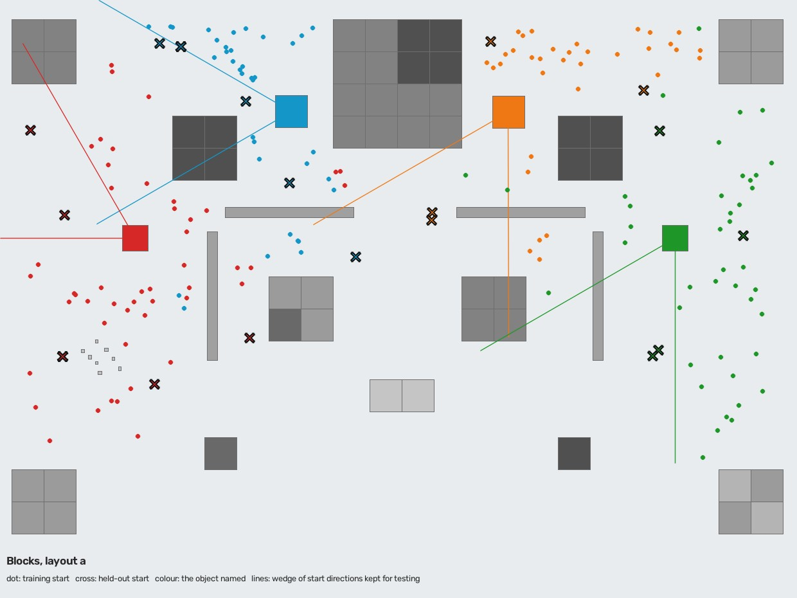
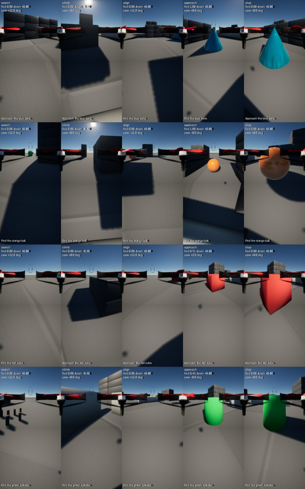
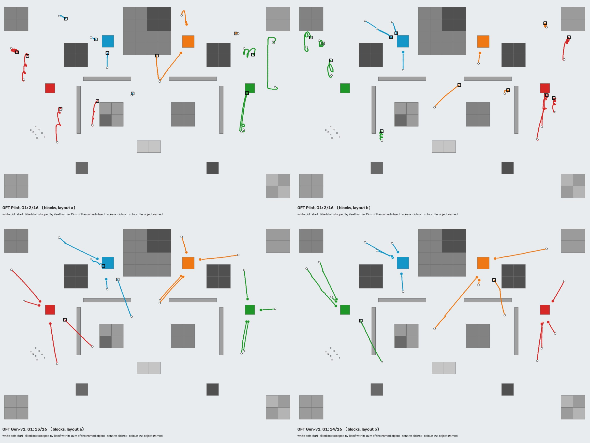
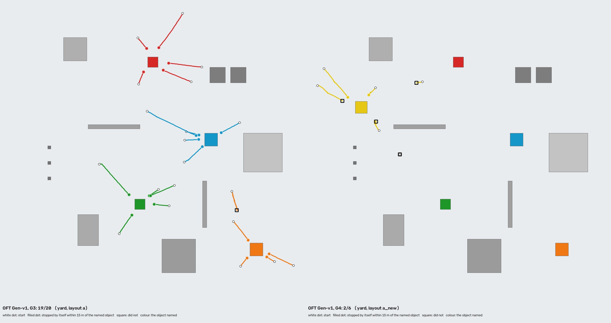

# AeroVLA-OFT 일반화 — 시작 위치, 물체, 맵

2026-10-07~08 실행. 브랜치 `exp/aerovla-oft-generalization`. [pilot](aerovla_oft.md)의 코드와 checkpoint는 그대로 두고 그 위에 추가했다.

**요약**

- **pilot은 자기 구역 밖에서는 거의 못 했다.** 자기 장면, 자기 물체, 자기 문장으로도 처음 보는 시작에서는 16회 중 5회 성공이다. 목표 근처까지는 12회 갔지만 멈추지 못했다.
- **데이터만 넓힌 Gen-v1은 처음 보는 시작에서 27/32, 충돌 0이다.** 구조와 학습 설정은 pilot과 같다. 학습에서 통째로 비워 둔 방향에서도 15/16이다.
- **학습하지 않은 장면(Yard)에서 19/20이다.** 다른 물체를 지시하면 가까이 보이는 물체에 멈춘 것은 20회 중 2회뿐이다. Yard는 같은 simulator 안에 만든 다른 장면이지, 다른 simulator 환경이 아니다.
- **처음 보는 물체는 약하다.** yellow pyramid로 Blocks 9/12, Yard 2/6이다. 문장을 따르기는 한다(같은 자리에서 "red cube"라고 하면 pyramid로 0/12).
- **찾기는 병목이 아니다.** 처음에 안 보이던 목표 73개를 모두 시야에 넣었다. 본 물체의 실패 9회 중 8회는 찾은 뒤에, 높은 곳에서 일찍 멈추거나 목표 앞에서 계속 올라가서 생겼다.
- **탐색은 한 방향 회전이다.** 정책이 영상 한 장만 보므로 좌우를 섞어 가르치면 탐색 자체가 사라진다(실험으로 확인). 성공률은 깎지 않고, 목표가 왼쪽에 있으면 12초 더 걸린다.
- **과적합 간격이 없어졌다.** pilot은 train 0.023 / val 0.322, Gen-v1은 0.115 / 0.092다.

## 무엇을 묻는가

pilot은 학습과 같은 구역에서 A 6/6, B 6/6, C 5/6, D 6/6이었지만 학습에 없던 위치에서는 2/6이었다. 이 모델이 "이 맵의 이 위치에서만 잘하는 모델"인지, 처음 보는 위치와 환경에서도 목표를 찾아가는지를 축 하나씩 나눠 본다.

| Level | Map | Object | Start | 이 저장소에서의 뜻 |
|---|---|---|---|---|
| G0 | 본 맵 | 본 물체 | 본 시작 | 학습 episode의 시작 상태를 그대로 다시 비행 |
| G1 | 본 맵 | 본 물체 | 처음 보는 시작 | 학습 시작점에서 6m 이상 떨어졌거나, 그 물체에 대해 학습에 아예 없는 방향에서 시작 |
| G2 | 본 맵 | 처음 보는 물체 | 처음 보는 시작 | 학습 영상에 한 번도 나오지 않은 yellow pyramid를 지시 |
| G3 | 학습하지 않은 장면 | 본 물체 | 처음 보는 시작 | Yard. 같은 simulator 안에 만든 다른 장면이다(아래 맵 정의) |
| G4 | 학습하지 않은 장면 | 처음 보는 물체 | 처음 보는 시작 | Yard의 yellow pyramid |

모델 입력은 모든 level에서 Front/Down RGB와 문장 하나다. 목표 좌표는 기체를 놓고, teacher를 움직이고, 점수를 매기는 데만 쓴다([입력 경로](aerovla_oft.md#visual-search-mode)는 pilot과 같다).

## 맵 정의

맵마다 코드에 좌표를 적지 않도록 `configs/maps/<id>.json`으로 옮겼다. 맵 파일에는 simulator scene, 장애물, 지시할 수 있는 물체와 layout별 위치, 시작 가능 영역, 고도 범위가 들어 있다.

| | Blocks (`blocks.json`) | Yard (`yard.json`) |
|---|---|---|
| 쓰임 | 학습, G0–G2 | G3, G4 평가만. 학습 비행 0회 |
| 장애물 | Project AirSim Blocks 1.0.1의 블록 63개 열(simulator bounding box를 그대로 읽어 `blocks.obstacles.json`에 기록) + 9m 벽 4개 | 벽 2, silo 2, 창고, 낮은 slab, 기둥 3, 둔덕, 탱크. 모두 실행 중에 띄운 mesh |
| 바닥 / 조명 | 회색 바닥, 기본 태양 | 모래색 바닥(560m slab), 저녁 19:00의 태양 |
| 물체 | blue cone, orange ball (맵에 원래 있음) / red cube, green cylinder (추가) / yellow pyramid (held-out) | red cube, green cylinder (Blocks와 같은 mesh), orange ball (Blocks와 같은 packaged asset), blue cone (닮은 mesh), yellow pyramid |
| Layout | `a`, `b`: cube와 cylinder가 서로 자리를 바꾼다. `a_new`, `b_new`: pyramid 추가. `pilot`: 손대지 않은 원래 맵 | `a`, `a_new` |

- **Blocks에는 cone과 ball 말고 구별되는 물체가 없다.** 그래서 simulator의 `spawn_object_from_file`로 단색 mesh(glTF)를 띄웠다. 띄운 물체도 충돌 판정이 된다(직접 부딪혀 확인).
- **cube와 cylinder는 두 자리를 번갈아 쓴다.** 한 자리에 어떤 때는 cube, 어떤 때는 cylinder가 있으므로 "남쪽 광장에 있는 것"으로는 맞힐 수 없고 물체를 봐야 한다.
- **벽 4개는 고도 탐색 상황을 만들려고 넣었다.** 원래 맵에는 목표를 가리면서 넘어갈 수 있는 높이(10m 안팎)의 구조물이 목표 근처에 거의 없다. 벽이 없는 `pilot` layout에서 pilot 학습 때와 같은 장면이 재현된다.
- **Yard는 진짜 다른 환경이 아니라 같은 실행 파일 안에 만든 두 번째 장면이다.** Project AirSim 1.0.1 release에는 Blocks만 있고 이 PC에 다른 Unreal 환경은 없다. Blocks 구조물에서 4km 떨어진 빈 평면에 바닥, 구조물, 물체를 띄웠다. 구조물의 모양·색·배치, 바닥색, 조명은 다르고, 하늘과 renderer는 같다. Blocks의 건물은 거리 때문에 보이지 않는다.

## Held-out 시작 상태

`configs/generalization_test_spawns.json`. 학습 계획을 만들기 전에 한 번 생성했고 다시 만들지 않는다(생성기는 파일이 있으면 거부하고, 테스트가 파일이 생성기 출력과 같은지 확인한다).

| Set | 수 | 내용 |
|---|---:|---|
| G1 | 32 | 물체 4개 × 8: visible 1, peripheral 2(좌·우), search 3(좌·우·뒤), altitude 1, reacquire 1. 절반은 held-out 방향 안 |
| G2 | 12 | yellow pyramid: visible 3, peripheral 3, search 6 |
| G3 | 20 | Yard, 물체 4개 × 5: visible 1, peripheral 1, search 3 |
| G4 | 6 | Yard의 yellow pyramid |
| P | 24 | G1 시작 8개를 학습에 없던 문장 3개로 (`Locate`, `Search for`, `Find and approach`) |
| S | 16 | 물체마다 한 자리에서 기체만 돌려 목표를 왼쪽·오른쪽·왼쪽 뒤·오른쪽 뒤에 둠 |

"처음 보는 시작"이 무작위 seed만 다른 것이 되지 않도록 두 가지로 분리했다.

1. **거리:** 학습·검증 시작점은 모든 held-out 시작점에서 6m 이상 떨어져 있다.
2. **방향:** 물체가 놓이는 자리마다 60° 폭의 시작 방향(wedge)을 통째로 비워 두었다. 그 자리의 물체를 그 방향에서 바라보며 시작하는 학습 episode는 없다. wedge는 물체가 아니라 자리에 속한다(cube와 cylinder가 자리를 바꿔도 같다).

`scripts/plan_generalization.py check`가 계획된 학습·검증 시작점 전부에 대해 두 조건과 seed 범위(test 0–199, train 1000–4999, val 5000–5999)를 검사한다.



점은 학습 시작, ×는 held-out 시작, 색은 지시한 물체, 선은 비워 둔 방향이다.

## Teacher

pilot의 teacher는 "안 보이면 오른쪽으로 돈다, 한 바퀴 넘게 돌아도 없으면 3m 올라간다"였다. 이번에 요청된 다양화(왼쪽 sweep, 짧게 좌우 scan, sweep 뒤 고도 상승, 마지막으로 본 방향 탐색)를 구현했지만, **학습 데이터에는 그중 영상만으로 정해지는 규칙만 넣었다.** 이유는 구조에 있다.

- **이 정책은 기억이 없다.** 입력은 지금의 Front/Down 한 장과 문장이고(proprio OFF), 실행은 chunk의 첫 행동뿐이다. "지금 왼쪽으로 돌던 중이다", "이미 한 바퀴 돌았다", "방금 오른쪽에서 봤다"는 영상 한 장에 없다.
- **같은 영상에 서로 다른 label이 붙으면 L1 회귀는 그 사이 값을 낸다.** 목표가 안 보이는 같은 장면에 어떤 episode는 "오른쪽", 어떤 episode는 "왼쪽"이 붙는다.

실제로 확인했다. pilot dataset의 탐색 label을 episode의 절반에서 왼쪽으로 뒤집어(같은 장면을 왼쪽 sweep teacher가 label한 것과 같다) 같은 설정으로 300 update씩 학습했다.

| 학습 label | 목표가 안 보이는 검증 frame에서 예측한 yaw (정규화, +1이 오른쪽 최대) | 탐색 frame의 L1 |
|---|---:|---:|
| 오른쪽 sweep만 | +0.88 | 0.093 |
| 오른쪽·왼쪽 50/50 | +0.07 | 0.359 |

섞으면 회전이 사실상 멈춘다. 탐색 자체가 사라지는 것이다. 그래서 이번 teacher의 규칙은 다음과 같다(`SearchTeacher`).

| 상황 (teacher가 아는 것) | 행동 | 영상에 드러나는가 |
|---|---|---|
| 가깝고(12m 이내) Front 또는 Down에 보임 | 정지 | 목표가 크게 보임 |
| Front에 보임 | 목표 쪽으로 돌고, 대략 정면이면 전진. 바로 앞(6m)에 넘어야 할 것이 있으면 먼저 상승 | 목표의 위치 |
| 안 보이고, 앞 16m 안에 기체 높이까지 올라온 구조물이 있음 | 상승 (0.5m/tick, 천장 14m까지) | 가까운 벽이 앞을 채움 |
| 안 보임 | 오른쪽으로 회전 | 목표가 없음 |

- **고도 탐색은 "한 바퀴 돌고 없으면 올라간다" 대신 "앞이 가까운 것에 막혀 있으면 올라간다"로 바꿨다.** 결과로 나오는 움직임은 요청한 것과 같다(회전 → 벽을 마주침 → 상승 → 다시 회전 → 벽 너머로 목표가 보임 → 접근). 차이는 상승의 계기가 세어 둔 회전량이 아니라 화면이라는 점이다. 앞이 트여 있으면 올라가지 않으므로 "안 보이면 무조건 최고 고도"가 되지 않는다.
- **가깝지만 안 보이는 목표에서는 멈추지 않는다.** pilot teacher는 거리만으로 멈췄다. 목표가 등 뒤에 있을 때의 정지는 영상으로 설명되지 않으므로, 보일 때까지 돈 뒤에 멈춘다.
- **기억이 필요한 전략 4개는 teacher에 남아 있고 simulator에서 각각 목표에 도착하는 것을 확인했다**(left, scan, last_seen, sweep_climb 각 1회, 4/4). 학습에는 쓰지 않았다. 이 전략들을 배우게 하려면 정책에 최소한의 상태(예: proprio의 yaw rate)가 있어야 한다.
- **모든 episode는 비행 전에 지도 위에서 먼저 돌려 본다.** teacher를 맵의 box만으로(동역학 없이) 끝까지 진행시켜, 목표에 도착하고 장애물에 2m 안으로 접근하지 않는 시작 상태만 채택한다. 같은 (맵, split, seed)는 항상 같은 episode다.

## Dataset

`datasets/projectairsim_visual_search/generalization_v1` (1.6GB, Git 제외). 계획 파일(split 포함), 요약, sample 20개는 [outputs/examples/generalization/](../outputs/examples/generalization/)에 있다.

| | pilot | generalization_v1 |
|---|---:|---:|
| Episode (train / val) | 72 (58 / 14) | 292 (260 / 32) |
| Sample (train / val) | 2,923 (2,227 / 696) | 11,745 (10,495 / 1,250) |
| Map | Blocks 원래 맵 | Blocks + 물체 2 + 벽 4, layout 2개 |
| 지시한 물체 | 2 | 4 (각 73 episode) |
| 시작 거리 | 28–45m | 14–70m |
| 시작 방향 | 물체 서쪽 한 구역 | 물체 둘레 전부(held-out 방향 제외) |
| 시작 고도 | 6m | 5–9m |
| 문장의 동사 | 보이면 `Approach`, 안 보이면 `Find` | 보이는지와 무관하게 `Find` 155 / `Approach` 137 |
| teacher가 도착하지 못해 버린 episode | 0 | 0 |



물체별(행)로 teacher 상태마다 한 장씩이다. 각 칸은 위가 Front, 아래가 Down이고, 글자는 그림에만 있다.

| 분포 | 값 |
|---|---|
| 시작 종류 | visible 44 (15%), peripheral 56 (19%), search 104 (36%), altitude 40 (14%), reacquire 48 (16%) |
| 시작 거리 | 12–20m 69, 20–30m 88, 30–40m 34, 40–50m 42, 50–60m 30, 60–70m 29 |
| 시작 때 목표 방향 | front 98, front-right 30, right 29, behind-right 25, behind 29, behind-left 22, left 24, front-left 35 |
| 시작 고도 | 5–6m 60, 6–7m 79, 7–8m 79, 8–9m 74 |
| Layout | a 160, b 132 |
| 목표가 안 보이는 구간이 있는 episode 195개 | 회전만으로 찾음 151 (77%), 고도를 올려 찾음 44 (23%) |
| 강제 회전 방향 (reacquire) | 왼쪽 27, 오른쪽 21 |
| 탐색 전략 | right 292 (100%). 기억이 필요한 전략의 sample 0 |
| Sample의 teacher 상태 | approach 7,978 (68%), search 1,895 (16%), stop 1,168 (10%), climb 530 (5%), align 174 (1%) |
| Sample에서 목표가 Front에 | 보임 9,348 (80%), 안 보임 2,397 (20%) |

- **좌우는 종류마다 번갈아 배정했다.** 학습 260 episode에서 peripheral 26/26, search 46/46, altitude 18/18, visible 20/20, reacquire 20/20이다. "이 물체는 항상 오른쪽에 있다"는 관계가 데이터에 없다.
- **고도 탐색은 예시로 든 40%보다 적은 23%다.** 벽 뒤 16m 안에서 시작해야 해서 자리가 좁다. 계획 단계에서 종류별 비율(15/20/35/15/15%)은 맞췄다.
- **분리 검사:** seed는 train 1000–1259, val 5000–5031, test 0–199다. 같은 episode, 궤적 폴더, seed, 시작점이 train과 val 양쪽에 있는 경우는 0이고(있으면 변환기가 멈춘다), 행동 범위를 벗어난 label도 0이다. 모든 episode에 seed, map, layout, 물체, 시작 상태, teacher 전략이 기록돼 있어 같은 seed로 다시 만들 수 있다.
- **수집 시간:** simulator 2개를 서로 다른 포트로 나란히 돌려 약 75분이다. episode는 평균 42 tick(최대 106)이다.

## Training

구조와 설정은 pilot과 같게 두었다. 달라진 것은 데이터, 검증 방식, checkpoint 선택뿐이다.

| 항목 | 값 |
|---|---|
| 구조 | OpenVLA-7B NF4 + AeroVLA adapter(고정) + 새 LoRA r16 + L1 head. chunk 4, 실행 1, FiLM OFF, proprio OFF |
| Optimizer | AdamW, lr 2e-4(선형 감소), batch 1 × accumulation 4, weight decay 0, teacher 상태별 균형 sampling(최대 3배) |
| 검증 | 250 update마다, 검증 episode에서 teacher 상태 비율대로 고정해 둔 320 sample |
| Checkpoint 선택 | 검증 L1이 가장 낮은 시점을 저장. 4번 연속 개선이 없으면 종료 |
| 계획 / 실제 update | 4,000 / 2,250에서 조기 종료 |
| **선택된 checkpoint** | **1,250 update** (5,004 sample, 0.48 epoch). `outputs/aerovla_oft/checkpoints/generalization_v1` |
| 마지막 가중치 | 2,250 update (0.86 epoch). 같은 폴더의 `last/`. 평가에는 쓰지 않았다 |
| Peak VRAM | 9.80GiB allocated / 10.03GiB reserved (RTX 5070 12GB) |
| 시간 | 108분 (앞 55분은 simulator와 GPU를 같이 써서 느렸다) |
| 재로드 | 새 프로세스에서 불러 저장 시점 예측과 비교, 차이 0.0 |

| Update | 250 | 500 | 750 | 1,000 | **1,250** | 1,500 | 1,750 | 2,000 | 2,250 |
|---|---:|---:|---:|---:|---:|---:|---:|---:|---:|
| Train L1 (이동 평균) | 0.217 | 0.160 | 0.092 | 0.100 | 0.115 | 0.076 | 0.077 | 0.051 | 0.048 |
| Val L1 | 0.260 | 0.177 | 0.155 | 0.122 | **0.092** | 0.148 | 0.110 | 0.107 | 0.097 |

- **과적합 간격이 사라졌다.** pilot은 train 0.023 / val 0.322였다. 이번에는 선택된 시점에서 train 0.115 / val 0.092, 마지막 시점에서 train 0.071 / val 0.097이다. architecture나 regularization은 바꾸지 않았고 데이터만 넓혔다.
- **한 epoch도 돌지 않았다.** 선택된 checkpoint는 sample을 평균 0.5번 봤다. 검증 L1은 250 update 사이에도 0.09–0.15로 흔들려서(320 sample), 1,250과 그 뒤 시점의 차이는 크지 않다. 그래도 정한 규칙대로 검증 최저점을 썼고, held-out 결과를 보고 checkpoint를 고르지 않았다.
- **상태별 검증 L1(첫 행동):** stop 0.031, align 0.041, search 0.065, approach 0.099, climb 0.284. 상승이 가장 덜 맞는다(전체 sample의 5%).
- **탐색 frame에서의 예측:** 목표가 안 보이는 검증 frame의 yaw 예측 평균은 +0.96(오른쪽 최대가 +1)이다. 상승 frame에서는 down 평균 -0.68(위로 최대가 -1)이다.

## Action range

pilot 비행에서 예측의 24%(1,302개 중 313개)가 행동 범위를 벗어났었다. 학습 전에 원인을 봤다(`scripts/analyze_action_range.py`, 강제 회전 tick 제외 1,237개).

| 축 | 범위 밖 예측 | 그중 teacher 행동이 정확히 그 한계값인 것 | 초과량 중앙값 / 최대 (정규화 단위) |
|---|---:|---:|---:|
| forward | 276 | 269 (97%) | 0.016 / 0.08 |
| down | 0 | - | - |
| yaw | 32 | 32 (100%) | 0.023 / 0.20 |

- **label이 한계값에 몰려 있어서 생기는 현상이다.** 학습 label의 첫 행동은 forward의 51%, yaw의 18%가 정확히 한계값(전진 0 또는 최대, 회전 최대)이다. head가 그 값을 1–2% 넘겨 예측하면 "범위 밖"으로 세어진다.
- **실행에는 영향이 없다.** 범위 밖 값은 한계값으로 잘려 실행되고, 그 한계값이 teacher가 낸 값이다. 정규화나 label 범위의 오류는 없었다(범위 밖 label 0개).
- **출력을 tanh로 묶는 head를 비교했다.** 같은 데이터, 같은 300 update에서 범위 밖 예측은 0%가 됐지만 검증 L1이 0.151 → 0.383으로 나빠졌다(접근 frame 0.150 → 0.599). label이 ±1에 있으면 tanh는 그 값에 닿으려고 포화 구간에서 학습해야 해서 느리다. 기존 head를 유지했다.

**Gen-v1에서는 빈도가 오히려 늘었고 크기는 그대로다.**

| 실행 | 판단 | 범위 밖(어느 축이든) | forward: 범위 밖 / teacher도 한계값 | yaw: 범위 밖 / teacher도 한계값 | 초과량 중앙값 / 최대 |
|---|---:|---:|---:|---:|---:|
| pilot (A–D) | 1,237 | 287 (23%) | 276 / 269 | 32 / 32 | 0.016 / 0.20 |
| Gen-v1 G1 | 2,418 | 1,295 (54%) | 1,186 / 922 | 568 / 566 | 0.023 / 0.19 |
| Gen-v1 G3 | 1,087 | 600 (55%) | 560 / 450 | 242 / 239 | 0.016 / 0.16 |

- 새 dataset은 한계값 label이 더 많다(forward 58%, yaw 20%, down 5%). 정지·회전·상승 sample이 늘어서다.
- 초과량은 여전히 범위의 1–3%이고 잘려서 실행된다. clip 빈도를 0으로 만드는 것은 목표로 두지 않고, 빈도와 초과량의 중앙값·최대만 계속 기록한다.

## 결과

모두 실제 비행이고, 성공 기준은 pilot 때와 같다(스스로 정지 + 목표 중심 15m 이내 + 충돌 없음). 표의 원자료는 [outputs/generalization/gen_v1_final/](../outputs/generalization/gen_v1_final/)에 고정해 두었다.

### Generalization matrix

| Model | G0 본 시작 | G1 처음 보는 시작 | G2 처음 보는 물체 | G3 처음 보는 장면 | G4 둘 다 |
|---|---:|---:|---:|---:|---:|
| AeroVLA Step | 3/18 ¹ | 1/16 | - | - | - |
| AeroVLA Continuous | - | 0/16 | - | - | - |
| OFT Pilot | 23/24 ¹ | 4/32 | 0/6 | 6/10 ² | - |
| **OFT Gen-v1** | **20/20** | **27/32** | **9/12** | **19/20** | **2/6** |
| Teacher (목표 위치를 앎) | - | 32/32 | 12/12 | 20/20 | 6/6 |

¹ pilot 단계의 결과다. pilot은 자기 학습 구역의 A–D, 기존 AeroVLA는 같은 구역의 A–C다([pilot 문서](aerovla_oft.md#visual-search-before--after)). ² pilot이 아는 물체(cone, ball)만.

같은 episode끼리 맞춰 보면 다음과 같다.

| 같은 episode | 기존 AeroVLA / pilot | Gen-v1 |
|---|---:|---:|
| G1 중 기존 AeroVLA가 비행한 16회 | step 1/16, continuous 0/16 | 12/16 |
| G1 중 cone·ball 16회 | pilot 4/16 | 13/16 |
| 위와 같은 시작을 pilot의 장면·문장으로 (벽과 추가 물체 없음) | pilot 5/16 | - |
| G3 중 cone·ball 10회 | pilot 6/10 | 9/10 |

- **Teacher(목표 위치를 아는 기준 정책)는 held-out 86회 모두 도착했다.** 시작 상태 자체가 불가능한 경우는 없다.
- **pilot은 줄여서 돌렸다.** held-out episode 대부분에서 시간 초과(회당 2분)로 끝나서, G1은 전부, 자기 장면(G1 중 cone·ball, 벽과 추가 물체가 없는 `pilot` layout, pilot 학습 때의 문장)은 전부, G3는 아는 물체(cone·ball) 10회, G2는 6회만 비행했다. G4와 좌우 시험은 돌리지 않았다.
- **기존 AeroVLA는 G1의 16회만 돌렸다**(visible 4, peripheral 4, search 4, altitude 4). 회당 2–3분이 걸린다.

### 찾기 → 접근 → 정지로 나눠 보기

| Level | 처음에 안 보인 목표를 시야에 넣음 | 20m 안까지 접근 | 스스로 정지 | 성공 |
|---|---:|---:|---:|---:|
| G0 | 8/8 | 20/20 | 20/20 | 20/20 |
| G1 | 16/16 | 32/32 | 31/32 | 27/32 |
| G2 | 6/6 | 11/12 | 9/12 | 9/12 |
| G3 | 12/12 | 19/20 | 19/20 | 19/20 |
| G4 | 3/3 | 4/6 | 3/6 | 2/6 |
| P | 12/12 | 24/24 | 23/24 | 21/24 |
| S | 16/16 | 16/16 | 16/16 | 16/16 |

**목표를 못 찾아서 실패한 경우는 없다(73/73).** 본 물체(G1, G3, P)의 실패 9회는 모두 찾은 뒤에 나왔다.

### G1 — 처음 보는 시작 (27/32, 충돌 0)



위는 pilot, 아래는 Gen-v1이고 왼쪽이 layout a, 오른쪽이 b다. 흰 점이 시작, 채운 점이 15m 안에서 스스로 멈춘 곳, 네모가 실패로 끝난 곳이다. [탐색](../outputs/examples/generalization/search_g1.gif), [놓친 뒤 다시 찾기](../outputs/examples/generalization/reacquire_g1.gif), [벽을 넘어 올라가서 찾기](../outputs/examples/generalization/climb_g1_v1.gif)의 실제 비행 GIF가 있다.

| | 결과 |
|---|---|
| 종류별 | visible 4/4, peripheral 7/8, search 12/12, reacquire 4/4, **altitude 0/4** |
| 물체별 | cone 6/8, ball 7/8, cube 7/8, cylinder 7/8 |
| 비워 둔 방향 | 안 15/16, 밖 12/16 (밖의 실패 4회는 모두 altitude) |
| 거리 (평균) | 시작 36.0m → 끝 11.3m. 성공 시 정지 거리 10.8m (teacher 10.6m) |
| 탐색 | 처음에 안 보인 16회 모두 시야에 넣음. 평균 20.6 판단 (teacher 11.4) |
| 소요 | 평균 77 판단, 40초 (teacher 43 판단, 21초) |

- **학습에 없던 방향(wedge)에서도 된다.** 15/16으로 그 밖보다 낮지 않다. 다만 그 방향의 먼 visible 시작 3회는 접근 중 목표를 놓치고 한두 바퀴 더 돈 뒤 도착했다(97, 170, 209 판단).
- **고도 탐색 4회는 찾고도 실패로 집계됐다.** 4회 모두 벽 뒤에서 올라가 목표를 시야에 넣고 접근했지만 15.0, 16.0, 16.3, 16.8m에서 스스로 멈췄다. 15m 기준을 0–1.8m 넘긴 것이다. 그중 red cube 시작을 GIF용으로 한 번 더 비행했을 때는 14.9m에서 멈춰 성공이었으니, 경계에 걸친 실패다. 본 시작(G0)의 고도 episode도 11.6–14.6m에서 멈춰, 높은 곳에서는 정지가 2–4m 일찍 나온다.
- **나머지 실패 1회는 목표 바로 옆에서의 상승이다.** cone이 14.6m 거리, 화면 왼쪽 가장자리에 있던 시작이다. 11m까지 다가간 뒤 멈추지 않고 28.8m까지 올라갔다([그림](../outputs/generalization/gen_v1_final/representative_failures/)).
- **왼쪽 가장자리의 가까운 목표로는 바로 돌지 않는다.** 목표가 왼쪽 31–34°, 15–23m에 있던 4회 모두 왼쪽으로 틀지 않고 오른쪽으로 한 바퀴 가까이 돌아서 찾았다(teacher는 15–22 판단, 모델은 57–240 판단).

### G3 — 처음 보는 장면 Yard (19/20, 충돌 0)

**학습하지 않았음: 확인.** 학습·검증 292 episode의 map은 모두 `blocks`이고(dataset summary), Yard 비행은 teacher 기준 비행과 평가뿐이다.



왼쪽이 G3(본 물체), 오른쪽이 G4(yellow pyramid)다. [Yard에서의 비행 GIF](../outputs/examples/generalization/yard_g3.gif)

| | 결과 |
|---|---|
| 종류별 | visible 4/4, peripheral 4/4, search 11/12 |
| 물체별 | cone(닮은 mesh) 5/5, ball 4/5, cube 5/5, cylinder 5/5 |
| 탐색 | 처음에 안 보인 12회 모두 시야에 넣음. 평균 20.1 판단 |
| 소요 | 평균 54 판단, 27초 (teacher 34 판단, 17초) |

- **실패 1회:** orange ball을 48.8m 뒤쪽에 두고 시작한 경우다. 27번째 판단에 찾았지만 33.8m까지만 다가가고 계속 돌다 시간 초과됐다.
- **다른 물체가 먼저 보여도 그리로 가지 않았다.** 탐색 중 다른 물체가 70m 안 시야에 들어온 episode가 8회이고 그중 7회는 지시한 물체보다 먼저였다. 다른 물체 옆에서 멈춘 경우는 0이다.
- Yard는 같은 simulator 안의 다른 장면이다(아래 한계 1). "처음 보는 simulator 환경"으로 읽으면 안 된다.

### G2, G4 — 처음 보는 물체 (yellow pyramid)

| | G2 (Blocks) | G4 (Yard) |
|---|---:|---:|
| 성공 | 9/12 | 2/6 |
| 시야에 넣음 | 6/6 | 3/3 |
| 20m 안까지 접근 | 11/12 | 4/6 |
| episode 평균 판단 (teacher) | 148 (38) | 169 (39) |
| 목표가 시야 밖인 판단 / 누적 회전 | 91 / 1,260° | 117 / 1,741° |

- **가기는 가지만 훨씬 머뭇거린다.** 본 물체(G1: 77 판단)의 두 배가 걸린다. 보이면 조금 다가가고, 다시 한 바퀴 돌고, 다시 다가가기를 반복한다.
- **Yard에서는 절반 넘게 실패한다.** 2회는 47m 거리에서 보이는데도 다가가지 않았다.

**눈에 띄는 물체로 그냥 가는 것인지 확인하는 대조 시험을 했다.** pyramid 주변 100m 안에는 다른 물체가 없어서, 위 결과만으로는 문장을 따른 것인지 알 수 없다. 같은 시작 상태에서 문장만 다른 물체를 가리키게 바꿨다(`-Named`, 평가 뒤에 추가한 시험).

| 같은 시작, 문장만 바꿈 | 가까이 있는(지시하지 않은) 물체 옆에서 정지 | 그 물체 15m 안까지 감 | 참고: 원래 문장 |
|---|---:|---:|---:|
| G2 시작 12회, `… the red cube.` (pyramid가 근처에 있음) | 0/12 | 0/12 | pyramid로 9/12 |
| G3 시작 20회, 다른 본 물체를 지시 (지시한 물체는 38–190m 밖) | 2/20 | 3/20 | 지시한 물체로 19/20 |

- **문장이 행동을 정한다.** "yellow pyramid"라고 하면 12회 중 9회 pyramid로 가고, 같은 자리에서 "red cube"라고 하면 한 번도 가지 않는다. 처음 보는 물체로 가는 것은 눈에 띄어서가 아니다.
- **본 물체끼리는 거의 헷갈리지 않는다.** Yard에서 다른 물체를 지시했을 때 가까이 보이는 물체에 멈춘 것은 20회 중 2회다. 지시한 물체가 70m 안에 있던 4회 중 3회는 그 물체를 찾아가서 멈췄다.
- 처음 보는 물체로 가는 근거가 "아는 네 물체가 아닌 것"인지 "yellow"와 "pyramid"를 알아서인지는 이 시험으로 가릴 수 없다.

### P — 학습에 없던 문장 (21/24)

같은 8개 시작 상태가 학습에 쓴 문장(`Find`, `Approach`)으로는 8/8이었다.

| 문장 | 결과 |
|---|---:|
| `Locate the …` | 7/8 |
| `Search for the …` | 8/8 |
| `Find and approach the …` | 6/8 |

- 탐색으로 시작한 12회는 문장과 무관하게 모두 성공했다.
- 실패 3회는 모두 비워 둔 방향의 먼 visible 시작(46–69m)이고, 7–12m 올라간 뒤 15.1–16.7m에서 멈추거나 시간 초과됐다. G1의 고도 실패와 같은 모습이 문장이 바뀌자 더 쉽게 나온 것이다.

### S — 목표를 좌우에 두고 (16/16)

물체마다 한 자리에서 기체 방향만 바꿨다.

| 목표 위치 | 첫 회전 | 시야에 넣기까지 | 성공 |
|---|---|---:|---:|
| 오른쪽 (+90°) | 오른쪽 4/4 | 8 판단 | 4/4 |
| 오른쪽 뒤 (+135°) | 오른쪽 4/4 | 14 판단 | 4/4 |
| 왼쪽 뒤 (-135°) | 오른쪽 4/4 | 26 판단 | 4/4 |
| 왼쪽 (-90°) | 오른쪽 4/4 | 32 판단 | 4/4 |

- **첫 회전은 언제나 오른쪽이다.** 설계대로다(위 Teacher 절). 물체나 문장에 따라 방향이 바뀌지 않는다.
- **성공률은 깎지 않고 시간만 든다.** 왼쪽에 있으면 오른쪽에 있을 때보다 24 판단(12초) 더 걸린다.

### 탐색 행동 정리

| 행동 | 결과 |
|---|---|
| 회전만으로 찾기 | G0 4/4, G1 12/12, G3 11/12, S 16/16 |
| 올라가서 찾기 | 찾기는 G0 4/4, G1 4/4. 성공은 G0 4/4, G1 0/4 (정지가 15.0–16.8m) |
| 놓친 뒤 다시 찾기 | G0 4/4, G1 4/4 |
| 고도가 찾는 데 도움이 되는가 | 고도 episode의 시작점은 시작 높이에서는 목표로 가는 시선이 벽에 막혀 있고 천장(14m)에서는 열려 있는 자리다. 모델은 8회 모두 2–15m 올라가 목표를 시야에 넣었다. 회전만으로는 그 자리에서 볼 수 없다 |
| 불필요한 상승 | 가까운 큰 물체(목표 자신 포함)가 화면을 채우면 올라가는 경우가 있다. G1 2회, G2 2회 |

## 움직임

같은 G1 시작 상태에서의 비교다. 기존 AeroVLA 두 방식은 16회, 나머지는 32회다.

| Model | 판단 주기 | 추론 시간 | 연속한 두 행동의 차이 (축 범위 대비) | 판단당 heading 변화: 평균 / 최대 | 평균 속도 | 충돌 | 성공 |
|---|---:|---:|---:|---:|---:|---:|---:|
| AeroVLA Step | 6.42초 | 1,110ms | 6.9% | 4.2° / 69° | 0.65m/s | 1/16 | 1/16 |
| AeroVLA Continuous | 2.97초 | 1,157ms | 4.6% | 3.1° / 65° | 0.89m/s | 0/16 | 0/16 |
| OFT Pilot | 0.55초 | 425ms | 2.4% | 4.2° / 14° | 0.22m/s | 3/32 | 4/32 |
| OFT Gen-v1 | 0.53초 | 398ms | 2.8% | 3.6° / 15° | 0.63m/s | 0/32 | 27/32 |
| Teacher | 0.51초 | - | 3.0% | 3.4° / 16° | 1.20m/s | 0/32 | 32/32 |

- **무엇이 무엇을 바꿨는지 나눠서 봐야 한다.**
  - *연속 실행기*(앞 명령이 끝나기 전에 다음 명령이 이어받음)는 기존 AeroVLA의 판단 주기를 6.4초에서 3.0초로 줄였다. 추론 시간(1.1초)과 큰 한 걸음(최대 65–69° 회전)은 그대로다.
  - *OFT의 병렬 디코딩*은 추론을 1.1초에서 0.4초로 줄였다.
  - *작은 연속 행동*(0.5초마다 최대 1m, 12°)이 판단당 heading 변화의 최댓값을 69°에서 15°로 줄였다.
  - *학습 데이터*가 성공률을 바꿨다. 구조와 실행기가 같은 pilot과 Gen-v1이 4/32와 27/32다.
- **pilot은 충돌이 있었고 Gen-v1은 없었다.** pilot은 G1 32회에서 3건(그중 2건은 본 적 없는 green cylinder를 지시한 경우), 자기 장면 16회에서 1건이다. Gen-v1은 held-out 130회에서 충돌이 없다.
- **모델의 탐색 회전은 teacher의 절반 속도다.** 최대 회전 명령을 내는 동안 teacher는 27°/s, 모델은 14°/s로 돈다(pilot도 13.6°/s). 실행기가 "관측 시점의 heading + 12°"를 목표로 보내는데, 모델은 추론에 0.4초를 쓰는 동안 기체가 이미 돌고 있어 한 번에 더해지는 양이 줄어든다. 학습과 무관한 실행기 쪽 성질이고, 이번에는 고치지 않았다. 탐색이 teacher보다 두 배 걸리는 주된 이유다.

## 해석

| 질문 | 답 | 근거 |
|---|---|---|
| 1. pilot은 시작 위치를 외운 것인가 | 대체로 그렇다. 특히 정지가 그렇다 | 자기 장면, 자기 물체, 자기 문장으로도 처음 보는 시작에서는 5/16이다(학습 구역에서는 23/24). 16회 중 12회는 목표 15m 안까지 갔지만 스스로 멈춘 것은 6회뿐이다 |
| 2. 탐색은 처음 보는 시작에서도 유지되는가 | 그렇다 | Gen-v1은 처음에 안 보이던 목표를 G1 16/16, 전체 73/73 시야에 넣었다. 학습에 없던 방향에서도 15/16 성공이다 |
| 3. 새 물체에 language grounding이 되는가 | 일부 된다. 약하고 장면에 따라 다르다 | yellow pyramid로 Blocks 9/12, Yard 2/6. 같은 자리에서 "red cube"라고 하면 pyramid로 0/12이므로 문장을 따른 것은 맞다. 본 물체보다 두 배 걸린다 |
| 4. 새 장면에서도 탐색이 남는가 | 그렇다 | Yard 19/20, 획득 12/12. 다른 물체를 지시하면 가까운 물체에 멈춘 것은 2/20 |
| 5. 고도 탐색은 목표를 찾는 데 도움이 되는가 | 찾는 데는 된다. 도착까지는 아직 아니다 | 벽 뒤 시작 8회 모두 올라가서 찾았다. 성공은 본 시작 4/4, 처음 보는 시작 0/4(15.0–16.8m에서 정지) |
| 6. teacher의 오른쪽 회전 shortcut이 줄었는가 | 줄지 않았다. 의도한 결과다 | 목표가 안 보인 채 시작한 73회 모두 첫 회전이 오른쪽이다. 기억 없는 정책은 방향을 섞으면 탐색을 잃는다(위 Teacher 절). 성공률은 깎지 않고(S 16/16) 왼쪽 목표에서 12초 더 걸린다 |
| 7. Failure-aware 실험으로 넘어갈 만큼 안정됐는가 | 본 물체에 한해 거의 그렇다 | 본 물체는 G1 84%, G3 95%, 충돌 0이다. 남은 실패는 찾은 뒤의 정지와 상승 전환에 몰려 있어, 그 부분만 보강한 [Gen-v2](aerovla_oft_gen_v2.md)로 먼저 확인했다 |

**종료 기준에 대한 답.** pilot은 "이 맵의 이 구역에서만 잘하는 모델"이었다. Gen-v1은 본 물체에 대해서는 처음 보는 시작과 처음 보는 장면에서도 목표를 찾아가 멈추는 정책을 어느 정도 학습했다. 처음 보는 물체와, 높은 곳에서의 정지는 아직 약하다.

## 한계

1. **Yard는 진짜 다른 환경이 아니다.** 같은 simulator 실행 파일 안에 띄운 장면이고 하늘, renderer, 물체의 재질 표현이 Blocks와 같다. 실제로 다른 Unreal 환경(다른 texture, 식생, 건물)에서의 결과는 모른다. `configs/maps/`에 맵 파일을 추가하면 같은 평가를 돌릴 수 있다.
2. **표본이 작고 한 번씩만 비행했다.** G1 32, G2 12, G3 20, G4 6회다. 같은 시작 상태를 반복하지 않았으므로 1–2회 차이는 의미를 두기 어렵다.
3. **정책에 기억이 없다.** 탐색은 한 방향 회전이고, 목표를 놓쳤을 때 마지막으로 본 쪽으로 돌아가지 못한다. 왼쪽에 있는 목표는 한 바퀴 가까이 돌아야 찾는다.
4. **고도 탐색 상황은 벽 4개가 만든 것이다.** 원래 Blocks 구조물 뒤에 가려진 목표, 14m보다 높은 구조물은 다루지 않았다.
5. **held-out 물체는 하나다.** yellow pyramid 하나로 본 결과이고, 색과 모양을 따로 바꿔 보는 시험(예: red cylinder)은 하지 않았다.
6. **물체가 크고 단색이다.** 8–10m 크기의 단색 도형이다. 작은 물체, 무늬가 있는 물체, 비슷한 물체 여러 개는 다루지 않았다.
7. **정지가 곧 도착 판정이다.** 15m 안에서 스스로 멈추면 성공이다. LAND와 착륙은 넣지 않았다.
8. **simulator 안의 결과다.** 바람, 센서 잡음, 영상 흐림은 없다. Blur와의 결합은 다음 단계다.
9. **NF4로 학습하고 NF4로 추론했다.** FiLM, proprio는 이번에도 켜지 않았다.

## 실행

```powershell
# 데모: level을 고르면 고정된 held-out 시작 상태를 비행한다 (관찰 창에 MODEL / MAP / TARGET / GENERALIZATION LEVEL 표시)
.\scripts
un_visual_search_demo.ps1 -Model oft -Checkpoint outputs/aerovla_oft/checkpoints/generalization_v1 -Level G1 -Target red_cube
.\scripts
un_visual_search_demo.ps1 -Model oft -Checkpoint outputs/aerovla_oft/checkpoints/generalization_v1 -Level G3 -Target orange_ball   # Yard 맵
.\scripts
un_visual_search_demo.ps1 -Model oft -Checkpoint outputs/aerovla_oft/checkpoints/generalization_v1 -Level G2                       # yellow pyramid

# Blocks held-out 평가 (창 없이). -Set: G1, G2, P, S
.\scripts
un_visual_search.ps1 -Policy oft -Checkpoint outputs/aerovla_oft/checkpoints/generalization_v1 -Plan configs/generalization_test_spawns.json -Set G1 -Output outputs/visual_search/gen_v1_g1
# 학습 시작 상태 그대로 (G0)
.\scripts
un_visual_search.ps1 -Policy oft -Checkpoint outputs/aerovla_oft/checkpoints/generalization_v1 -Plan configs/generalization_seen_starts.json -Set G0 -Output outputs/visual_search/gen_v1_g0

# 학습하지 않은 장면 (Yard). -Set: G3, G4
.\scripts
un_visual_search.ps1 -Policy oft -Checkpoint outputs/aerovla_oft/checkpoints/generalization_v1 -Plan configs/generalization_test_spawns.json -Set G3 -Output outputs/visual_search/gen_v1_g3

# 비교군: pilot, 기존 AeroVLA (step / continuous)
.\scripts
un_visual_search.ps1 -Policy oft -Checkpoint outputs/aerovla_oft/checkpoints/pilot -Plan configs/generalization_test_spawns.json -Set G1 -Output outputs/visual_search/pilot_g1
.\scripts
un_visual_search.ps1 -Policy baseline -Flight continuous -Plan configs/generalization_test_spawns.json -Set G1 -Output outputs/visual_search/aerovla_continuous_g1

# 표와 그림
.\assets\projectairsim-env\Scripts\python.exe scripts\summarize_generalization.py "Gen-v1:G1=outputs/visual_search/gen_v1_g1" "Gen-v1:G3=outputs/visual_search/gen_v1_g3" "Pilot:G1=outputs/visual_search/pilot_g1"
.\assets\projectairsim-env\Scripts\python.exe scripts\export_visual_search_media.py flown "Gen-v1 G1=outputs/visual_search/gen_v1_g1" --output flown.jpg
.\assets\projectairsim-env\Scripts\python.exe scripts\analyze_action_range.py outputs\visual_search\gen_v1_g1
```

학습 (WSL의 integration 환경. 영상은 Linux 파일 시스템으로 복사해 두고 읽는 편이 빠르다):

```powershell
# 1. 계획: held-out 시작점을 피해 학습 260 + 검증 32 episode를 정하고, 분리를 검사한다
.\assets\projectairsim-env\Scripts\python.exe scripts\plan_generalization.py train --output datasets/projectairsim_visual_search/generalization_v1 --episodes 260 --validation 32
.\assets\projectairsim-env\Scripts\python.exe scripts\plan_generalization.py check --plan datasets/projectairsim_visual_search/generalization_v1/plan.json
# 2. 수집: teacher가 계획대로 비행하며 기록한다 (-TopicsPort/-ServicesPort를 달리하면 simulator 여러 개로 나눠 돌릴 수 있다)
.\scripts
un_visual_search.ps1 -Policy teacher -Plan datasets/projectairsim_visual_search/generalization_v1/plan.json -Set train -Record datasets/projectairsim_visual_search/generalization_v1 -Output outputs/visual_search/collect_train
.\scripts
un_visual_search.ps1 -Policy teacher -Plan datasets/projectairsim_visual_search/generalization_v1/plan.json -Set val -Record datasets/projectairsim_visual_search/generalization_v1 -Output outputs/visual_search/collect_val
```

```bash
# 3. 변환과 학습. 검증 L1이 가장 낮은 checkpoint가 출력 폴더에 남고, 마지막 가중치는 last/에 따로 남는다
python scripts/build_visual_search_dataset.py datasets/projectairsim_visual_search/generalization_v1
python scripts/train_aerovla_oft.py --dataset datasets/projectairsim_visual_search/generalization_v1 --output outputs/aerovla_oft/checkpoints/generalization_v1 \
  --steps 4000 --eval-every 250 --eval-samples 320 --patience 4 --strategies right --name OFT-Generalization-v1
python scripts/train_aerovla_oft.py --verify outputs/aerovla_oft/checkpoints/generalization_v1 --dataset datasets/projectairsim_visual_search/generalization_v1
```

- 이미 checkpoint가 있는 폴더로는 학습하지 않는다. pilot(`checkpoints/pilot`)은 그대로 있다.
- 새 맵은 `configs/maps/`에 파일을 추가하면 된다. Blocks처럼 원래 있는 구조물이 있으면 `scripts/audit_map_obstacles.py`로 simulator의 bounding box를 읽어 장애물 파일을 만든다.
- checkpoint와 dataset은 Git에 없다. `-Model oft` 데모와 평가는 학습한 PC에서만 동작한다.

## Tests

- **Python 146/146, PowerShell 4/4 통과**(WSL). 이 단계에서 `tests/test_generalization.py` 36개를 추가했다.
  - 맵: 두 맵이 읽히고 모든 layout이 정의된 물체만 놓는다. `pilot` layout은 손대지 않은 맵이고 held-out 물체는 학습 layout에 없다. 원래 물체의 위치는 simulator 기록에서 온다. 벽이 목표를 가리고 그 위로 올라가면 보인다. mesh가 요청한 크기의 유효한 GLB다.
  - Teacher: 규칙 표의 각 줄, 안 보이는 목표에서는 멈추거나 전진하지 않음, **학습에 쓰는 전략은 이전 이력과 무관하게 같은 view에 같은 행동을 냄**, 나머지 네 전략은 이력에 따라 달라짐.
  - 계획: 종류와 물체가 연속 seed에서 정한 비율대로 나옴, 종류별 시작 상태가 이름대로임(visible이면 정면, search면 물체 전체가 화면 밖, altitude면 시작 높이에서 가려져 있고 계획상 1.5m 이상 상승), 같은 seed는 같은 episode, 천장까지 올라가도 가려진 시작은 채택하지 않음.
  - Held-out: **파일이 생성기 출력과 정확히 같음**, set별 개수와 구성, wedge가 물체가 아니라 자리에 속함, 좌우 시험이 같은 자리에서 방향만 다름, 계획된 학습 시작이 모든 held-out 시작과 wedge에서 떨어져 있음(일부러 넣은 침범은 검사에 걸림).
  - Dataset과 학습: seed 범위로 split, train/val에 같은 궤적·시작이 있으면 보고, sweep 뒤집기가 회전 label만 바꿈, 기존 checkpoint 폴더로는 학습을 거부, 검증 부분집합이 고정이고 모든 teacher 상태를 포함, tanh head는 범위 안, 병합 시 중복 거부.
  - 보고: 실패 분류가 episode마다 하나, 단계(찾기·접근·정지) 계산, 첫 회전 집계, 관찰 창에 MODEL·MAP·TARGET·LEVEL 표시, launcher 옵션.
- **Checkpoint 재로드:** `generalization_v1`을 새 프로세스에서 불러 저장 시점 예측과 비교했고 차이는 0.0이다.
- **Live:** 이 단계의 실제 비행은 teacher 수집 292회(도착 실패 0), teacher 기준 86회, Gen-v1 held-out 130회, 대조 32회, pilot 64회, 기존 AeroVLA 32회다. 그 과정에서 프로그램 문제 둘을 찾아 고쳤다. (1) 연속 실행 때 앞 simulator가 포트를 놓기 전에 다음 실행이 시작돼 거부되던 것. (2) scene을 다시 불러올 때마다 조명이 기본값으로 돌아가 Yard의 저녁 조명이 첫 episode에만 적용되던 것. 고친 뒤 Yard의 teacher 기준 비행을 다시 했고, Gen-v1과 pilot의 Yard 평가는 고친 뒤에 했다.
- **Regression:** pilot checkpoint를 새 실행기로 자기 case A, C에 한 번씩 비행해 둘 다 성공했다. 이 단계에서 바꾼 파일은 visual search와 AeroVLA-OFT 쪽뿐이고(`src/integration`, `src/mission`, `src/failures`와 그 launcher는 그대로), 좌표 목표 미션과 Blur 데모의 실제 비행은 이번에 다시 하지 않았다. 그쪽 단위 테스트는 통과한다.
