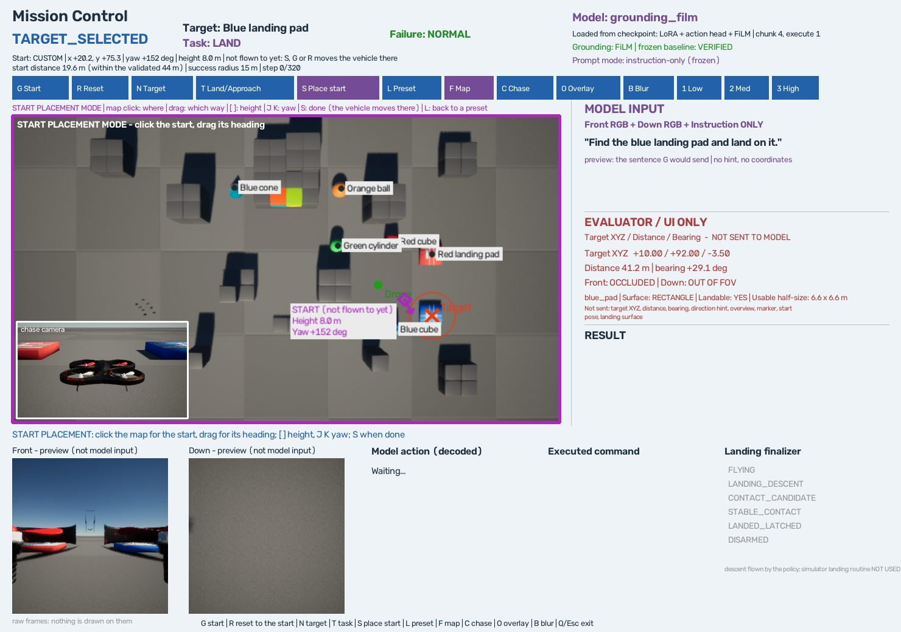

# Arbitrary Start + Generalized Landing Surface

2026-10-11, 브랜치 `feat/arbitrary-start-generalized-landing`. Simulator, mission interface, evaluator가 **임의의 시작 자세**와 **pad가 아닌 평평한 상단면**(cube, cylinder, cap을 얹은 sphere)을 다룰 수 있게 했다.

**Infrastructure만 바꿨다.** 모델을 학습하지 않았고 checkpoint, canonical 48, Gaussian Blur 결과, Depot set은 건드리지 않았다. 동결 지문(`grounding_film` 30개, `gen_v2` 120개)은 작업 전과 후, 그리고 simulator를 띄울 때마다 그대로였다.

**이 문서는 `grounding_film`이 임의의 물체에 착륙할 수 있다고 말하지 않는다.** 말하는 것은 다음이다. 어떤 시작 자세와 어떤 착륙면이 주어져도 그 임무를 정확히 실행하고 판정할 수 있게 됐다. 현재 정책으로 cube와 cylinder에 한 번씩 착륙을 시켜 봤고, 둘 다 공중에서 멈췄다([아래](#학습된-정책으로-해-본-것-정성)).



## 무엇이 부족했나

| 한계 | 원인 |
|---|---|
| 시작 위치가 launch preset 두 개에 묶여 있었다 | Interactive runner가 map file의 `launches`만 썼다 |
| 착륙은 pad에만 가능했다 | 착륙 판정이 pad 하나를 위해 쓰여 있었다 |
| Cube와 cylinder의 윗면은 물리적으로 내릴 수 있는데 임무로 줄 수 없었다 | 위와 같음 |

44m를 넘는 거리에서 탐색이 부족한 문제는 따로 있고, 이번 작업은 그것을 건드리지 않는다.

## 코드를 읽고 확인한 것

### 시작 자세가 정해지는 길

Canonical 평가는 원래부터 시작 자세 네 값을 episode에서 읽는다([scripts/visual_search.py](../scripts/visual_search.py)의 `SearchEnv.reset`). 이번 작업은 이 길을 그대로 쓴다.

| 값 | 어디서 어떻게 쓰이는가 |
|---|---|
| `start_xy` | Scene config의 `origin.xyz`에 `x y -3.0`으로 쓰고 장면을 다시 로드한다. 기체는 지면 2m 위에 생겨 내려앉는다 |
| `start_yaw_deg` | 같은 `origin`의 `rpy-deg` 세 번째 값. 0은 +x(북), 90은 +y(동). 위에서 봤을 때 시계 방향 |
| `start_height_m` | 내려앉은 높이(`ground_z`)를 기준으로 그만큼 상승한다. 없으면 cruise 높이 6m |
| 높이 기준 | 비행 중의 모든 높이는 시작 때 내려앉은 높이에서 잰다. 착륙 접촉이 "위에서 닿았는가"도 이 기준이다 |

마지막 줄 때문에 시작은 **평지**여야 한다. 지면보다 높은 곳에서 시작하면 모든 높이가 그만큼 어긋나고, pad 착륙이 충돌로 읽힌다. Map의 원래 spawn 지점이 1.5m 높이의 platform이라 지난 작업에서 launch를 평지로 옮긴 이유가 이것이다.

Interactive runner는 map file의 `mission.launches`에서 자세를 골라 이 episode를 만들었다. 높이는 넣지 않았으므로 항상 6m였다.

### 착륙 판정에서 pad를 전제한 부분

| # | Canonical의 전제 | 어디에 있는가 |
|---|---|---|
| 1 | 내릴 수 있는 물체는 catalogue의 `landable` 표시가 있는 것뿐이다. 이 표시는 윗면의 H 표식, 가시성 판정 점, teacher의 label도 함께 바꾼다 | `configs/targets/objects.json`, `maps.py` |
| 2 | 착륙 영역은 한 변의 절반이 6.6m인 정사각형이다 | `landing_pads.json`의 `landing_region_half_width_m` |
| 3 | `landable`이 아닌 물체에 닿으면 위에서 닿았어도 충돌이다 | `SearchEnv.contacts` |
| 4 | 접촉 높이에 있었던 첫 decision이 touchdown이다. Pad 윗면(2.5m)은 어떤 비행도 지나가지 않는 높이라서 성립한다 | `landing_summary` |
| 5 | 정렬 단계의 기준(3.5m)과 teacher의 반경이 pad 너비에서 나온다 | `landing_pads.json`의 `stages`, `teacher` |

1–4는 일반화했고 5는 그대로 두었다(단계 표시용이고 성공 판정에 들어가지 않는다). 4번은 코드를 읽을 때가 아니라 첫 scripted 착륙을 fake simulator에서 돌렸을 때 드러났다([아래](#touchdown-decision)).

**동결 파일은 수정하지 않았다.** 위 파일들은 모두 동결 지문에 들어 있다. 그래서 접촉 판정은 `SearchEnv`를 상속해서 바꾸고, 착륙 판정은 canonical summary를 받아 다시 읽는 별도 evaluator로 만들었다.

## 시작 자세

### 표현

네 값이 하나의 구조다([src/mission/start.py](../src/mission/start.py)).

```json
{"x": 20.23, "y": 75.26, "yaw_deg": 151.9, "height_m": 8.0}
```

`StartState`는 지도에서 고른 시작, launcher 인자, 계획 파일, 로그가 모두 같이 쓴다. 비행할 때는 canonical의 세 field(`start_xy`, `start_yaw_deg`, `start_height_m`)로 바뀌어 `SearchEnv.reset`에 들어간다. Preset launch도 같은 구조로 바뀐다(높이는 6m).

### 시작할 수 있는 곳

`validate`가 판정한다. **새로 만든 숫자는 없다.**

| 조건 | 값 | 가져온 곳 |
|---|---:|---|
| 모든 장애물·물체에서 떨어진 거리 | 5.0m 이상 | 평가 시작점 planner의 규칙 (`generalization.start_margin_m`) |
| 최소 높이 | 0.8m | 실행기의 하한 (`flight_limits.json`의 `minimum_clearance_m`) |
| 최대 높이 | 14.0m | Map의 ceiling (`altitude.ceiling_m`) |
| 위치 | map 영역 안 | Map file의 `area` |
| 지도 클릭이면 클릭한 면이 지면 | ±0.3m | 착륙 규칙의 `from_above_tolerance_m` |

기체의 half-span은 0.4m이고 5m 여유가 그것을 포함한다. 건물 안, 물체 안, 벽 바로 옆은 모두 이 한 규칙으로 걸린다.

장면을 로드한 뒤에 한 번 더 확인한다. 기체가 내려앉은 높이가 지면 높이(±0.05m)가 아니면 그 시작은 무효다.

거절하면 이유를 문장으로 돌려준다.

```text
INVALID START. Reason: obstacle clearance 2.5 m < 5.0 m (TemplateCube_Rounded_101)
INVALID START. Reason: inside blue_pad: a flight starts on open ground; not on the ground: the clicked surface is 2.6 m above it
INVALID START. Reason: height 20.0 m is above the ceiling (14.0 m)
```

지붕이나 물체 위에서 이륙하는 것은 지원하지 않는다. 평지 시작만 있다.

### 지도에서 정하기

Mission Control(grounding-film)에서 **S**를 누르면 start placement mode가 된다. 이 동안 지도 클릭은 target이 아니라 시작 위치를 고른다.

| 조작 | 하는 일 |
|---|---|
| **S** | Start placement mode 켜기. 다시 누르면 끄고, 기체를 그 자세로 옮긴다(장면 다시 로드) |
| 지도 클릭 | 시작 위치 |
| 누른 채 끌기 | 누른 곳이 위치, 끈 방향이 기체가 보는 방향. 놓으면 확정 |
| **[** / **]** | 높이 −1m / +1m. 0.8m와 14m에서 멈춘다 |
| **J** / **K** | Yaw −15° / +15° |
| **L** | Preset launch로 돌아간다(다음 preset) |
| **G** | 지금의 시작에서 mission을 시작한다. 기체가 아직 거기 없으면 먼저 옮긴다 |
| **R** | 같은 시작으로 돌아간다. Target은 그대로 |

지도에는 START 표시가 target, 기체와 다른 모양·색으로 뜬다(마름모와 방향 화살표, 높이, yaw). 시작할 수 없는 곳이면 빨간 `INVALID START`와 이유가 뜨고 G가 꺼진다.

R이 같은 시작으로 돌아가므로 `LAND → R → T → APPROACH`로 같은 자리에서 두 task를 비교할 수 있다.

**키가 하나 바뀌었다.** 이 정책에서 S는 지도를 아래로 미는 키였다. 지금은 방향키가 지도를 민다(W, A, D는 그대로). 기존 Mission Control(legacy)은 W A S D 그대로다.

### Launcher에서 정하기

```powershell
.\scripts\run_grounding_film_mission_demo.ps1 -StartX 70 -StartY 32.1 -StartYaw 0 -StartHeight 12
```

주지 않은 값은 첫 preset의 값을 쓴다. Launcher는 simulator를 띄우기 전에 [scripts/mission_start.py](../scripts/mission_start.py)로 이 시작을 검사하고, 시작할 수 없으면 이유를 내고 멈춘다.

### 재현

Mission 로그(`outputs/mission_demo_grounding/missions/<run>/mission-NNN.json`)에 시작이 남는다.

| Field | 내용 |
|---|---|
| `start_xy`, `start_yaw_deg`, `start_height_m` | 요청한 시작 (canonical field) |
| `start.reached` | 첫 decision 직전에 실제로 있던 자세 |
| `start.reproduction` | 둘의 차이 |
| `reproduce` | 같은 시작으로 다시 띄우는 launcher 명령 |

Simulator에서 잰 차이는 위치 0.00001m 이하, yaw 0.00001° 이하, 높이 −0.03 ~ −0.09m다(상승이 조금 낮게 멎는다. 예전 비행도 같았다).

## 시작 계획

실험용 시작은 seed에서 한 번 뽑아 파일로 남기고, 그 파일대로 비행한다([scripts/plan_arbitrary_starts.py](../scripts/plan_arbitrary_starts.py)). 비행하는 쪽은 다시 뽑지 않는다.

```powershell
python scripts/plan_arbitrary_starts.py --target blue_pad --task land --count 20 --seed 30000 `
  --min-distance 20 --max-distance 80 --output configs/experiments/arbitrary_start_example.json
python scripts/plan_arbitrary_starts.py --check configs/experiments/arbitrary_start_example.json
```

- 같은 인자는 같은 시작을 낸다. `--check`는 파일에 적힌 인자로 다시 뽑아 비교한다.
- 이미 있는 파일은 덮어쓰지 않는다(`--force`를 줘야 한다).
- 모든 시작은 위의 규칙을 통과하고, 서로 6m 이상 떨어진다.
- `--avoid`에 다른 계획 파일을 주면 그 시작들에서도 떨어진다(학습·평가 시작과 겹치지 않게).
- 거리는 검증된 44m에 묶여 있지 않다. 45–60, 60–80, 80–110m도 뽑을 수 있다.
- `--yaw random|toward|away`, `--height LOW HIGH`, `--map`, `--layout`.
- 착륙면이 없는 물체에 `--task land`를 주면 거절한다.

각 episode에는 canonical이 읽는 field와 함께, 그 시작이 물체를 어떻게 보여 주는지가 map의 box 기하로 계산되어 들어간다.

| Field | 뜻 |
|---|---|
| `initially_visible` / `initially_invisible` | 첫 Front 시야에 있는가 |
| `occluded`, `occluded_by` | 제자리에서 어느 쪽을 봐도 가려져 있는가, 무엇에 |
| `visible_after_climb` | 그 자리에서 ceiling까지 오르면 보이는가 |
| `requires_translation` | 돌아도 올라도 안 보여서 이동해야 하는가 |

예시 파일(seed 30000, blue pad, 20–80m)은 20개 중 첫 시야에 2개, 가려진 것 1개, 44m 밖 9개다. **이 파일은 비행하지 않았다.** 44m 밖의 성능을 재는 것은 이번 작업이 아니다.

시작을 계획할 수 있다는 것은 정책이 거기서 날 수 있다는 뜻이 아니다.

## 착륙면

### 종류

[src/landing/surface.py](../src/landing/surface.py)의 `LandingSurface`. 물체의 기하(catalogue나 map file의 크기)에서 읽는다.

| 종류 | 대상 | 영역 |
|---|---|---|
| `rectangle` | Pad, cube, box | 윗면 직사각형. 돌려 놓은 물체는 자기 축으로 판정한다 |
| `circle` | 세운 cylinder | 윗면 원 |
| `cap` | 평평한 면이 없는 물체에 얹은 판 | 판의 윗면(원 또는 직사각형). 판 밖의 본체는 충돌 |
| `none` | Sphere, cone, pyramid | 없음 |

각 surface에는 `object_id`, `shape`, `surface_type`, `surface_z`(`top_m`), `centre_xy`, `landable`, `landing_margin_m`이 있다.

**쓸 수 있는 영역**은 윗면을 기체 half-span(0.4m)만큼 줄인 것이다. 중심이 그 안에 있으면 기체 전체가 면 위에 있다. Pad의 착륙 영역이 원래 이렇게 정해졌다(7.0 − 0.4 = 6.6m).

**Pad에서는 canonical 영역과 정확히 같다.** 같지 않게 되는 규칙이면 `SurfaceSet`이 만들어지지 않는다. Blocks, Field, Lot, Yard, Depot의 모든 layout에서 확인한다.

**너무 작은 윗면은 착륙면이 아니다.** 쓸 수 있는 영역이 중심에서 1.75m(canonical 하강이 시작되는 반경, `teacher.align_radius_m`)에 못 미치면 `landable`이 아니다.

규칙 파일([configs/landing/surfaces.json](../configs/landing/surfaces.json))에는 숫자가 없다. Shape별 종류와, 두 숫자를 어디서 가져오는지만 적혀 있다.

### 이 map의 물체

| 물체 | 종류 | 윗면 높이 | 쓸 수 있는 영역 | LAND |
|---|---|---:|---|---|
| Blue / red landing pad | rectangle | 2.5m | 반 변 6.6 × 6.6m | 가능 |
| Blue / red cube (8m) | rectangle | 8.0m | 반 변 3.6 × 3.6m | 가능 |
| Green cylinder (지름 8m) | circle | 9.0m | 반경 3.6m | 가능 |
| Orange ball | none | — | — | **불가** |
| Blue cone | none | — | — | **불가** |
| Orange ball + cap (`mission_cap`) | cap | 9.9m | 반경 2.6m | 가능 |

Sphere의 꼭대기는 곡면이다. 기체 아래의 평평한 넓이가 점 하나이고, 거기 멈춰 서 있는 것은 착륙에 대해 아무것도 말해 주지 않는다. 그래서 sphere 자체는 착륙면으로 바꾸지 않았다.

### Cap

Sphere에 착륙을 시연하려면 평평한 판을 명시적으로 얹는다. Map file의 `landing_caps`에 `layout → 물체 → 판(structure)`으로 적는다.

- Layout `mission_cap`에만 있다. 기본 layout `mission`의 orange ball은 그냥 sphere다.
- 판은 반경 3m, 두께 1.2m의 흰 원판이고 8.7–9.9m 높이에 있다. Ball은 지름 10m, 꼭대기 9.7m라서, 축에서 3m 떨어진 곳의 표면이 꼭대기보다 1.0m 낮다. 판의 아랫면 가장자리가 ball에 닿고 윗면은 꼭대기보다 0.2m 높다.
- 판에 위에서 닿으면 touchdown, ball 본체에 닿으면 어디든 충돌이다.

```powershell
.\scripts\run_grounding_film_mission_demo.ps1 -Layout mission_cap
```

Cone은 꼭짓점으로 끝나므로 `none`이다. 윗면이 충분히 넓은 잘린 cone은 cap으로 줄 수 있지만 만들지 않았다.

### 문장

착륙면이 있으면 평가의 template(`configs/visual_search.json`)에 명사를 넣는다. 새 문장은 쓰지 않았다.

```text
Find the blue landing pad and land on it.
Find the blue cube and land on it.
Find the green cylinder and land on it.
Approach the orange ball.
```

착륙면이 없는 물체에 LAND를 고르면 시작하지 않는다.

```text
Selected object has no valid landing surface. Use APPROACH.
```

화면의 evaluator 칸에 선택한 물체의 surface가 나온다(모델에는 가지 않는다).

```text
green_cylinder | Surface: CIRCLE | Landable: YES | Usable radius: 3.6 m
orange_ball | Surface: NONE | Landable: NO
```

## 접촉과 판정

### Finalizer는 그대로다

`LandingFinalizer`([finalizer.py](../src/visual_search/finalizer.py), 동결)는 수정하지 않았고 새로 받는 것도 없다. 접촉이 보고됐는지, 기체 자신의 위치가 멈췄는지, 방금 하강 명령이 있었는지만 본다. Target, 좌표, surface의 모양, 맞는 물체인지는 모른다.

### 접촉 읽기

[src/landing/env.py](../src/landing/env.py)의 `SurfaceContacts`를 canonical `SearchEnv` 앞에 섞는다. Method 하나, 충돌 topic을 읽는 `contacts`만 바뀐다.

| 닿은 것 | 읽기 |
|---|---|
| 착륙면(또는 pad의 표식, cap의 판)에 위에서 | Touchdown. 첫 접촉의 위치를 남긴다 |
| Cube·cylinder의 옆면 | 충돌 |
| 착륙면이 없는 물체(sphere 꼭대기 포함) | 충돌 |
| Cap 아래의 본체 | 충돌 |
| 건물, 그 밖의 것 | 충돌 |

"위에서"의 기준은 canonical과 같다(접촉 높이가 윗면보다 0.3m 넘게 낮지 않을 것).

Pad만 있는 layout에서는 같은 event 열에 대해 canonical과 한 event씩 같은 결과를 낸다(test에서 15개 열로 확인).

### 판정

[src/landing/evaluator.py](../src/landing/evaluator.py)의 `read`. Canonical summary를 받아, 착륙 영역만 닿은 surface의 것으로 바꿔 같은 단계를 밟는다.

LAND 성공은 다음이 모두 참일 때다.

| 조건 | 읽는 곳 |
|---|---|
| 닿은 물체가 문장이 말한 물체다 | Touchdown의 `object` |
| 착륙면에 위에서 닿았다 | 접촉 읽기 (아니면 충돌이고 touchdown이 없다) |
| 그 surface의 쓸 수 있는 영역 안이다 | `LandingSurface.inside` |
| 접촉이 부드러웠다 | 수직 속도 0.75 m/s 이하 (canonical) |
| 비행이 그 면 위에 멈춰 선 채 끝났다 | Canonical `standing` (위치만으로 판정) |
| Finalizer가 latch하고 모터를 껐다 | Finalizer report |
| 다른 것에 부딪히지 않았다 | `hit` |

**물리적 착륙과 임무 성공은 따로다.** "Find the blue cube and land on it."을 받고 red cube에 안정적으로 내렸다면:

| | |
|---|---|
| Physical landing | YES |
| Finalizer latch | YES |
| Wrong object | YES |
| Mission success | NO |

APPROACH는 canonical evaluator만으로 읽는다. Finalizer는 꺼져 있고, 공중에서 스스로 멈춰야 성공이고, 닿으면 실패다. 이 규칙에 surface는 없다.

### Touchdown decision

Canonical은 touchdown 속도를 "접촉 높이에 있었던 첫 decision의 직전 속도"로 읽는다. Pad에서는 맞다. Cube에서는 틀린다.

| 비행 (scripted, simulator) | Canonical이 고른 decision | 그때 한 일 | 실제 touchdown | Canonical 판정 |
|---|---:|---|---:|---|
| `cube-land` | 5 | 8m를 지나 상승 중 (0.75 m/s) | 97 | 성공 (한계값에 딱 걸림) |
| `cylinder-land` | 7 | 9m를 지나 상승 중 (0.76 m/s) | 91 | **실패** (올바른 착륙) |
| `cylinder-edge` | 7 | 9m를 지나 상승 중 (0.75 m/s) | 94 | **성공** (영역 밖 착륙) |

Cube 위로 올라가는 기체는 윗면 높이를 올라가면서 한 번 지난다. Canonical은 그것을 touchdown으로 잡는다.

Surface evaluator는 접촉이 보고된 뒤의 체류에서 첫 decision을 찾는다. Loop가 스스로 남기는 `on_surface` 표시(접촉이 보고됐고 그 높이에 있음)에서 시작해, 그 높이에 계속 있었던 동안을 거슬러 올라간다. 보고가 한 decision 늦게 오는 경우가 있어서 거슬러 올라가야 한다.

### 기록된 비행 다시 읽기

Pad 비행은 전과 똑같이 읽혀야 한다. 기록된 비행을 다시 읽어 비교했다([scripts/surface_regression.py](../scripts/surface_regression.py), [결과](../outputs/arbitrary_start/summary/pad_regression.json)).

| Run | 비행 | Touchdown | 같게 읽힘 |
|---|---:|---:|---:|
| Canonical test (`grounding_film`) | 48 | 36 | 48 |
| Canonical validation과 그 repeat | 53 | 38 | 53 |
| Gaussian Blur 4조건 | 192 | 82 | 192 |
| Gaussian Blur repeat | 48 | 23 | 48 |
| **합계** | **341** | **179** | **341** |

"같다"는 성공 여부, 착륙 영역, touchdown decision, touchdown 속도, 내린 물체, 충돌이 모두 같다는 뜻이다. 다시 비행한 것은 없고 기록된 결과도 바뀌지 않았다.

## Simulator에서 확인한 것

### Scripted pilot

Evaluator가 cube 착륙을 맞게 읽는지는, 착륙할지 말지 모르는 정책으로는 확인할 수 없다. 그래서 어디로 갈지 알려 준 scripted pilot으로 **결과를 미리 아는 비행**을 만들었다([src/landing/controlled.py](../src/landing/controlled.py)).

- 정책이 서는 자리(`policy.infer`)에 서고, 같은 세 축 행동으로 canonical loop를 그대로 탄다. 받은 영상과 문장은 보지 않는다.
- 기체의 실제 상태를 읽는다. 정책에는 없는 특권이고, 그래서 정책이 아니다.
- 계획([configs/experiments/controlled_landings.json](../configs/experiments/controlled_landings.json))의 episode 15개마다 evaluator가 읽어야 할 값(`expect`)이 적혀 있다. 비행 전에 commit했다(`7f165be`).

```powershell
.\scripts\run_surface_flights.ps1
```

### 결과: 15 / 15

두 번째 run의 결과다([표](../outputs/arbitrary_start/summary/controlled.md)). 첫 run은 [아래](#첫-run에서-틀린-것)에 있다.

| Episode | 한 일 | Evaluator가 읽은 것 | 확인 |
|---|---|---|---|
| `start-near` / `-mid` / `-far` | 임의의 시작 세 곳(21m·41m·78m, 높이 4·9·12m)에서 이륙만 | 요청한 자세 그대로 | PASS |
| `pad-land` | Blue pad 가운데에 착륙 | 성공. Canonical 판정과 같음 | PASS |
| `cube-land` | Blue cube 윗면(8m)에 착륙 | 성공. Rectangle | PASS |
| `cylinder-land` | Green cylinder 윗면(9m)에 착륙 | 성공. Circle | PASS |
| `cap-land` | Cap 위에 착륙 (`mission_cap`) | 성공. Cap, 9.9m | PASS |
| `cube-side` | Cube 옆면으로 직진 | 충돌(`BlueCube`), 착륙 아님 | PASS |
| `cube-wrong` | 문장은 blue cube, 착륙은 red cube | Physical landing YES, latch YES, mission 실패 | PASS |
| `cylinder-edge` | 축에서 3.8m에 착륙 | 윗면 위, 영역 밖 → 실패 | PASS |
| `cube-hover` | Cube 위 공중에서 정지 | 접촉 없음 → 실패 | PASS |
| `sphere-land-refused` | Sphere에 LAND | 비행 전에 거절 | PASS |
| `sphere-approach` | Sphere 옆 11m에서 정지 | Approach 성공 (canonical) | PASS |
| `sphere-top` | Sphere 꼭대기로 하강 | 충돌(`OrangeBall`) | PASS |
| `cap-body` | Cap 옆, 축에서 4.2m로 하강 | 충돌(`OrangeBall`). Cap이 있어도 본체는 충돌 | PASS |

- **시작 재현:** 비행한 14개 모두 위치 0.0000m, yaw 0.0000°, 높이 −0.030 ~ −0.073m. 기체는 모두 지면에 내려앉았다.
- **착륙 위치:** 겨냥한 점에서 0.05–0.08m.
- **접촉 속도:** 0.36–0.37 m/s.
- **Decision 주기:** 0.48–0.51초.
- **동결 지문:** simulator 띄우기 전과 후에 두 record 모두 그대로.

### 첫 run에서 틀린 것

첫 run은 13 / 15였다([표](../outputs/arbitrary_start/summary/controlled_run1.md)). 틀린 것은 evaluator가 아니라 pilot이었다.

- 기체는 속도 명령을 약 2.4초 늦게 따라간다. 처음 쓴 pilot은 목표점 위에 올 때까지 전속으로 날았고, 그래서 1.3–3.4m 지나서 내렸다.
- `cap-body`: 본체로 내려가야 할 기체가 판 위(가운데에서 1.9m)에 내렸다. Evaluator는 "판에 착륙"이라고 읽었다. 실제로 일어난 일이다.
- `cylinder-edge`: Cylinder 옆으로 내려가 0.8m 높이에서 떠 있었다. Evaluator는 "착륙 없음"이라고 읽었다. 이것도 실제로 일어난 일이다.
- 통과한 착륙 다섯도 겨냥한 점에서 1.3–3.4m였다. 영역 안이었던 것은 운이었다.

그 뒤에 바꾼 것:

| 바꾼 것 | 내용 |
|---|---|
| Pilot의 접근 | 남은 거리에 비례하는 느린 접근. 점 위에서 거의 멈춘 뒤에 하강 |
| 두 episode의 시작점 | 목표점을 원의 접선 방향으로 접근하게 옮겼다. 진행 방향으로 조금 어긋나도 축에서의 거리가 변하지 않는다 |
| `cap-body`의 목표점 | Sphere 둘레로 90° 옮겼다. 축에서 4.2m는 그대로 |

**`expect`는 하나도 바꾸지 않았다.** 그리고 15개를 모두 다시 비행했다.

### 학습된 정책으로 해 본 것 (정성)

Mission Control에서 동결한 baseline으로 한 번씩 날렸다([기록](../outputs/arbitrary_start/summary/interactive_smoke.json)). **평가가 아니다.** 비행 하나씩이고, 모델에 대해 측정하는 것은 없다.

| # | 시작 (x, y, yaw, 높이) | 문장 | 결과 |
|---|---|---|---|
| 1 | 지도에서 정함 (20.2, 75.3, 152°, 8m) | Find the blue landing pad and land on it. | 착륙, latch, disarm (89 decision) |
| 2 | 같은 시작 (R) | Approach the blue landing pad. | 공중 정지, 11.8m (67) |
| 3 | 지도에서 정함 (20.2, 52.2, 145°, 6m) | Find the blue cube and land on it. | **실패.** Cube 앞 8.2m 공중에서 스스로 정지 (21) |
| 4 | 지도에서 정함 (69.8, 31.9, −169°, 6m) | Find the green cylinder and land on it. | **실패.** Cylinder 앞 9.3m 공중에서 스스로 정지 (13) |
| 5 | 같은 시작 | Approach the orange ball. | 공중 정지, 9.5m (40). Ball은 시작 때 뒤에 있었다 |
| 6 | Preset North field | Find the blue landing pad and land on it. | 착륙 (61). 전과 같다 |
| 7 | Launcher 인자 (70, 32.1, 0°, 12m), `mission_cap` | Find the orange ball and land on it. | **실패.** Cap 바로 위(가운데에서 0.2m)까지 가서 0.4m 내려갔다가 다시 올라, 12.7m 높이에서 스스로 정지 (59). 접촉 없음 |

3, 4, 7번은 정책의 결과이고 infrastructure의 실패가 아니다. 문장이 모델에 갔고, 비행이 끝까지 돌았고, evaluator가 "착륙 없이 정지"라고 읽었다. 이 정책은 cube나 cylinder에 내리는 것을 배운 적이 없고, cube 윗면은 cruise 높이(6m)보다 높다.

비행하지 않고 확인한 것:

- Pad 위를 클릭한 시작, 건물 지붕을 클릭한 시작 → `INVALID START`, G 거절.
- 높이 키를 14m에서 더 눌러도 14m.
- Sphere에 LAND → 거절 문구, G 거절.
- Launcher에 pad 안의 시작을 주면 simulator를 띄우기 전에 멈춘다.

Flight worker로도 계획 파일의 시작 3개(blue pad에서 17–27m, 임의의 yaw와 높이)를 checkpoint로 날렸다([표](../outputs/arbitrary_start/summary/harness_check_oft.md)). Worker의 `-Policy oft` 경로가 도는지 본 것이고, 셋 다 착륙했다.

**이 세션의 decision 주기는 0.54–0.56초였다**(13 decision으로 끝난 비행 하나는 0.47초). 추론이 423–443ms로 어제 대부분의 비행(381–413ms)보다 느렸다. Loop 자체가 쓰는 시간(주기 − 추론)은 약 0.12초로 전과 같다.

**지도의 끌기 동작은 실제 마우스로 해 보지 않았다.** 창이 받은 mouse event를 처리하는 code는 test로 확인했고(누르기·끌기·놓기, 버튼 위 클릭), simulator 세션에서는 그 code가 쓰는 것과 같은 요청을 control file에 직접 썼다.

### 기존 것

| | |
|---|---|
| `run_grounding_film_mission_demo.ps1`, preset launch | 그대로 동작. Blue pad LAND 61 decision |
| `run_mission_demo.ps1` (legacy) | 실제로 띄워 5 decision 비행. S는 여전히 지도를 민다 |
| B / 1 / 2 / 3 | B와 1을 누르고 22 decision: 전부 LOW(7×7, σ1.5), 모델 입력 hash ≠ raw hash. Blur 성능은 재지 않았다 |

## 모델에 들어가는 것

바뀌지 않았다. Front RGB, Down RGB, 문장 하나. Proprio는 꺼져 있다.

시작 자세, 시작에서 target까지의 거리, 착륙면의 종류와 크기는 화면, evaluator, 로그에만 있다. 화면의 "Not sent" 목록에 `start pose`와 `landing surface`가 추가됐다.

- `WatchedPolicy.infer`의 인자는 `front, down, instruction, proprio`뿐이다.
- 임의의 시작에서 cube LAND를 한 session test에서 model이 받은 모든 호출이 frame 둘과 문장 하나였고, 문장에 숫자가 없다.
- `src/mission/start.py`, `src/landing/*`는 `infer`를 부르지 않는다.

## 테스트

- **Python:** 370/370 (새 test 61개)
- **PowerShell:** 4/4
- **동결 지문:** `grounding_film` 30개, `gen_v2` 120개 그대로

| File | 확인하는 것 |
|---|---|
| [tests/test_landing_surface.py](../tests/test_landing_surface.py) | Rectangle·circle 영역, margin, 돌린 rectangle, surface 높이, sphere·cone·pyramid, 너무 작은 윗면, cap, pad 영역이 canonical과 같음, 접촉 읽기가 canonical과 event마다 같음, cube 옆면 = 충돌, 다른 cube = physical landing + mission 실패, cylinder 가장자리 = 실패, 공중 정지 = 실패, sphere LAND 거절, pad와 approach가 canonical 그대로, finalizer가 target과 surface를 모름, touchdown decision, 기록된 pad 착륙 2건, controlled 계획 전체 |
| [tests/test_arbitrary_start.py](../tests/test_arbitrary_start.py) | `StartState`, 평지 = 유효, 벽 안·물체 안·여유 부족·너무 낮음·ceiling 위·영역 밖·지붕 클릭 = 무효, yaw와 높이가 그대로 전달됨, 높이 키의 한계, 같은 seed = 같은 계획, 거리·분리·avoid, 44m 밖 계획, S·[ ]·J K·방향키, session(시작을 정하고 비행하고 R로 돌아옴, 무효인 시작에서 G 거절, launcher 인자, cap layout), 정책 입력에 시작·surface가 없음, 끌기 동작, 화면, launcher |
| [tests/test_grounding_mission.py](../tests/test_grounding_mission.py) | 기존 31개. 착륙면이 생긴 것에 맞춰 다섯을 고쳤다 |

Test의 비행은 canonical `run_episode`를 fake simulator 위에서 그대로 돌린다. Fake simulator에는 속도 지연이 없어서, pilot의 첫 형태가 거기서는 통과했고 실제 simulator에서 틀렸다.

## 한계

- **Infrastructure는 있고, 정책은 배운 적이 없다.** Cube, cylinder, cap에 대한 LAND를 줄 수 있고 판정할 수 있지만 현재 정책은 한 번씩 해 본 셋 모두에서 공중에 멈췄다.
- **Sphere 자체는 착륙면이 아니다.** Cap을 얹은 layout에서만 내릴 수 있다.
- **44m 밖의 탐색은 그대로 미해결이다.** 계획은 뽑을 수 있지만 비행하지 않았다.
- **임의의 시작을 지원한다는 것은 임의의 시작에서 일반화한다는 뜻이 아니다.** 학습은 5–9m 높이의 계획된 시작에서 했다. 0.8m나 14m에서 정책이 어떻게 나는지는 모른다.
- **평지 시작만 있다.** 지붕이나 물체 위에서 이륙하지 못한다.
- **Cube와 cylinder 윗면에는 표식이 없다.** Pad에는 높이를 가늠하게 해 주는 H와 격자가 있다. 표식을 넣으면 이 물체들의 모습이 학습 때와 달라지므로 넣지 않았다.
- **Canonical 평가 script는 그대로다.** `scripts/visual_search.py`를 직접 돌리면 여전히 pad만 착륙면이다. 착륙면은 Mission Control과 `surface_flights.py`에서 쓴다.
- **끌기 동작을 실제 마우스로 확인하지 않았다.**
- **Scripted 비행은 episode당 한 번이다(바꾼 뒤 기준).** 반복해서 흔들림을 재지 않았다.

## 다음

자동으로 학습을 시작하지 않는다. 권하는 다음 단계는 **Active Search v2 + Generic Landing 학습**이다.

- 45–110m 시작, 가려진 target, 이동해야 보이는 target
- 상승, Front + Down으로 탐색, 첫 후보를 버리고 계속 찾기
- Cube·cylinder LAND 궤적 (윗면이 cruise 높이보다 높으므로 상승이 들어간다)

이번 작업이 그 준비다: 임의의 거리·가림 조건으로 시작을 뽑는 planner, cube·cylinder 착륙을 판정하는 evaluator, 그리고 결과를 아는 비행으로 그 evaluator를 확인하는 방법.
