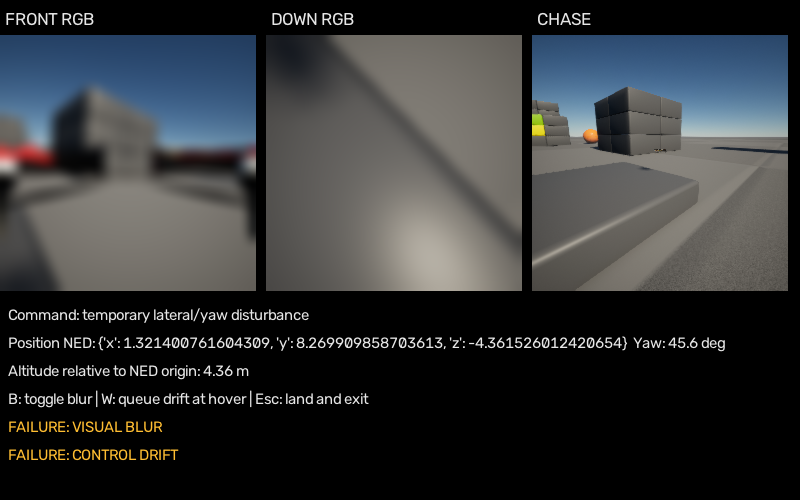

# Windows Project AirSim smoke test

2026-10-05 KST. **RTX 5070에서 Windows Project AirSim rendering, front/down camera, scripted flight, 임시 blur/drift demo를 실행했다. 전체 판정은 ⚠️**: takeoff의 False 반환과 미측정 renderer FPS가 남았다. 이전 Microsoft AirSim 1.8.1 Blocks 결과와 별개다.

## B1 — 공식 배포와 API

| 항목 | 결과 |
|---|---|
| Repository | iamaisim/ProjectAirSim |
| 최신 안정 simulator release | **v1.0.1**, prerelease=false |
| Release date | **2026-09-07 18:37:12 UTC** |
| 지정 / 실제 Python client | **projectairsim 1.0.2 / 1.0.2** |
| Python | 별도 Windows venv, 3.12.14 |
| Unreal | 다운로드한 Blocks build-manifest **5.2**; 다른 plugin의 5.7과 구분 |
| Windows support | 공식 prebuilt와 실제 launch 확인 |
| Prebuilt maps | Blocks, LandscapeMountains, Neighborhood, CityEnviron |
| Drone example | hello_drone.py, Simple Flight quadrotor |
| Camera API | Drone.get_images(camera_id,[0]), 또는 topic subscription |
| Vehicle API | enable_api_control, arm, takeoff_async, body/world velocity, yaw, hover, land |
| Transport | NNG topics **8989** / services **8990**; legacy AirSim 41451과 다름 |

출처: [공식 release](https://github.com/iamaisim/ProjectAirSim/releases/tag/v1.0.1), [실행 안내](https://github.com/iamaisim/ProjectAirSim/blob/v1.0.1/docs/development/use_prebuilt.md), [drone example](https://github.com/iamaisim/ProjectAirSim/blob/v1.0.1/client/python/example_user_scripts/hello_drone.py), [Robot camera API](https://github.com/iamaisim/ProjectAirSim/blob/v1.0.1/client/python/projectairsim/src/projectairsim/robot.py), [Drone API](https://github.com/iamaisim/ProjectAirSim/blob/v1.0.1/client/python/projectairsim/src/projectairsim/drone.py).

Source pyproject의 1.0.1 대신 release가 지정한 PyPI client **1.0.2**를 설치했다. 버전 반복 설치는 없었고 `pip check`가 통과했다. Dependency freeze (`outputs/platform_final/client-freeze.txt`, 로컬 기록·Git 제외). 기존 WSL NF4 환경은 수정하지 않았다.

## B2 — 최소 다운로드와 원본 보존

**Blocks Windows 한 개**: 677,972,773 bytes = 646.565 MiB. LandscapeMountains Windows(647,830,770 bytes)가 더 작지만 사용자 우선순위 Blocks를 선택했다. 다른 map은 받지 않았다.

SHA256 `ae86066b588783512ab0d420e29b05cb9b1deea86cc130aad6e3480eb63859d1` 및 byte size가 official release와 일치한다. Download manifest (`outputs/platform_final/download.json`, 로컬 기록·Git 제외), release metadata (`outputs/platform_final/release.json`, 로컬 기록·Git 제외).

Executable: `<repository>\assets\projectairsim-blocks-1.0.1\Blocks\Binaries\Win64\Blocks-Win64-Shipping.exe`. Package source SHA는 `deff6aa11dd8961ae5de05ea64630995a12bbf67`, source tag는 `validation-release-1.0.1`이다. 해당 SHA의 공개 raw source는 404여서 release tag의 코드만으로 binary 내부 원인을 확정하지 않는다.

공식 config를 별도 실험 설정 (`outputs/platform_final/sim_config/scene_basic_drone.jsonc`, 로컬 기록·Git 제외)으로 복사했다. Drone1, front/down/chase 256×256 RGB, FOV 90°, interval 0.0333333 s, clock ratio 1. Chase streaming=true로 main viewport를 구성하고 front/down은 request-response로 받는다. Upstream/기존 TravelUAV map은 덮어쓰지 않았다.

## B3 — GPU와 자원 실측

Simulator는 960×540 windowed, camera/debug는 별도 OpenCV 창으로 실행했다. MainWindowTitle은 `Blocks Environment`, NNG 포트 owner는 해당 simulator PID였다.

| 지표 | 값 / 증거 |
|---|---|
| GPU | RTX 5070, driver 591.86, 12,227 MiB = **11.940 GiB** |
| RTX rendering | ✅ nvidia-smi GPU 0 RTX 5070에 simulator PID 43976 C+G 등록; 해당 PID의 WDDM 3D 활성, 실제 RGB 수신 |
| Renderer | Windows hardware Direct3D; **D3D12 추정**: d3d12.dll/D3D12Core.dll/nvwgf2umx.dll 로드. d3d11.dll도 로드돼 exact active RHI는 미확정 |
| Unreal RHI log | Shipping binary가 요청한 abslog 파일을 만들지 않음. 별도 Project AirSim server log 확보 |
| llvmpipe | NVIDIA 3D engine 사용 확인; llvmpipe/Vulkan process 증거 없음 |
| Simulator dedicated GPU peak / mean | **941.184 / 940.300 MiB**; peak **0.919 GiB** |
| Simulator shared GPU peak | **172.418 MiB**, system-backed memory; dedicated에 합산하지 않음 |
| Simulator 3D utilization mean / peak | **58.25 / 61%** |
| Global NVIDIA GPU utilization peak | **60%**, 다른 앱 포함 |
| Global GPU memory peak | **3,368 MiB = 3.289 GiB**, desktop/driver/다른 앱 포함 |
| 종료 후 global GPU memory | 1,954 MiB = 1.908 GiB; 앞뒤 차이는 simulator 전용 실측과 다름 |
| Simulator RAM working set peak | **668.879 MiB = 0.653 GiB** |
| Simulator RAM private commit peak | **1,572.121 MiB = 1.535 GiB** |
| Simulator CPU mean / peak | **30.72 / 46.65%**, 12 logical CPUs로 정규화 |
| 전체 system RAM used peak | **18.998 GiB**, simulator 전용 값이 아님 |
| Renderer FPS | **NOT MEASURED**; stat fps 실제 표시를 읽지 못함 |
| Debug GUI refresh | **5.24 FPS**; 세 camera 순차 RPC, decode, state, GUI, PNG 저장 포함 |

최종 run에 해당하는 32개 WDDM 표본을 집계했다. Task Manager UI를 직접 읽은 값이 아니라 동일 GPU performance counter 계열의 programmatic 수집이다. Camera/debug FPS를 renderer FPS로 쓰지 않았다. Raw samples (`outputs/platform_final/wddm-samples.jsonl`, 로컬 기록·Git 제외), renderer DLL (`outputs/platform_final/renderer-modules.json`, 로컬 기록·Git 제외), server log (`outputs/platform_final/projectairsim-server.log`, 로컬 기록·Git 제외), summary (`outputs/platform_final/summary.json`, 로컬 기록·Git 제외).

## B4 — 실제 비행과 반환값 제한

Spawn → takeoff → up → forward → right yaw → forward → down → hover → 임시 drift → hover → land → disarm을 실행했다.

| 명령 | Return | 실제 변화 |
|---|---|---|
| takeoff | **False** | Z -1.309 m, 실제 상승 |
| up | True | Z -1.108 m |
| forward | True | X +1.308 m / Y -1.209 m |
| yaw right | True | +59.18° |
| forward after yaw | True | X +1.670 m / Y +0.452 m |
| down | True | Z +0.590 m |
| hover | True | 작은 위치 변화, 유지 명령 응답 |
| temporary lateral/yaw disturbance | True | X -0.450 m / Y +1.151 m / yaw +29.92° |
| land | True | Z +1.681 m, touchdown 위치와 zero velocity |
| disarm 후 landed | 0 = LANDED | 정상 |

GUI run 두 번과 **GUI/camera 없는 최소 재현**에서 takeoff False가 반복됐다. 최소 재현은 3.24 s 후 상승해 단순 GUI 문제로 보지는 않는다. 진단 JSON (`outputs/platform_final/control-diagnosis.json`, 로컬 기록·Git 제외). Exact cause는 미확정이다. Release-tag 코드의 MoveToPosition/MoveOnPath completion 및 estimator/frame semantics가 확인 지점이며 binary source가 공개 조회되지 않아 upstream bug를 확정하지 않았다.

Land 직후 motor가 켜져 있으면 FLYING state가 남았고 disarm 후 2초에는 LANDED였다. **Drone control ⚠️**: 기본 motion은 확인했지만 takeoff 반환 계약을 완전히 통과했다고 하지 않는다.

## B5 — 카메라 100-frame 테스트

Camera별 첫 5개 warm-up 이후 **100회 request-response**. Timestamp 100개씩 모두 unique/monotonically increasing. Resolution 256×256, encoding BGR.

| Camera | n | mean | median | p95 | effective FPS |
|---|---:|---:|---:|---:|---:|
| Front RGB | 100 | **40.759 ms** | **40.587 ms** | **42.019 ms** | **22.42** |
| Down RGB | 100 | **40.885 ms** | **40.765 ms** | **42.048 ms** | **22.33** |

Latency는 get_images 호출→response 수신: 다음 capture 대기, serialization, transport 포함. FPS는 acquisition+decode wall time 기준. Camera별 따로 측정했으므로 **22 FPS synchronized dual-view pair를 증명하지 않는다**. Absolute capture-to-receive age 또는 renderer FPS도 아니다. p95는 NumPy linear percentile.

Raw 100개씩 (`outputs/platform_final/projectairsim-result.json`, 로컬 기록·Git 제외), run log (`outputs/platform_final/projectairsim-probe.log`, 로컬 기록·Git 제외), front (`outputs/platform_final/FrontCamera-measured.png`, 로컬 기록·Git 제외), down (`outputs/platform_final/DownCamera-measured.png`, 로컬 기록·Git 제외).

## B6/B7 — 폐기 가능한 demo

Simulator와 별도 창에 front/down/chase, NED position, yaw, NED origin 기준 altitude, command를 표시했다. 다음 PNG는 **실제 camera 기반 debug export이며 desktop screenshot이 아니다**.



- B: blur toggle. 실제 검증은 `--auto-failures` config 경로였다. 사용자 키 입력 자동화는 하지 않았다.
- W: 다음 hover에서 2초 lateral 0.7 m/s + yaw 15°/s 예약. 즉시 interrupt/physical wind model은 구현하지 않았다.
- `FAILURE: VISUAL BLUR`, `FAILURE: CONTROL DRIFT` 표시와 실제 위치/yaw 변화를 확인했다.
- Gaussian blur 21×21, sigma 6 적용. 최초 GUI run의 보존된 source/output pair에서 Laplacian variance **237.35 → 1.36**.
- 다음 hover/land는 고정 script 명령이다. Failure Detection/Recovery 구현은 아니다.
- **Visual demo quality: Good (잠정 기술 평가)**. 실제 사용자 재미 평가는 미수집. 5.24 FPS와 단순 Blocks 때문에 Excellent로 보지 않는다.

[Prototype](../../scripts/projectairsim_probe.py), [visible launcher](../../scripts/run_projectairsim_demo.ps1), blur export (`outputs/platform_final/demo-blur.png`, 로컬 기록·Git 제외). VLA는 연결하지 않았다.

현재 준비된 환경에서 PowerShell로 재실행:

```powershell
Set-Location '<repository>'
.\scripts\run_projectairsim_demo.ps1 -AutoFailures
```

`-AutoFailures` 생략 시 자동 장애는 꺼지고 B/W 입력은 사용할 수 있다. Benchmark 후 약 40초 script 비행을 보이고 종료한다. 수동 실행은 manual-demo-result.json을 생성하고 camera PNG를 갱신하므로 evidence 보존 시 outputs/platform_final을 먼저 복사한다.

## AeroVLA adapter — Medium

Dual image, state, velocity, yaw primitive가 있지만 legacy MultirotorClient의 주소만 바꾸는 방식은 안 된다. [공식 API 문서](https://github.com/iamaisim/ProjectAirSim/blob/v1.0.1/docs/api.md)는 strict legacy backward compatibility를 목표로 하지 않는다고 명시한다.

실제 AeroVLA AirVLNSimulatorClientTool_AeroVLA.py는 fwd/down **거리**와 yaw **radian increment**를 world displacement로 바꾸고 legacy yaw API에는 **degree**를 전달한다. Project AirSim yaw API는 radian이므로 단위/좌표와 duration을 보존해야 한다. BGR→RGB, front/down 순서/결합, timestamp alignment와 pose schema 변환도 필요하다.

향후 WSL inference는 NNG 8989/8990 **두 경로**를 새로 검증해야 한다. 이번 client는 Windows native였다. 기존 legacy 1-port reverse bridge를 Project AirSim split inference 통과로 취급하지 않는다. VLA adapter와 AeroVLA NF4 loader는 미구현/미실행이다.

## B8 — 결과

```yaml
Project AirSim Result: ⚠️
Windows launch: ✅
RTX 5070 rendering: ✅
Drone control: ⚠️  # takeoff False; 실제 motion/land/disarm 확인
Front RGB: ✅
Down RGB: ✅
Camera latency:
  Front mean/median/p95 ms: 40.759 / 40.587 / 42.019
  Down mean/median/p95 ms: 40.885 / 40.765 / 42.048
Simulator VRAM: 941.184 MiB dedicated peak
System RAM: 668.879 MiB working set; 1572.121 MiB private commit
Approx FPS: camera 22.42/22.33; debug 5.24; renderer NOT MEASURED
Failure injection prototype: ✅  # config path
Visual demo quality: Good  # 잠정 기술 평가
AeroVLA adapter feasibility: Medium
Major blockers:
  1: takeoff False 의미/원인 미해결
  2: WSL NNG dual-port 연결 및 API adapter 미검증
  3: 실제 AeroVLA NF4 loader와 공존 VRAM 미검증
```

측정 후 창/프로세스를 종료하고 listener 8989/8990이 없어졌다. Cleanup (`outputs/platform_final/cleanup.json`, 로컬 기록·Git 제외). Model, CityEnviron, 전체 dataset은 다운로드하지 않았다.
