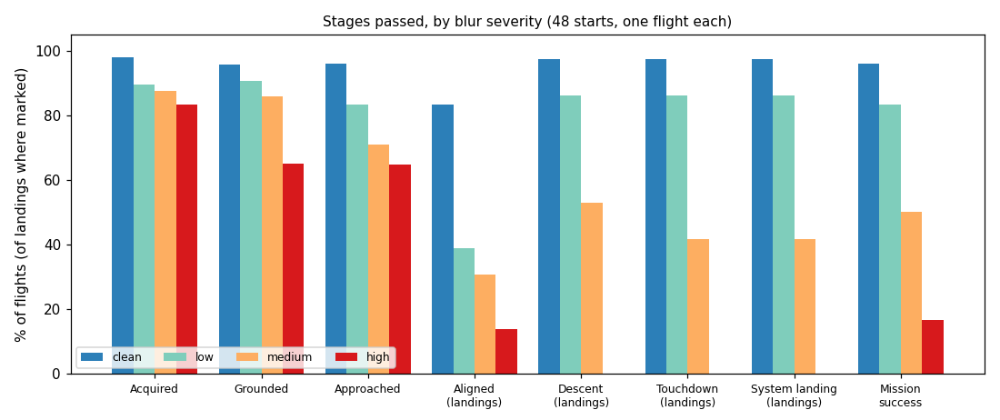
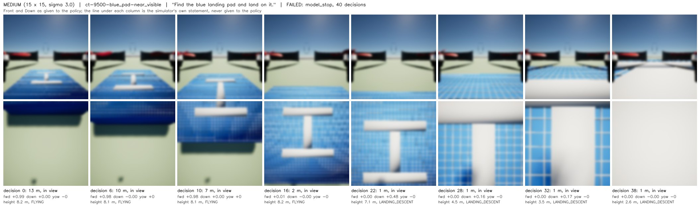
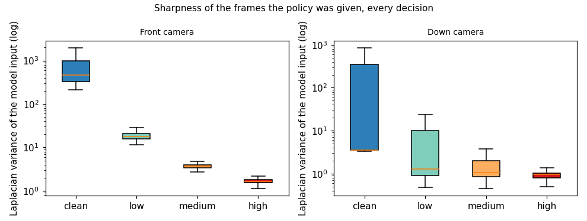
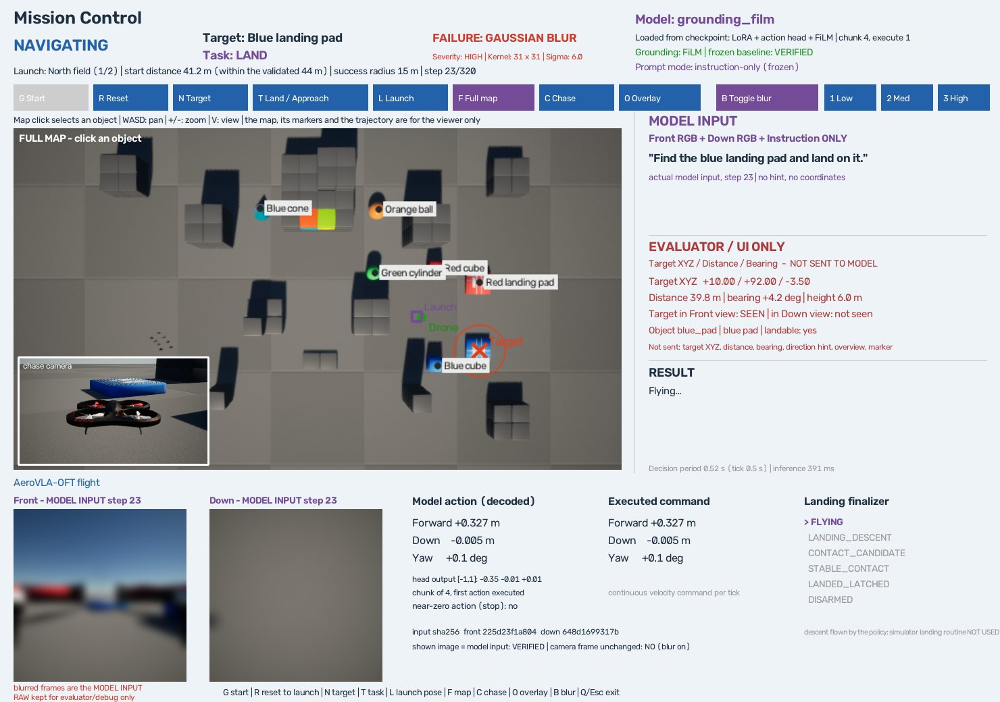
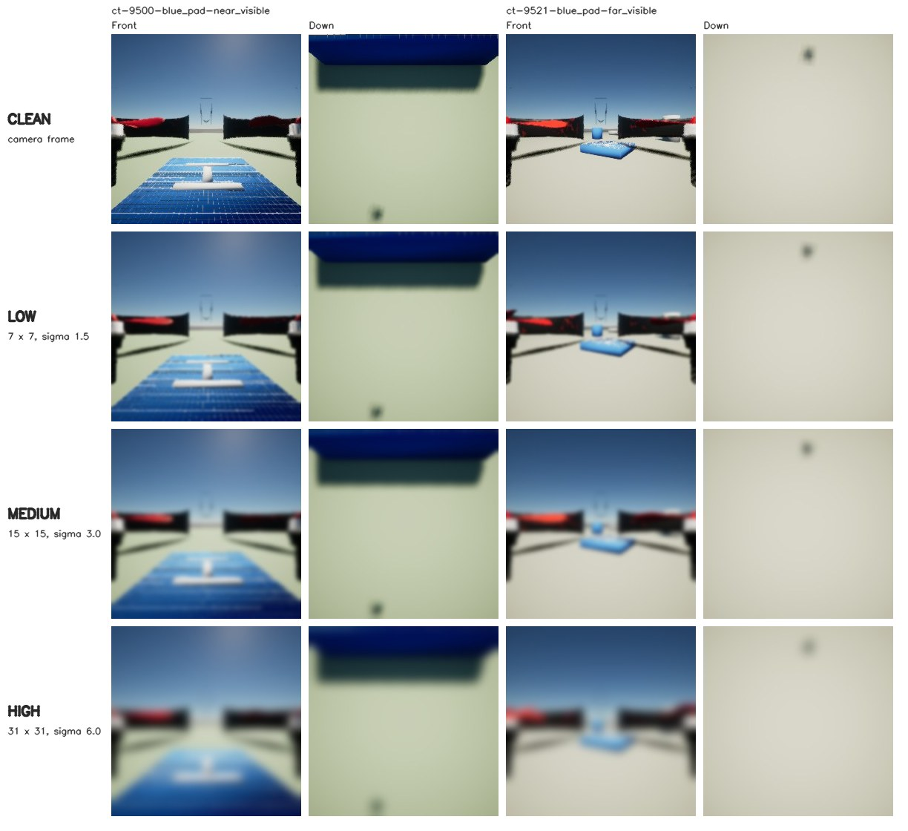

# Gaussian Blur Robustness Characterization

2026-10-10, 브랜치 `exp/failure-gaussian-blur-characterization`. Clean canonical test에서 47/48을 낸 동결 baseline(`grounding_film`)에 Gaussian Blur를 넣었을 때 **어느 강도에서, 어느 단계가, 얼마나** 무너지는지 측정했다. 모델은 학습하지 않았고, 감지(detector)나 복구(recovery)도 만들지 않았다.

**결론: Gaussian Blur는 의미 있는 failure mode다.** 48개 시작에서 mission success는 clean 46 → low 40 → medium 24 → high 8로 떨어진다. 충돌이나 다른 물체로 가는 일은 늘지 않는다. 무너지는 방식은 하나로 모인다: **정책이 공중에서 스스로 정지 행동(zero action)을 낸다.** High에서는 착륙 36회 중 하강을 시작한 비행이 하나도 없다.



## 무엇을 바꾸고 무엇을 고정했나

**바꾼 것은 하나다:** 정책이 받는 Front·Down RGB에 건 Gaussian Blur의 강도.

| 조건 | Kernel | Sigma |
|---|---|---|
| CLEAN | 없음 (카메라 배열 그대로) | |
| LOW | 7 × 7 | 1.5 |
| MEDIUM | 15 × 15 | 3.0 |
| HIGH | 31 × 31 | 6.0 |

- Interactive demo의 `1 / 2 / 3` key와 같은 값이다. 비행 전에 [config](../configs/failures/gaussian_blur_characterization.json)에 고정해 commit했고(`90a1850`), 결과를 본 뒤 바꾸지 않았다.
- Front와 Down에 같은 강도를 건다.
- 모델, 문장, 목표, 장면과 배치, 시작 자세, finalizer, evaluator, decision 한도(320), 실행기, 카메라, 성공 기준은 네 조건에서 같다.

**동결 baseline은 건드리지 않았다.** 실험 launch 전후로 지문 30개를 검증했고 8번 모두 통과했다([기록](../outputs/failures/gaussian_blur/config/frozen_verification.jsonl)).

## Blur가 들어가는 자리

```
카메라 RGB (256×256) → Gaussian Blur → 정책 전처리 → grounding_film → 행동
```

- **비행은 canonical 평가 그대로다.** `SearchEnv.reset`과 `run_episode`([scripts/visual_search.py](../scripts/visual_search.py))를 수정 없이 쓴다. 추가한 것은 `BlurEnv.observe` 하나로, canonical 관측을 받은 뒤 두 frame만 바꿔 넘긴다([blur_characterization.py](../scripts/blur_characterization.py)).
- **Ground truth에는 걸지 않는다.** 목표가 보이는지, depth, 접촉, finalizer, evaluator는 blur 전의 simulator 상태를 읽는다.
- **모델은 조건을 모른다.** 호출 인자는 frame 둘과 문장뿐이다. Blur 여부, 강도, kernel, sigma, 선명도 수치는 넘어가지 않는다.
- **Clean은 카메라 배열을 그대로 넘긴다.** 복사본도 만들지 않는다.

비행마다 확인한 것(통과하지 못하면 실험이 멈춘다):

| 조건 | Decisions | Front가 raw와 같음 | Down이 raw와 같음 |
|---|---:|---:|---:|
| Clean | 3,109 | 3,109 | 3,109 |
| Low | 2,293 | 0 | 0 |
| Medium | 2,213 | 0 | 0 |
| High | 2,472 | 0 | 0 |

모든 decision에서 정책이 받은 배열이 주입기가 낸 배열과 같은 객체였고, 평가 loop가 기록한 입력 hash와 일치했다.

## 비행 계획

- **시작:** canonical test의 48개([gen_v3_canonical_44m_test.json](../configs/gen_v3_canonical_44m_test.json)). 착륙 36, 접근 12.
- **본 실행:** 48 × 4조건 = 192회. 시작 하나의 네 조건을 이어서 비행하되 순서는 시작마다 다르다. 24가지 순서를 두 번씩 써서 각 조건이 1·2·3·4번째로 12번씩 비행됐다. 비행마다 장면을 다시 로드한다.
- **Repeat:** 계획만 보고 고른 12개 시작([repeat subset](../configs/failures/gaussian_blur_repeat_subset.json))을 네 조건으로 한 번 더, 48회. 본 실행 전에 commit했다.
- **Clean도 다시 비행했다.** 예전 47/48을 가져다 쓰지 않았다.

**이 48개는 이제 held-out이 아니다.** 한 번 쓴 test set을 모델 선택이 아닌 paired 비교용으로 다시 썼다. 이 결과로 recovery를 설계한다면 같은 48개에서의 성능을 held-out 성능이라고 말할 수 없다. 새 평가 set이 필요하다.

## 결과: 강도별 요약

48개 시작, 조건당 한 번. 착륙 단계는 착륙 36회 기준이다.

| Metric | Clean | Low | Medium | High |
|---|---:|---:|---:|---:|
| **Mission success** | **46/48** | **40/48** | **24/48** | **8/48** |
| Acquisition (목표가 화면에 들어옴) | 47/48 | 43/48 | 42/48 | 40/48 |
| Correct grounding (들어온 것 중 접근 시작) | 45/47 | 39/43 | 36/42 | 26/40 |
| 지시한 물체에서 끝남 | 46/48 | 40/48 | 34/48 | 28/48 |
| Wrong target | 1 | 2 | 2 | 2 |
| Approach (20m 안) | 46/48 | 40/48 | 34/48 | 31/48 |
| Alignment | 30/36 | 14/36 | 11/36 | 5/36 |
| Descent started | 35/36 | 31/36 | 19/36 | 0/36 |
| Touchdown | 35/36 | 31/36 | 15/36 | 0/36 |
| Stable landing | 35/36 | 31/36 | 15/36 | 0/36 |
| System landing | 35/36 | 31/36 | 15/36 | 0/36 |
| Strict zero action | 34/36 | 31/36 | 16/36 | 0/36 |
| Collision | 0 | 0 | 0 | 0 |
| Timeout | 1 | 0 | 0 | 2 |

Alignment(pad 중심 3.5m 안)은 착륙에 필요한 것보다 엄격한 기준이라 clean에서도 30/36이다.

### Success retention

| 조건 | Success | Clean 대비 | Retention | 착륙만 |
|---|---:|---:|---:|---:|
| Clean | 95.8% | | | 35/36 |
| Low | 83.3% | −12.5%p | 0.87 | 31/36 (0.89) |
| Medium | 50.0% | −45.8%p | 0.52 | 15/36 (0.43) |
| High | 16.7% | −79.2%p | 0.17 | 0/36 (0.00) |

### 과제별

| | Clean | Low | Medium | High |
|---|---:|---:|---:|---:|
| 착륙, 목표가 첫 화면에 보임 | 18/18 | 18/18 | 12/18 | 0/18 |
| 착륙, 첫 화면에 없음 | 17/18 | 13/18 | 3/18 | 0/18 |
| 접근, 보임 | 3/3 | 3/3 | 3/3 | 3/3 |
| 접근, 없음 | 8/9 | 6/9 | 6/9 | 5/9 |

접근은 high에서도 8/12가 성공한다. 무너지는 것은 착륙이다.

## 어떻게 실패하는가: 스스로 멈춘다

| 비행이 끝난 방식 | Clean | Low | Medium | High |
|---|---:|---:|---:|---:|
| 착륙 (pad 접촉) | 35 | 31 | 16 | 0 |
| 정책의 정지 행동 | 12 | 17 | 32 | 46 |
| Decision 소진 | 1 | 0 | 0 | 2 |
| 충돌 | 0 | 0 | 0 | 0 |

Clean의 정지 12회 중 11회는 접근 성공이다. Blur가 강해질수록 **성공이 아닌 정지**가 늘어난다(아래 표는 비행을 읽으며 추가한 기술 통계다).

| 정책이 스스로 끝냈지만 미션은 실패 | Clean | Low | Medium | High |
|---|---:|---:|---:|---:|
| 전체 | 1 | 8 | 24 | 38 |
| 첫 10 decision 안에 정지 | 0 | 1 | 3 | 7 |
| 목표 15m 밖에서 정지 | 1 | 8 | 14 | 18 |
| 착륙 미션인데 공중에서 정지 | 0 | 5 | 20 | 36 |
| … 그중 pad 바로 위(중심 7m 안) | 0 | 0 | 9 | 15 |

- **High의 착륙 36회는 전부 공중 정지로 끝났다.** 15회는 pad 위(높이 중앙값 6.6m), 5회는 7–15m, 16회는 15m 밖.
- **Medium의 실패한 착륙 21회 중 9회가 pad 위에서 멈췄다.** 그중 2회는 하강을 마치고 표면 0.1m 위(높이 2.6m)에서, 7회는 내려가지 않고 6–8m에서.
- 충돌 0, wrong target은 늘지 않음, timeout은 거의 없음. Blur 속에서 헤매거나 부딪히는 것이 아니라 **일찍 끝낸다.**



위 그림은 test 파일의 첫 시작(`ct-9500-near_visible`)의 medium 비행이다. Pad의 가는 격자선은 마지막 1m의 높이 단서로 넣은 것인데(Gen-v3), blur가 그 선을 지운다. 같은 시작의 [clean](../outputs/failures/gaussian_blur/examples/flight_near_visible_clean.jpg) · [low](../outputs/failures/gaussian_blur/examples/flight_near_visible_low.jpg) · [high](../outputs/failures/gaussian_blur/examples/flight_near_visible_high.jpg).

왜 정지 행동이 나오는지는 이 실험으로 확정할 수 없다. 관측한 것은 "blur가 강할수록 정지 행동이 공중에서 나온다"까지다.

## Failure taxonomy

실패한 비행마다 통과하지 못한 첫 단계 하나를 준다(canonical 분류기의 순서 그대로).

| Failure | Clean | Low | Medium | High |
|---|---:|---:|---:|---:|
| B1 Search | 1 | 5 | 6 | 7 |
| B2 Grounding | 1 | 3 | 6 | 13 |
| B3 Approach | 0 | 0 | 2 | 1 |
| B4 Alignment | 0 | 0 | 7 | 13 |
| B5 Descent | 0 | 0 | 1 | 5 |
| B6 Touchdown | 0 | 0 | 2 | 0 |
| B7 Stable landing | 0 | 0 | 0 | 0 |
| B8 Wrong target | 0 | 0 | 0 | 0 |
| B9 Collision | 0 | 0 | 0 | 0 |
| B10 Timeout | 0 | 0 | 0 | 1 |
| B12 Other | 0 | 0 | 0 | 0 |
| **합계** | **2** | **8** | **24** | **40** |

- **Low:** search와 grounding뿐이다. Pad 위에 간 31회는 모두 하강하고 모두 착륙했다.
- **Medium:** 착륙 단계(B4–B6) 10, grounding 6, search 6.
- **High:** 착륙 단계 18, grounding 13, search 7.
- B8이 0인 이유: wrong target으로 끝난 비행(아래)은 지시한 물체를 한 번도 보지 못해 canonical 순서상 search로 분류된다.
- B11(runtime error)은 mission failure에 넣지 않았다(아래 "Runtime").

**Main failure stage: MIXED.** Low에서는 search·grounding이 먼저 무너지고, medium부터 착륙(하강)이 가장 큰 몫이 된다.

## 착륙

| 착륙 36회 | Clean | Low | Medium | High |
|---|---:|---:|---:|---:|
| Down 화면에 pad가 보임 | 35 | 31 | 24 | 15 |
| Pad 위에 감 | 35 | 31 | 25 | 17 |
| Down alignment (중심 3.5m 안) | 30 | 14 | 11 | 5 |
| Descent start | 35 | 31 | 19 | 0 |
| Touchdown | 35 | 31 | 15 | 0 |
| Stable landing | 35 | 31 | 15 | 0 |
| System landing | 35 | 31 | 15 | 0 |
| Pad 위에 간 것 중 하강 시작 | 35/35 | 31/31 | 19/25 | 0/17 |
| Touchdown 오차 중앙값 | 2.8m | 3.8m | 4.2m | — |

- **착륙은 search와 별개로 무너진다.** 목표가 첫 화면에 보여 탐색이 필요 없는 착륙 18회도 18 → 18 → 12 → 0이다. Pad 위까지 간 비행만 봐도 하강 시작이 35/35 → 31/31 → 19/25 → 0/17이다.
- **Low는 착륙을 막지 않지만 정밀도를 낮춘다.** 3.5m 안 정렬이 30 → 14로 줄고 touchdown 오차가 2.8m → 3.8m로 늘었다. 착륙 영역(6.6m) 안이라 성공으로 남는다.
- Finalizer는 접촉한 모든 착륙에서 latch·disarm했다. 다른 pad에 내린 비행은 없다.
- Medium의 실패한 착륙 21회 중 20회는 공중 정지이고, 1회는 지시한 pad의 가장자리(중심에서 7.4m, 착륙 영역 밖)에 내렸다.

## Search와 grounding

| 목표가 첫 화면에 없는 27개 시작 | Clean | Low | Medium | High |
|---|---:|---:|---:|---:|
| Acquired | 26 | 22 | 21 | 19 |
| Mission success | 25 | 19 | 9 | 5 |
| 처음 보인 decision (중앙값) | 10 | 15 | 15 | 13 |

| Grounding transition | Clean | Low | Medium | High |
|---|---:|---:|---:|---:|
| 목표가 화면에 들어옴 | 47 | 43 | 42 | 40 |
| 접근을 시작함 | 45 | 39 | 36 | 26 |
| 첫 번째로 보였을 때 시작함 | 42 | 37 | 36 | 24 |

- 탐색 회전 자체는 대체로 유지된다(acquisition 47 → 40). 찾기 전에 멈추는 비행이 늘 뿐이다.
- Grounding transition은 high에서 크게 떨어진다(45/47 → 26/40). 보이는데 접근을 시작하지 않고 멈춘다.

### Wrong target

| 조건 | 시작 | 지시 | 간 곳 | 지시한 물체를 봤나 |
|---|---|---|---|---|
| Clean | `ct-9507-…-find-blue_cube` | blue cube | blue pad | 아니오 |
| Low, Medium, High | 같은 시작 | blue cube | blue pad | 아니오 |
| Low, Medium, High | `ct-9518-…-find-blue_cube` | blue cube | blue pad | 아니오 |

- **Blur로 wrong target이 늘지 않는다**(1 → 2 → 2 → 2). 전부 "blue cube를 찾으라는데 먼저 보이는 blue pad 옆에 멈춤"이고, 첫 번째는 clean test의 실패와 같은 시작이다.
- Blue pad → blue cube, blue pad → blue cone, red pad → red cube는 한 번도 없었다.

### Distractor

모든 시작에 관련 물체가 있다(관련 물체 없는 시작 0개).

| | Clean | Low | Medium | High |
|---|---:|---:|---:|---:|
| Same-color (22) | 21 | 14 | 7 | 2 |
| Same-shape (26) | 25 | 26 | 17 | 6 |
| 관련 물체가 먼저 보임 (17) | 16 | 12 | 7 | 4 |

Same-color 시작이 더 빨리 떨어지지만, **색 혼동이 늘어서가 아니다.** Low에서 잃은 7개는 모두 search·grounding 단계의 정지였고 다른 물체로 간 것은 1개뿐이다. 이 7개는 전부 Lot 장면, 목표가 첫 화면에 없는 시작이다(아래). Same-color 묶음은 장면·시작 종류와 겹쳐 있어 색의 효과만 떼어 낼 수 없다.

## 거리, 크기, 장면

| Distance | Clean | Low | Medium | High |
|---|---:|---:|---:|---:|
| 12–20m | 15/16 | 14/16 | 8/16 | 2/16 |
| 20–32m | 16/16 | 14/16 | 8/16 | 3/16 |
| 32–44m | 15/16 | 12/16 | 8/16 | 3/16 |

**먼 거리에서 더 크게 무너지지 않는다.** 세 구간이 거의 같다.

| | Clean | Low | Medium | High |
|---|---:|---:|---:|---:|
| 처음 보일 때 작게 보임 (22) | 21 | 16 | 11 | 3 |
| 크게 보임 (22) | 22 | 21 | 12 | 4 |
| Field (21) | 20 | 21 | 12 | 4 |
| Lot (27) | 26 | 19 | 12 | 4 |
| Lot, 목표가 첫 화면에 없음 (19) | 18 | 11 | 6 | 4 |

- **Low의 손실은 한곳에 몰려 있다:** Lot 장면, 목표가 첫 화면에 없는 시작(18 → 11). Field에서는 low로 잃은 시작이 없다.
- 작게 보이는 목표가 low에서 먼저 영향을 받는다(21 → 16, 크게 보이는 쪽은 22 → 21). Medium부터는 차이가 없다.
- 크기 구분은 clean 비행의 첫 관측 크기 중앙값으로 나눈 기술 통계다.

## 시작별 비교 (paired)

| Clean → | S→S | S→F | F→S | F→F | McNemar exact p |
|---|---:|---:|---:|---:|---:|
| Low | 39 | 7 | 1 | 1 | 0.07 |
| Medium | 24 | 22 | 0 | 2 | < 0.001 |
| High | 8 | 38 | 0 | 2 | < 0.001 |

표본이 48개라 p값은 참고용이다. 방향이 한쪽인 것(medium 22 대 0, high 38 대 0)이 더 분명한 근거다.

| 처음 실패한 강도 | 시작 수 |
|---|---:|
| 없음 (네 조건 모두 성공) | 8 |
| LOW | 7 |
| MEDIUM | 15 |
| HIGH | 16 |
| CLEAN부터 실패 | 2 |

- 네 조건 모두 성공한 8개는 전부 접근 미션이다.
- **Non-monotonic 1개:** `ct-9527-far_behind`는 clean에서 timeout, low에서 성공, medium·high에서 실패했다.
- 시작별 전체 표: [tables.md](../outputs/failures/gaussian_blur/summary/tables.md), [paired_starts.csv](../outputs/failures/gaussian_blur/summary/paired_starts.csv), [그림](../outputs/failures/gaussian_blur/summary/paired_starts.png).

조건을 비행한 순서(시작 안에서 몇 번째였는지)에 따른 일관된 차이는 없었다.

## Repeat: 같은 시작을 한 번 더

12개 시작, 조건마다 두 번 비행.

| | Clean | Low | Medium | High |
|---|---:|---:|---:|---:|
| 2/2 성공 | 12 | 11 | 7 | 2 |
| 1/2 | 0 | 0 | 1 | 0 |
| 0/2 | 0 | 1 | 4 | 10 |
| 두 비행의 결과가 같음 | 12/12 | 12/12 | 11/12 | 12/12 |

- **48쌍 중 47쌍이 같은 결과였다.** Blur의 효과는 반복 비행의 흔들림보다 훨씬 크다.
- Clean 2/2이면서 high 0/2인 시작이 12개 중 10개다. High에서 2/2인 2개는 둘 다 접근 미션이다.
- Low에서 0/2인 1개(`ct-9522-far_search-approach`)는 본 실행에서도 low로 실패한 시작이다. Low의 손실도 우연이 아니라 특정 시작에서 반복된다.

## Clean 재현성

| | 결과 |
|---|---|
| Historical clean (2026-10-10 오전) | 47/48 |
| 이번 실행의 clean | 46/48 |
| 같은 결과인 시작 | 47/48 |

- `ct-9507-…-find-blue_cube`: 두 번 다 실패(blue pad 옆에 멈춤).
- `ct-9527-far_behind`: 전에는 성공, 이번에는 decision 소진. 목표가 보였지만 접근을 시작하지 않고 80m 밖까지 갔다.
- Clean의 반복 흔들림은 48개 중 1개 수준이다.

Simulator 창을 띄운 것 외에 실행 chain은 같다(아래 "Runtime").

## Image quality (분석 전용)

정책에 들어간 frame의 Laplacian variance. **정책에는 쓰지 않았고 threshold도 만들지 않았다.**

| | Clean | Low | Medium | High |
|---|---:|---:|---:|---:|
| Front 중앙값 | 467 | 17.7 | 3.7 | 1.7 |
| Front 5–95% | 273–1648 | 13.7–29.7 | 3.1–4.5 | 1.4–2.0 |
| Down 중앙값 | 3.6 | 1.3 | 1.1 | 1.0 |
| Down 5–95% | 3.4–2668 | 0.8–35.1 | 0.8–3.9 | 0.7–1.6 |

| 이웃한 강도의 구분 (AUROC) | Front | Down |
|---|---:|---:|
| Clean vs Low | 1.00 | 0.77 |
| Low vs Medium | 1.00 | 0.66 |
| Medium vs High | 1.00 | 0.70 |

- **Front는 네 조건의 분포가 겹치지 않는다.** 단순한 통계만으로도 강도를 가를 수 있다.
- **Down은 겹친다.** 평지를 내려다보는 Down 화면은 선명해도 질감이 거의 없기 때문이다(clean 중앙값 3.6).
- 이 장면들에서의 값이다. 다른 질감의 환경에서는 달라질 수 있다.



## Latency

| 조건 | Blur 처리 (중앙값 / p95) | 추론 (중앙값 / p95) | Decision 주기 (평균 / 중앙값 / p95) |
|---|---|---|---|
| Clean | 0.00 / 0.00 ms | 390 / 422 ms | 0.511 / 0.507 / 0.538 s |
| Low | 0.26 / 0.41 ms | 389 / 421 ms | 0.511 / 0.506 / 0.537 s |
| Medium | 0.43 / 0.68 ms | 390 / 422 ms | 0.512 / 0.507 / 0.539 s |
| High | 1.10 / 1.56 ms | 389 / 418 ms | 0.511 / 0.506 / 0.537 s |

**Blur 연산 때문에 decision 주기가 달라지지 않았다.** 성능 저하는 영상 때문이지 지연 때문이 아니다.

## Runtime

- **비행:** 본 실행 192회(118.8분), repeat 48회(28.9분). 모든 비행에서 simulator가 실시간의 0.96배 이상으로 돌았다(기준 0.8).
- **Harness error 2건.** 둘 다 같은 시작(`ct-9517-mid_behind`)에서 simulator 연결이 끊긴 한 사건이다.
  - Low 비행: `Object closed`로 시작도 못 함 → 새 simulator에서 다시 비행(자동).
  - 바로 앞의 clean 비행: pad에 안정 착륙하고 latch까지 한 뒤 **disarm 호출에 simulator가 응답하지 않았다.** Canonical code는 이 예외를 삼키고 "disarm 안 됨"을 돌려주므로 mission 실패로 기록됐다. 이 비행만 종료 처리에 68초가 걸렸다(다른 191회는 6.5–10초).
- **이 clean 비행은 기록을 보존한 채 따로 빼고 다시 비행했다**(다시 비행: 착륙 성공). RPC disconnect는 mission failure에 섞지 않는 runtime error이기 때문이다. 이 규칙("disarm 호출에 응답이 없으면 harness error")은 본 실행을 본 뒤에 추가했다. 빼기 전의 clean은 45/48이었다. 기록: [flights_main.jsonl](../outputs/failures/gaussian_blur/config/flights_main.jsonl).
- **Simulator 창을 띄웠다.** Canonical test는 창을 숨기고 비행했다. 이번에는 데스크톱 세션이 끊긴 상태였고, 숨긴 simulator는 이륙 뒤 멈췄다(수정하지 않은 평가 launcher도 같았다). 크기와 인자는 같고, clean을 포함한 모든 비행에 똑같이 적용했다.
- 모델을 로드한 뒤 빈 frame으로 추론을 한 번 돌려 둔다. 첫 비행만 첫 decision이 1초 느린 것을 없애기 위해서다.

## Interactive demo

```powershell
.\scripts\run_grounding_film_mission_demo.ps1
```

`B`로 blur를 켜고 끄고, `1 / 2 / 3`으로 LOW / MEDIUM / HIGH를 고른다. 기본은 꺼짐이다. 켜면 그 decision부터 모델 입력이 바뀌고 화면에 `FAILURE: GAUSSIAN BLUR`, severity, kernel, sigma가 표시된다. Front/Down은 실제로 모델에 들어간 흐린 영상이다. Demo와 실험은 같은 주입기를 쓴다.



**정성 확인(정량 결과에 넣지 않음).** Blocks 지도의 blue pad LAND를 같은 자세에서 네 조건으로, 두 세션([기록](../outputs/failures/gaussian_blur/examples/interactive_smoke.json)):

| 조건 | 세션 1 | 세션 2 |
|---|---|---|
| Clean | 착륙 (65) | 착륙 (62) |
| Low | 착륙 (66) | 착륙 (63) |
| Medium | 실패: pad 중심 0.7m 위, 5.9m 높이에서 정지 (56) | 실패: 0.6m 위에서 정지 (54) |
| High | 실패: 27.7m 앞에서 정지 (64) | 실패: 26.3m 앞에서 정지 (112) |

- Clean은 모든 decision에서 raw = model input, blur 조건은 모두 raw ≠ model input이었다.
- 화면: [clean](../outputs/failures/gaussian_blur/examples/interactive_clean.jpg) · [low](../outputs/failures/gaussian_blur/examples/interactive_low.jpg) · [medium](../outputs/failures/gaussian_blur/examples/interactive_medium.jpg).
- 요청하신 예시 중 "medium 성공이지만 느림"과 "blur로 인한 wrong target"은 interactive 비행에서 나오지 않았다. 만들어 내지 않았다.

### 같은 시작, 같은 순간의 모델 입력



근거리·원거리 각각 "pad가 첫 화면에 보이는 첫 착륙 시작"이다. 예시 비행은 규칙으로 골랐다: test 파일의 첫 시작(네 조건), low에서 처음 실패한 시작([search 중 정지](../outputs/failures/gaussian_blur/examples/flight_search_low.jpg)), high에서 처음 성공한 시작([접근](../outputs/failures/gaussian_blur/examples/flight_approach_high.jpg)).

## 질문에 대한 답

1. **Blur가 mission success를 실질적으로 낮추는가?** 그렇다. 46 → 40 → 24 → 8.
2. **어느 강도에서?** Medium에서 분명하다(−46%p, 22개를 잃고 얻은 것 0). Low는 −12.5%p로 작고 특정 시작에 몰려 있다. High에서는 착륙이 전부 실패한다.
3. **어느 단계가 먼저?** Low에서는 search·grounding(목표가 첫 화면에 없는 시작). 착륙은 medium부터 무너지고 가장 큰 몫이 된다.
4. **Same-color grounding이 나빠지는가?** Same-color 시작의 성공은 더 빨리 떨어지지만 wrong target은 늘지 않는다(1 → 2 → 2 → 2). 다른 물체를 고르는 것이 아니라 멈춘다.
5. **착륙이 search와 별개로 나빠지는가?** 그렇다. 탐색이 필요 없는 착륙도 18 → 18 → 12 → 0이고, pad 위까지 간 비행의 하강 시작이 35/35 → 31/31 → 19/25 → 0/17이다.
6. **먼 거리에서 더 큰가?** 아니다. 세 거리 구간이 거의 같다.
7. **반복 비행의 흔들림보다 큰가?** 그렇다. 같은 조건의 두 비행은 48쌍 중 47쌍이 같았고, clean은 예전 실행과 48개 중 47개가 같았다.

## 다음 단계

**A — Blur Detector + Recovery 설계.** Medium에서 성공률이 절반으로 떨어지므로 대응할 가치가 있다. 이 결과가 설계에 주는 것:

- **실패 신호가 분명하다.** Blur 아래의 실패는 대부분 "성공 조건을 만족하지 않은 정지 행동"이다. 충돌하지 않고 멀리 가지 않으므로 복구할 여지가 있다.
- **Front 영상의 선명도만으로 강도가 갈린다**(이 장면들에서). Down은 그렇지 않다.
- **먼저 할 것은 Front만 / Down만 blur하는 ablation이다(C).** Pad 위에서 내려가지 않는 것이 어느 카메라 때문인지 알아야 복구를 어디에 둘지 정할 수 있다. 이번 실험은 두 카메라를 함께 흐렸으므로 답하지 못한다.

## 한계

- **Simulator의 Gaussian Blur다.** 실제 카메라의 초점 이탈이나 motion blur와 같다고 주장하지 않는다. 세 강도가 현실의 어느 정도에 해당하는지도 정하지 않았다.
- **조건당 한 번(12개 시작은 두 번) 비행했다.** 조건 간 차이는 크지만, 세부 묶음(장면별, 크기별)은 표본이 작다.
- **두 카메라를 같은 강도로 흐렸다.** 카메라별 기여는 모른다.
- **정지 행동이 왜 나오는지는 관측하지 못했다.** 비행 기록으로 볼 수 있는 것은 언제, 어디서 나오는지까지다.
- **이 48개 시작은 held-out이 아니다**(위 "비행 계획").
- Canonical 범위(44m 이하), 학습 장면의 새 배치라는 점은 clean baseline과 같다.

## 파일과 실행

| 무엇 | 어디 |
|---|---|
| 실험 config | [gaussian_blur_characterization.json](../configs/failures/gaussian_blur_characterization.json), [repeat subset](../configs/failures/gaussian_blur_repeat_subset.json) |
| 주입기, 순서, 분류 | [blur_experiment.py](../src/failures/blur_experiment.py) |
| 비행 | [blur_characterization.py](../scripts/blur_characterization.py), [run_blur_characterization.ps1](../scripts/run_blur_characterization.ps1) |
| 분석, 그림 | [blur_analysis.py](../scripts/blur_analysis.py), [blur_figures.py](../scripts/blur_figures.py) |
| 표와 요약 | [summary/](../outputs/failures/gaussian_blur/summary/) (`tables.md`, `summary.json`, `episodes.csv`) |
| 실행 기록 | [config/](../outputs/failures/gaussian_blur/config/) (비행 순서, 시도 로그, 동결 검증) |

```powershell
.\scripts\run_blur_characterization.ps1 -Phase main      # 아직 비행하지 않은 것만 비행한다
.\scripts\run_blur_characterization.ps1 -Phase repeat
```

```bash
python scripts/blur_analysis.py --figures
```

비행 원자료(step 기록, frame)는 `outputs/failures/gaussian_blur/` 아래에 로컬로만 둔다.

**Tests:** Python 309/309, PowerShell 4/4. 동결 지문 그대로.
