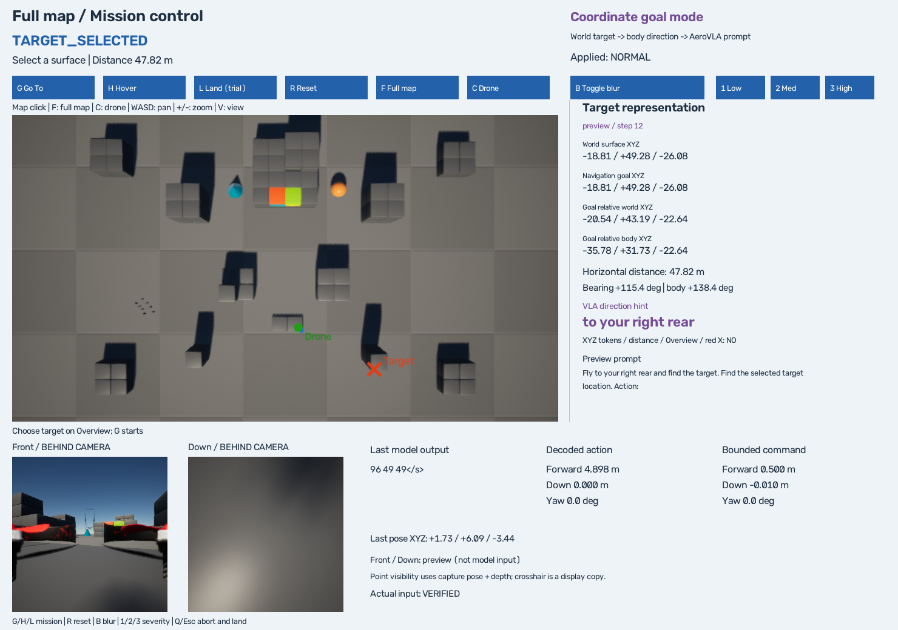

# Full Map + Target Grounding Inspector

2026-10-06 검증. **전체 Blocks 구조물 영역에서 목표를 클릭하고, 그 좌표가 방향 문장으로 바뀌어 AeroVLA에 전달되는 과정을 실시간으로 표시한다.** 이번 Near/Medium/Far 미션은 모두 실패했다. 지도·Inspector·실제 closed loop와 실패 기록을 검증한 결과이며 장거리 navigation 성공이나 visual target detection을 입증한 결과는 아니다.



## Current AeroVLA Target Representation

| 모델이 받는 정보 | 실제 실행 경로 |
|---|---|
| Exact XYZ numeric tokens | **NO** |
| Distance numeric token | **NO** |
| Overview image | **NO** |
| UI의 빨간 X / 카메라 crosshair | **NO** |
| 실제 전달 정보 | 원래 Front/Down RGB + body-frame **coarse direction** + 기존 지시 문장 |

현재 이름은 **COORDINATE GOAL MODE**, 즉 coordinate-direction-guided navigation이다.

```text
Overview RGB + matched DepthPlanar + captured pose
    -> clicked world surface XYZ
    -> navigation goal = surface XY + 시작 비행 고도 Z
    -> target - current position
    -> inverse body quaternion rotation
    -> body bearing -> semantic_direction()
    -> make_prompt() -> tokenizer + Front/Down mosaic -> AeroVLA
```

함수 위치: [semantic_direction / make_prompt](../src/integration/projectairsim_observation_adapter.py), [infer](../src/integration/aerovla_int4_loader.py), [grounding_report](../src/mission/grounding.py), [실제 runner](../src/mission/runner.py). Inspector는 동일한 기존 adapter 함수를 호출하고, **실제 `inference['prompt']`와 일치하는지 실행 중 검사**한다.

실제 Far 마지막 decision의 prompt는 다음이었다.

```text
<image>
Fly straight ahead and find the target. Find the selected target location.
Action:
```

world/surface 좌표는 UI·평가용이며, navigation goal의 숫자 XYZ는 방향 계산의 내부 인자다. 모델 token에는 숫자 좌표·거리·bearing이 들어가지 않는다. 임의의 클릭 지점을 시각적으로 인식한 것으로 해석하지 않는다.

## Full Map

193개 object의 `list_objects`, `get_object_pose`, world-axis `get_3d_bounding_box`를 실제 조회했다. **167개 geometry를 포함하고 26개를 제외**한 union은 다음과 같다.

| 축 | 실제 min | 실제 max |
|---|---:|---:|
| X | -40.1000m | 120.0000m |
| Y | -122.5000m | 117.5000m |
| Z (NED) | -26.0000m | 2.5000m |

이는 약 **160.1×240m의 Blocks geometry footprint**다. selection ROI는 그 XY 범위에 5m margin을 둔 **170.1×250m**다. simulator가 제공한 navmesh/playable boundary라고 주장하지 않는다. 구조물 밖의 거대한 바닥 전체는 포함하지 않는다.

`Ground`는 40,000×40,000×2m bbox라 지도 크기를 왜곡한다. 이 바닥과 sky/light/fog/camera/reflection/volume/drone/player/game helper를 제외했다. malformed/nonfinite/degenerate boxes, 크기>500m, 좌표 절댓값>5000m, median/MAD 기반 spatial outlier도 필터링한다. 기준과 **object별 제외 이유**, 원본 pose/bounds를 `outputs/mission_demo/scene-geometry.json`에 기록한다. 이번 scene에서는 Ground와 helper 26개가 제외됐으며, 다른 scene에서 같은 기준의 적절성은 다시 감사해야 한다.

이전 방식은 `(3.1,4)`의 한 플랫폼 anchor, 높이 18–65m, depth<100m 제한이었다. 새 방식은 actor 이름에 고정하지 않고 union을 fit한다. 기본은 **Full-map Top Down**이고 `V`로 Elevated를 선택한다. 실제 기본 카메라 위치는 약 `(39.95,-2.50,-215.95)`m, HFOV80°, 640×360이다. Top-down은 화면의 가로=world Y, 세로=world X를 고려해 fit하며, Elevated는 union을 감싸는 sphere와 좁은 쪽 FOV를 이용한다. 양쪽 시점에서 union의 여덟 corner가 화면 안에 들어오는지 테스트했다. 확대 시 뒤/바깥의 marker는 생략하고 trajectory를 clip하여 창이 닫히지 않게 한다.

## Target Selection / Restrictions

실제 RGB/depth timestamp·pose 일치, PNG hash, 클릭 frame ID, 최근 네 프레임 캐시를 유지한다. 가정한 ground plane과 guessed landmark 좌표를 사용하지 않는다. 100m 초기 depth 제한을 제거하여 200m 이상 거리의 전체 맵 카메라에서도 선택된다.

| 조건 | 처리 / 이유 |
|---|---|
| 권장 1–2m / 거리 제한 | 권고만 있었음; 거리 gate는 없음. 이번에 68m 목표도 선택·실행 |
| camera 높이 18–65m | 초기 관찰 제한 제거; scene fit + zoom/pan으로 변경 |
| 유효 depth | 유지: positive/finite, float16 far/sky sentinel(≥65000m) 거절 |
| image 바깥·edge | 유지: 정상 계산에 필요한 이웃 pixel이 없는 가장자리 거절 |
| 평평한 표면, 최대 20° | G/H/L이 공유하는 표면·착륙 안전 기준으로 유지; 벽/급경사 면은 선택하지 않음 |
| geometry ROI | union XY +5m 밖의 거대한 바닥은 거절 |
| 높은 surface | **선택/관찰 가능**; 현재 비행 고도와의 clearance<0.8m이면 mission 시작 거절 |
| 경로의 reachability | 보장하지 않음. 높은 표면/invalid click은 거절하나 obstacle-free 경로 계산은 없음 |

float16 depth·pixel 크기·camera pose·표면 경계 때문에 좌표는 근사치다. 이번 Full-map Medium/Far 클릭 z는 알려진 플랫폼/바닥 top과 약 0.077m 차이가 있었다. 넓은 지도에서 정밀한 작은 목표를 고르려면 C 또는 zoom을 사용한다. depth deprojection의 기존 NED 축과 round-trip 검사는 유지했다.

## Target Inspector

World surface XYZ, navigation goal XYZ, **goal relative world/body XYZ**, horizontal distance, world bearing, body bearing, semantic direction, 실제 prompt를 표시한다. `preview`는 시작 전 예상 prompt이고 `actual model input / step N`은 해당 decision에서 실제 사용된 값이다. Surface point는 visibility에, navigation goal은 방향 힌트·고도 오차에 사용되므로 두 Z를 별도로 표시한다.

헤더 **Final**은 판정 시점의 오차, **live**는 최신 관측의 오차다. 오른쪽의 distance/bearing은 **해당 모델 입력 시점**의 값이다. 완료 이후 native hover 중 움직임이 있어도 과거 판정·입력 데이터를 바꾸지 않는다.

## Target Visibility

Front/Down의 원래 RGB capture settings, 256×256, HFOV90°, origin/gimbal/physics를 유지했다. 같은 camera에 **debug-only DepthPlanar capture setting**만 추가했다. `get_images(camera,[0,1])`에서 실제 RGB와 depth의 timestamp·pose가 일치함을 확인했으며 depth는 16FC1/metres다. 모델에는 RGB만 전달한다.

surface world point를 captured camera quaternion/position으로 변환한다. optical x≤0은 BEHIND CAMERA, projection이 pixel 범위 밖이면 OUT OF FOV다. 안쪽에서는 expected optical depth와 실제 scene depth를 비교한다. 기본 tolerance는 `max(0.12m, 0.004*expected_depth)`다.

- 더 가까운 scene depth: **OCCLUDED** 추정.
- depth 일치: **VISIBLE** 추정.
- 유효 depth 없음/예상보다 멂: **UNKNOWN DEPTH / DEPTH MISMATCH**, visible=null.

이는 **점의 기하학적 depth-consistency 추정**이며 객체/색상 인식 결과가 아니다. float16, surface 좌표 오차, 단일 pixel sampling, 경계·grazing angle에서는 부정확할 수 있다. camera 간에는 별도 capture 시각이 있으며 두 camera 전체가 한 timestamp라고 주장하지 않는다.

Overlay는 `.copy()`에만 그린다. 모델 input 파일에 marker를 쓰지 않는다. 세 계획 미션의 **51개 실행 decision 모두 Blur OFF의 실제 GPU tensor가 raw reference와 같았고**, UI/model input hash binding도 검사했다. copy-only overlay와 mismatched depth 거절은 테스트로 검증했다.

## Mission Tests

동일한 시작 scene에서 각 목표를 실제 depth 클릭으로 선택하고 GO_TO/Blur OFF를 실행했다. 시험 budget은 **최대 30 executed steps / 300초**, 사용자 기본값은 60이다. steering과 자동 상승을 추가하지 않았다.

| 목표 | 실제 surface XYZ (m) | 초기→최종 XY 거리 | VLA 호출 / 실행 | 결과 |
|---|---|---|---:|---|
| Near | (0.443, 6.557, -2.517) | 2.041→1.289m | 30 / 30 | FAILED: max_steps |
| Medium | (5.260, 0.857, -2.577) | 9.498→7.625m | 9 / 9 | FAILED: extreme_altitude |
| Far | (-0.054, -59.971, -1.077) | 67.978→66.000m | 12 / 12 | FAILED: extreme_altitude |

각 미션은 한 번이다. 장거리 성공률 비교, 반복 benchmark, NORMAL/BLUR 비교를 수행하지 않았다. 이전 약 1.2m GO_TO/호버 성공 기록은 [mission demo](mission_demo.md)에 그대로 남아 있다.

| 목표 | Front 상태 | Down 상태 |
|---|---|---|
| Near | VISIBLE 3 → OUT OF FOV/BEHIND CAMERA (13/14, 일부 교대) | OUT OF FOV 3 → VISIBLE 27 |
| Medium | DEPTH MISMATCH 7, OCCLUDED 2 | OUT OF FOV 9 |
| Far | OCCLUDED 11, VISIBLE 1 | OUT OF FOV 12 |

Near의 step3/4는 모두 raw `96 49 49`였는데 step4부터 Down visibility가 VISIBLE로 바뀌었다. 즉 그 전환에서 바로 행동이 바뀌었다고 주장하지 않는다. Medium은 확인된 VISIBLE 없이도 방향 힌트를 받고 거리가 줄었으며, Far에서도 거의 모든 decision에서 point가 occluded 상태였지만 일부 진행했다. 이것을 visual target recognition 성공이라고 해석하지 않는다.

원본은 로컬 `outputs/full_map/near-run`, `medium-run`, `far-run`과 `outputs/mission_demo/runs/`에 보존한다. 같은 Medium 세션의 추가 14.185m 미션은 1회 추론/0회 실행 후 altitude envelope 예외로 실패했고, 세 계획 미션과 별도로 보존했다. 이후 range 밖의 pose에서는 새 mission 시작을 거절하도록 보완했다. **R은 mission 상태만 초기화하며 drone을 teleport/상승시키지 않는다.**

Near 종료는 NNG 10초 receive timeout에서 실패했다. 20초 native Land 명령보다 짧은 transport 제한을 30초로 맞췄다. 이후 Medium 세션과 최종 Far 세션은 land=True, disarm 후 LANDED=0, cleanup error 없음으로 종료했다. Far 프로그램은 STOPPED, 소유 worker 종료는 forced=false였다. Near의 높은 고도에서 발생한 timeout은 실패 기록으로 보존했고 동일 조건을 반복해 성공으로 바꾸지는 않았다. 미션의 FAILED와 cleanup 성공 여부는 구분한다.

## Logging / Regression

`mission-steps.jsonl`은 실행 완료한 step, `mission-decisions.jsonl`은 **REQUESTED → INFERRED → EXECUTED/INVALID_ACTION/SKIPPED/RUNTIME_ERROR** 이벤트다. mission_id/decision_id로 묶고 마지막 event를 읽는다. 이동 전에 멈춘 추론도 direction·prompt·distance·camera pose·pixel·visibility·input evidence를 남긴다. `vla_steps`는 모델 호출 수, `executed_steps`는 완료 실행 수다. Near는 이 event logger 추가 전 run이지만 input_step=30/실행 로그30을 확인했다. 기존 per-step grounding/visibility는 모두 있다. 추가 실패 시도의 출력도 누락하지 않는다.

GO_TO/HOVER/LAND state machine, 기존 B/1/2/3 Gaussian Blur, 기존 loader/preprocessing/action 범위를 유지했다. 고도 이탈 후 새 미션 시작은 거절하며 회복 조종을 하지 않는다. SDK camera pose mismatch, unknown depth, 높은 zoom, 중단된 모델 decision, GUI controls를 별도 검사한다.

## Altitude

현재 및 권장 기본값: **초기 resting platform 기준 0.8–4.0m 유지**. 숫자 범위 확대: **NO**. [flight_limits.json](../configs/flight_limits.json)으로 maximum을 configurable하게 만들었다. 8m 옵션의 clamp는 unit test만 수행했으며 8m 실제 비행은 실행하지 않았다.

scene 최고 geometry는 NED z=-26m다. 4m ceiling으로 모든 roof를 도달할 수 없고, 단순히 ceiling을 높여도 obstacle avoidance나 vertical goal 전달이 생기지 않는다. 이번에는 낮은 surface의 coordinate mission을 관찰하고, 고도 이탈을 그대로 실패로 기록했다. visibility에 따른 자동 상승/search는 구현하지 않았다.

## Visual Landmark Mode — 설계만

Coordinate mode는 임의 점·방향 힌트 기반 navigation/failure injection 관찰에 사용한다. **VISUAL LANDMARK MODE**는 semantic grounding·search·target recognition을 별도로 확인하는 문제다.

향후 `infer_visual(front,down,instruction)` 같은 별도 entry를 두고 `Find the blue block and land on it.`을 전달한다. 그 경로는 `semantic_direction()`/coordinate hint를 호출하지 않는다. ground-truth coordinate는 success/visibility evaluation에만 사용한다. RAW RGB에 평가용 marker를 넣지 않는다. 현재 `infer()`는 항상 coordinate hint를 만들므로 이름만 바꾸어 Visual mode라고 부르면 안 된다. Oracle direction 제거 후 upstream prompt 호환성과 policy capability를 먼저 검증해야 한다. **이번에는 해당 inference mode, recognition, search, detection, recovery를 구현하지 않았다.**

## 실행

```powershell
.\scripts\run_mission_demo.ps1
```

F 전체 맵 → 평평한 표면 클릭 → G. C는 drone 중심 확대, WASD pan, +/- zoom, V 시점 전환이다. 기존 H/L/R/B/1/2/3/Q/Esc도 유지한다. 높은 surface는 preview 가능하나 시작이 거절될 수 있다. 새 물리적 시작 상태가 필요하면 Q로 종료한 뒤 같은 launcher를 다시 실행한다.

실제 자동 확인은 관찰 창과 동일한 handler가 만든 frame ID/pixel/control file 요청으로 수행했다. 물리적 마우스·키 입력을 자동화한 검증은 아니다. 창의 실제 렌더링/export, callback 좌표와 조작 함수는 검증했고, GUI 조작은 `control-events.jsonl`에 출처와 request ID를 남긴다.

## Tests / Git

**기존 47 + 신규 15 = Python 62/62 통과.** Windows PowerShell 5.1 / PowerShell 7에서도 mission 초기화·launcher parse, native/WSL argv, Blur init/quit, worker exit tracking 네 검사 script가 각각 통과했다. 별도 읽기 전용 검토의 두 Important finding(높은 Elevated zoom의 뒤쪽 marker, 중단된 decision 로그 누락)을 재현 테스트와 함께 수정하고 재검토했다. 남은 Important/Critical finding은 없다.

원본 baseline 설정·model revision·기존 예시를 보존했다. 문서 링크, 큰 파일, 개인 경로와 credential pattern 검사를 통과했고 새 대표 PNG는 약 690KiB다. 구현은 `codex/full-map-grounding`에서 진행하며 구현과 결과 문서/화면을 별도 커밋으로 나눈다. 최종 main commit은 `git log -1 --oneline`으로 확인한다. 테스트 종료 후 실행 중인 simulator/소유 worker와 열린 RPC 포트가 남지 않았는지 확인한다. Visual landmark navigation, Failure Detection, Recovery는 여기서 시작하지 않는다.
