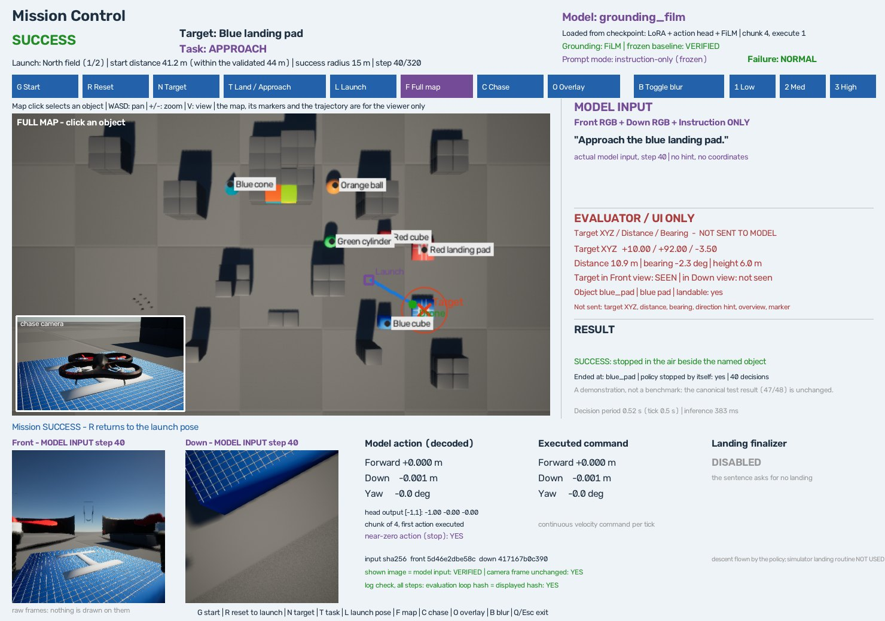

# grounding_film Interactive Mission Control

2026-10-10, 브랜치 `feat/grounding-film-interactive-mission`. 기존 Mission Control 화면에서 동결한 AeroVLA-OFT checkpoint(`grounding_film`)에 미션을 주고, 모델이 실제로 받는 Front/Down 영상과 문장, 모델의 행동, 착륙 finalizer의 상태를 한 창에서 본다.

> 2026-10-11: 시작 자세를 지도에서 직접 정할 수 있고(S), LAND를 cube와 cylinder에도 줄 수 있게 됐다 — [Arbitrary Start + Generalized Landing Surface](arbitrary_start_generalized_landing.md). 이 정책에서 S는 더 이상 지도를 밀지 않는다(방향키가 민다). 아래는 그 전의 기록이다.

**이 화면의 결과는 평가가 아니다.** 사람이 직접 눌러 보는 시연이고, canonical test의 47/48은 그대로다. 모델을 학습하지 않았고 checkpoint, canonical 검증·test set, Depot set은 건드리지 않았다. Gaussian Blur 실험도 하지 않았다.


## 실행

```powershell
.\scripts\run_grounding_film_mission_demo.ps1
```

Simulator, 관찰 창, WSL worker가 함께 뜬다. 지도가 먼저 보이고 기체가 launch 자세로 이륙한다. Checkpoint는 그 사이에 로드된다(약 30초).

```powershell
.\scripts\run_grounding_film_mission_demo.ps1 -Checkpoint outputs/aerovla_oft/checkpoints/grounding_film -MaxSteps 120
.\scripts\run_mission_demo.ps1 -Policy grounding-film      # 같은 것
.\scripts\run_mission_demo.ps1                             # 기존 데모(legacy). 기본값은 바뀌지 않았다
```

- **`-Checkpoint`:** 기본은 동결한 baseline. 다른 AeroVLA-OFT checkpoint를 주면 "custom checkpoint, 검증된 것 없음" 경고를 내고 실행한다.
- **`-MaxSteps`:** 미션당 decision 수. 기본은 평가와 같은 320(`configs/visual_search.json`의 `gen_v3.max_ticks`).

시작할 때 checkpoint를 검사한다([scripts/mission_checkpoint.py](../scripts/mission_checkpoint.py)).

- Checkpoint 폴더, `manifest.json`, LoRA, action head 파일이 있어야 한다.
- 기본 checkpoint는 `outputs/generalization/grounding_film_frozen.json`의 지문 30개와 다시 비교한다. 하나라도 다르면 시작하지 않는다. 지문에는 weight뿐 아니라 평가에 쓴 code와 config도 들어 있다.
- 모델을 로드한 뒤 FiLM 모듈, LoRA, action head가 실제로 checkpoint에서 읽혔는지 확인한다. FiLM의 마지막 층과 LoRA의 B 행렬은 새로 만들면 0이므로, 0이 아니어야 통과한다.

GPU만으로 확인하려면(simulator 없음, WSL):

```bash
python scripts/check_mission_model.py
```

## 구조: Mission Control은 화면과 평가, 정책은 canonical 그대로

| 부분 | 무엇을 쓰는가 |
|---|---|
| 지도, 클릭, 궤적, 창 | 기존 Mission Control ([mission_viewer.py](../scripts/mission_viewer.py), [scene.py](../src/mission/scene.py)) |
| 비행 한 번 | canonical 평가의 `run_episode` 그대로 ([scripts/visual_search.py](../scripts/visual_search.py)) |
| 시작 | canonical `SearchEnv.reset` 그대로: 장면 로드 → 이륙 → cruise 높이(6m) |
| 모델 | `AeroVLAOFT`, checkpoint의 `manifest.json`에 저장된 config |
| 착륙의 끝 | canonical `LandingFinalizer` |
| 판정 | canonical `summarise`와 evaluator v2 |

미션용으로 다시 쓴 decoding이나 실행 code는 없다. 관측, 문장, chunk 4개 중 첫 행동 실행, 연속 속도 명령, stop 판정, finalizer가 모두 평가 loop의 것이다.

**동결 파일은 수정하지 않았다.** `scripts/visual_search.py`, `finalizer.py`, `model.py`, `configs/maps/` 등은 동결 지문에 들어 있다. 그래서 공통 helper를 뽑아내는 대신 `SearchEnv`를 상속했다([oft_runner.py](../src/mission/oft_runner.py)의 `MissionEnv`). 상속한 method는 canonical method를 그대로 부르고 화면에 알릴 뿐이다. 다르게 동작하는 것은 하나다.

- **`close`:** 공중에서 끝난 비행은 hover로 둔다. 평가는 여기서 모터를 끄지만(다음 episode가 장면을 다시 로드하므로), 미션은 모델이 멈춘 자리를 사람이 봐야 한다.

Finalizer의 상태를 화면에 보이려고 한 가지를 더 했다. 평가 loop가 finalizer를 직접 만들기 때문에, 비행 한 번 동안만 그 class를 "자기 단계가 끝날 때마다 화면에 알리는" 하위 class로 바꿔 둔다(`watched_finalizer`). 판단은 바뀌지 않고, 비행이 끝나면 원래 class로 돌아간다.

## 모델에 들어가는 것과 들어가지 않는 것

| 모델에 들어감 | 들어가지 않음 (화면·평가·로그 전용) |
|---|---|
| Front RGB | 목표 XYZ |
| Down RGB | 목표까지 거리, bearing |
| 문장 하나 | 방향 힌트, 지도(overview), 목표 표시 |

Proprio는 이 checkpoint가 쓰지 않으므로 넣지 않는다.

이 구분이 지켜지는 곳:

- **모델로 가는 길은 하나다.** `WatchedPolicy.infer(front, down, instruction, proprio)`. 목표를 넘길 parameter가 없다. 테스트가 runner source에 `.infer(` 호출이 하나뿐임을 확인한다.
- **문장은 canonical gate를 지난다.** `policy_inputs`는 방향 단어, 거리, 좌표가 든 문장을 거부한다.
- **Prompt mode가 없다.** 기존 데모의 M(방향 힌트 → 설명 → 지시문)은 이 mode에서 아무것도 바꾸지 않는다. 화면에 `Prompt mode: instruction-only (frozen)`으로 표시한다.
- **화면의 영상은 모델이 받은 배열이다.** 관찰 창은 파일의 pixel hash가 worker가 보낸 hash와 같을 때만 `MODEL INPUT`으로 보여 준다. 미션이 끝나면 평가 loop가 기록한 입력 hash와 화면에 준 hash를 모든 step에서 비교해 결과를 표시한다.
- **Blur가 꺼져 있으면 카메라 배열을 그대로 넘긴다.** 복사본도 만들지 않는다. 화면에 `camera frame unchanged: YES`로 표시한다.
- **Finalizer는 목표를 모른다.** 접촉 보고, 기체 자신의 위치, 마지막 하강 명령만 받는다(canonical과 같음).

화면 오른쪽에는 `MODEL INPUT — Front RGB + Down RGB + Instruction ONLY`와 `EVALUATOR / UI ONLY — NOT SENT TO MODEL`이 따로 있다. 지도, 지도 위의 표시, 궤적도 사람만 본다.

## 장면

**지도는 기존 Blocks 그대로다.** 지형, 건물, 벽을 추가하거나 옮기지 않았다. 문장으로 부를 수 있는 물체만 빈 자리에 놓았다([grounding_film_demo.json](../configs/mission/grounding_film_demo.json)).

| 물체 | 문장의 이름 | 어떻게 있는가 | 착륙 |
|---|---|---|---|
| `blue_pad` | the blue landing pad | catalogue 정의로 spawn (14 × 14 × 2.5m) | 가능 |
| `red_pad` | the red landing pad | spawn | 가능 |
| `blue_cube` | the blue cube | spawn (8 × 8 × 8m) | 불가 |
| `red_cube` | the red cube | spawn | 불가 |
| `blue_cone` | the blue cone | Blocks에 원래 있는 것 | 불가 |
| `green_cylinder` | the green cylinder | spawn (8 × 8 × 9m) | 불가 |
| `orange_ball` | the orange ball | Blocks에 원래 있는 것 | 불가 |

- 크기, 색, 형태는 평가와 같은 catalogue(`configs/targets/objects.json`)에서 온다. 새로 만든 모양은 없다.
- 지도 파일은 평가의 loader(`load_map`)가 읽는 형식이다. `configs/maps/`는 동결 지문에 들어 있어 그 밖(`configs/mission/`)에 두었다.
- 기존 landmark 중 colored wall은 학습한 이름이 아니라 목표에서 뺐다.

### Launch 자세

기존 데모는 높이 1.5m의 platform 위에서 출발한다. Canonical 평가는 출발할 때 기체가 선 높이를 지면으로 삼으므로, platform에서 출발하면 2.5m pad 위의 touchdown이 충돌로 읽힌다. 그래서 평지의 launch 자세 두 곳을 두었다. **모든 미션은 선택한 launch에서 시작한다.**

| Launch | 위치, 방향 | 범위 안의 목표 |
|---|---|---|
| North field (기본) | (30, 56), +y | blue pad 41m(+29°), red pad 41m(−29°), blue cube 30m(+70°), red cube 30m(−70°), green cylinder 36m(뒤쪽) |
| South plaza | (60, −36), +x | blue cone 31m(정면) |

- North field에서는 첫 화면에 두 pad가 함께 보이고, 각 pad의 바깥쪽에 같은 색 cube가 있다.
- Orange ball은 어느 launch에서도 44m를 넘는다(66m, 75m). 화면에 `BEYOND the validated 44 m`로 표시한다.
- Launch는 가장 가까운 block에서 16m 넘게 떨어져 있다(아래 "수동 확인"의 첫 배치 참고).

**Blocks는 모델이 학습한 장면 중 하나다**(Gen-v2 data와 Gen-v3의 pad episode 58개). 이 배치는 새것이다: 이 지도의 학습 배치에서 두 pad는 지도 반대편에 168m 떨어져 있었고, blue cube는 이 지도에 선 적이 없으며, 물체를 가리던 벽이 여기에는 없다. Red pad의 자리는 학습에서 pad가 서던 자리 (52, 84)에서 8m 떨어져 있다.

## Task: LAND와 APPROACH

`T`로 고른다. 문장은 평가의 template(`configs/visual_search.json`의 `land`, `approach`)에 물체의 이름을 넣어 만든다. 따로 적어 둔 문구는 없다.

| 목표 | LAND | APPROACH |
|---|---|---|
| blue pad | `Find the blue landing pad and land on it.` | `Approach the blue landing pad.` |
| red pad | `Find the red landing pad and land on it.` | `Approach the red landing pad.` |
| blue cube | 시작하지 않음 | `Approach the blue cube.` |

시작을 막는 경우:

- **Pad가 아닌 물체 + LAND:** `Selected object is not landable. Use APPROACH or select a landing pad.`
- **물체가 없는 땅이나 건물 클릭:** `grounding_film requires a semantic object target. Select a configured landmark/object.` 선택이 지워지고 G가 꺼진다.

## 착륙

- **하강은 모델이 한다.** 탐색, 접근, 정렬, 하강, touchdown까지 같은 세 축(전진, 하강, 회전)의 행동이다.
- **끝은 canonical finalizer가 맡는다.** `FLYING → LANDING_DESCENT → CONTACT_CANDIDATE → STABLE_CONTACT → LANDED_LATCHED → DISARMED`. Latch 뒤에는 모델이 무엇을 내든 명령을 넘기지 않고 모터를 끈다.
- **Simulator의 착륙 routine(`land_async`)은 쓰지 않는다.** 이 mode의 어디에서도 부르지 않는다. Q/Esc로 닫을 때도 기체를 hover로 두고 끝낸다.
- **APPROACH에서는 finalizer가 꺼져 있다.** 문장에 land가 없으면 켜지지 않는다. 모델이 목표 근처에서 멈추면 공중에 hover한 채로 성공이고, pad에 내려앉으면 실패다.
- **어느 pad였는지는 evaluator가 따로 본다.** Red pad를 시켰는데 blue pad에 안정 착륙하면 finalizer는 정상적으로 latch·disarm하지만 미션은 실패다.

## 화면

- **왼쪽 위:** 전체 지도(F) 또는 simulator의 chase camera(C). 다른 하나는 왼쪽 아래에 작게 보인다.
- **오른쪽:** 모델 입력(문장), evaluator 전용 정보(목표 XYZ, 거리, bearing, 보이는지), 결과.
- **아래:** Front, Down(`MODEL INPUT step N`), 모델의 행동, 실행된 명령, finalizer 상태.
- **위 오른쪽:** 모델 이름, checkpoint에서 읽힌 것, 동결 지문 검증 결과, `Failure: NORMAL`.

Front/Down에는 아무것도 그리지 않는다. `O`를 누르면 목표 위치에 십자를 그린 **복사본**을 보여 주고 `overlay is display-only`라고 표시한다.

| 조작 | 기능 |
|---|---|
| 지도 클릭 | 물체 선택 |
| N | 다음 물체 |
| T | LAND ↔ APPROACH |
| G | 시작 (launch 자세에서) |
| R | Launch 자세로 되돌림. 목표는 유지. 비행 중이면 그 비행을 중단으로 기록하고 되돌림 |
| L | 다음 launch 자세 |
| F / C | 전체 지도 / chase camera |
| WASD, +/−, V | 지도 이동, 확대, 시점 |
| O | 화면용 십자 표시 |
| B, 1/2/3 | Gaussian Blur. 기본은 꺼짐. 누르기 전에는 모델 입력을 바꾸지 않는다 |
| Q / Esc | 종료 |

**같은 자세에서 LAND와 APPROACH 비교:** pad 선택 → G(착륙) → R → T → G(공중 정지). R이 장면과 기체를 launch 자세로 되돌리므로 두 비행의 시작이 같다.

R이 장면을 다시 로드하는 이유: pad에 닿은 기체는 simulator가 그 자리에 고정해서 다시 뜰 수 없다.

## 로그

`outputs/mission_demo_grounding/missions/<실행>/`에 남는다(Git에는 넣지 않는다).

- `mission-NNN.json`: checkpoint, 목표(id, 이름), task, 문장, canonical summary, step마다 입력 hash·모델의 chunk·실행된 명령·목표가 보였는지·거리·finalizer 상태.
- `missions.jsonl`: 미션마다 한 줄.
- `session.json`: 종료 상태와 정리 내용.

## 수동 확인 (2026-10-10)

관찰 창의 key가 쓰는 control 파일로 조작했다. 모두 한 번씩의 비행이다. 요약: [manual_smoke.json](../outputs/examples/grounding_film_mission/manual_smoke.json) (네 세션, 13회).

### 최종 배치 (세션 3)

| 시나리오 | 문장 | 결과 | Decisions |
|---|---|---|---:|
| Blue pad — LAND | Find the blue landing pad and land on it. | 착륙, latch → disarm. 중심에서 1.8m, 0.59m/s | 65 |
| Blue pad — APPROACH (R 뒤 같은 자세) | Approach the blue landing pad. | 10.9m 앞 공중 정지. Finalizer 꺼짐, touchdown 없음 | 40 |
| Red pad — LAND (옆에 red cube) | Find the red landing pad and land on it. | 착륙, latch → disarm. 중심에서 2.6m | 106 |
| Blue cube — APPROACH (28m 옆에 blue pad) | Approach the blue cube. | 10.6m 앞 공중 정지 | 37 |
| Blue cone — APPROACH (South plaza) | Approach the blue cone. | 10.1m 앞 공중 정지 | 27 |
| Green cylinder — APPROACH | Approach the green cylinder. | 372° 돌아 찾고 10.5m 앞 공중 정지 | 66 |

- "Blue pad와 red pad 구분"은 따로 비행하지 않았다. 두 pad가 첫 화면에 함께 보이는 자세에서 blue pad 착륙과 red pad 착륙이 각각 지시한 pad에서 끝났다.
- Red pad 착륙에서 모델은 왼쪽에 보이는 red pad로 바로 돌지 않고 오른쪽으로 한 바퀴 반(541°)을 돈 뒤 갔다. [도는 중의 화면](../outputs/examples/grounding_film_mission/searching.jpg): block 무리를 보고 있고 목표는 뒤에 있다.
- 여섯 미션 모두 평가 loop의 입력 hash와 화면의 hash가 일치했고, 카메라 배열이 그대로 모델에 들어갔다.
- 종료(Q): 기체 hover, 착륙 routine 호출 없음, launcher 정상 종료.



### 첫 배치 (세션 1, 2)와 바꾼 것

최종 배치는 첫 배치의 비행을 보고 고친 것이다.

| 미션 | 결과 | 비고 |
|---|---|---|
| Blue pad — LAND | 성공, 64 | |
| Blue pad — APPROACH | 성공, 89 | 중간에 한 바퀴 넘게 돌았다 |
| Red pad — LAND | 성공, 181 | 돌면서 20m까지 올라갔다 |
| Blue cube — APPROACH | 성공, 35 | |
| Blue cone — APPROACH (첫 plaza launch) | **실패, 320** | 43m 앞에서 좌우로 돌기만 하다 decision을 다 썼다 |
| Red pad — APPROACH | 중단 | R 동작을 확인하려고 비행 중에 눌렀다 |

- **North launch를 block에서 멀리 옮겼다(8.5m → 18.5m).** 첫 자리에서는 오른쪽으로 돌 때 block 무리가 화면을 채웠고, 모델은 이럴 때 올라가도록 배웠다. 옮긴 뒤 red pad 착륙은 6m 높이를 유지했다(106 decision).
- **Plaza launch를 옮겼다.** 첫 자리는 색 블록 벽을 정면으로 보았고 cone은 화면 가장자리에 있었다. 벽의 청록 블록이 화면 가운데였다. 옮긴 자리에서는 cone이 정면이고 접근에 성공했다.

Blue cone 앞의 망설임은 Gen-v3 문서에 이미 적힌 약점이다. 자세를 바꿔 이 시연에서 보이지 않게 된 것이지 고쳐진 것이 아니다.

### 최종 code 확인 (세션 4)

마지막 수정 뒤 `-MaxSteps 120`으로 한 번 더 띄웠다. 조작 script가 launch를 바꾸는 key를 놓쳐서, North field에서 blue cone 접근을 시킨 비행이 됐다. Cone은 110m 밖, 건물 뒤에 있고 화면은 `BEYOND the validated 44 m`로 표시했다. 모델은 cone을 보지 못한 채 120 decision을 다 써서 **실패**했다. 의도한 시나리오는 아니지만 일어난 대로 적는다. 실행, 비행 loop, 로그, 종료는 정상이었다.

### 합계

13회 중 성공 10, 실패 2, 내가 중단한 것 1. Cube + LAND와 빈 땅 클릭은 정해 둔 문구로 거부됐다.

### Decision 주기

Canonical test 비행의 decision 주기는 평균 0.513초(tick 0.5초)다. 추론이 0.4초를 쓰므로 남는 시간이 없다.

- **화면용 파일은 별도 thread가 쓴다**([feed.py](../src/mission/feed.py)). WSL에서 Windows drive에 파일을 쓰는 데 수 ms가 걸리기 때문이다. Key도 그 thread가 읽는다.
- **비행 중에는 지도를 다시 찍지 않는다.** 지도 캡처 한 번이 0.18초 걸린다. 처음에는 5초마다 찍었고, 그때 10번에 한 번 주기가 0.7초로 늘었다(평균 0.536초). 지금은 사용자가 지도 시점을 바꿀 때만 찍는다. 기체와 궤적은 관찰 창이 telemetry로 그린다.
- 최종 배치 여섯 미션의 주기: 평균 0.515–0.530초, 가장 긴 것 0.59초.

첫 미션의 첫 decision은 1.3–1.5초 걸린다(모델을 로드한 뒤의 첫 추론). 그동안 기체는 hover한다.

## 기존 데모

`.\scripts\run_mission_demo.ps1`은 그대로다. 실제로 실행해 확인했다: 원래 지도와 platform 출발, 방향 힌트 prompt, 기존 AeroVLA 추론, 4 decision 뒤 `max_steps`, Q로 정상 종료. 추가한 물체는 이 mode에 나타나지 않는다.

## 테스트

- **Python 291/291** (기존 260 + 새 31, [test_grounding_mission.py](../tests/test_grounding_mission.py)).
- **PowerShell 4/4.**
- **동결 지문:** `grounding_film` 30개, `gen_v2` 120개 모두 그대로.

새 테스트는 가짜 simulator([fake_airsim.py](../tests/fake_airsim.py)) 위에서 **canonical episode loop를 실제로 돌린다.** 모델 자리에는 호출 인자를 모두 기록하는 대역이 들어간다.

| 테스트 | 확인하는 것 |
|---|---|
| `test_grounding_film_policy_input_has_no_target_geometry` | 모델 호출마다 인자가 frame 둘, 문장, `None`뿐. 문장에 숫자와 방향 단어 없음. 카메라 배열 그대로 |
| `test_the_runner_has_one_way_to_the_model_…` | Runner에 `.infer(` 하나, `land_async` 등 없음 |
| `test_the_sentences_are_the_evaluations_own` | 문장 네 개가 정확히 맞음 |
| `test_a_landing_on_something_that_is_not_a_pad_…` | Cube + LAND, 목표 없음 거부 |
| `test_a_landing_is_flown_by_the_policy_and_ended_by_the_canonical_finalizer` | 접촉 → 안정 → latch → 명령 차단 → disarm |
| `test_an_approach_has_no_finalizer_and_ends_hovering` | APPROACH에서 finalizer 꺼짐, hover로 끝남 |
| `test_a_stable_landing_on_the_other_pad_…` | 다른 pad 착륙: finalizer는 latch, 미션은 실패 |
| `test_land_then_reset_then_approach_from_the_same_pose` | 세션 전체: N → G → R → T → G → Q, 두 비행의 시작 위치 같음 |

## 한계

- **시연이다.** 조건마다 한 번 비행했고, 배치는 첫 비행을 보고 고쳤다. 성공률을 말할 수 없다.
- **Canonical 평가와 분포가 다르다.** Blocks는 학습 장면이지만 canonical test는 Field·Lot의 새 배치였다. 여기서의 성공이나 실패를 47/48에 더하지 않는다.
- **시작은 launch 자세 두 곳뿐이다.** 임의의 자리에서 이어서 시작할 수 없다.
- **Orange ball은 검증 범위(44m) 밖에서만 고를 수 있다.**
- **Blur는 꺼진 상태만 확인했다.** B 스위치는 테스트(가짜 simulator)에서만 켜 보았다.
- 모델의 약점은 그대로다: 목표가 화면에 없으면 오른쪽으로만 돌고, 색이나 형태가 같은 물체 사이의 선택이 가장 약하다.

## 다음: Gaussian Blur

같은 화면에서 `B`, `1/2/3`으로 Blur를 켜면 그 decision부터 모델 입력이 바뀐다. 화면은 실제로 들어간 영상을 보여 주고 `camera frame unchanged: NO (blur on)`으로 표시한다. 이번 작업에서는 켜지 않았다.
