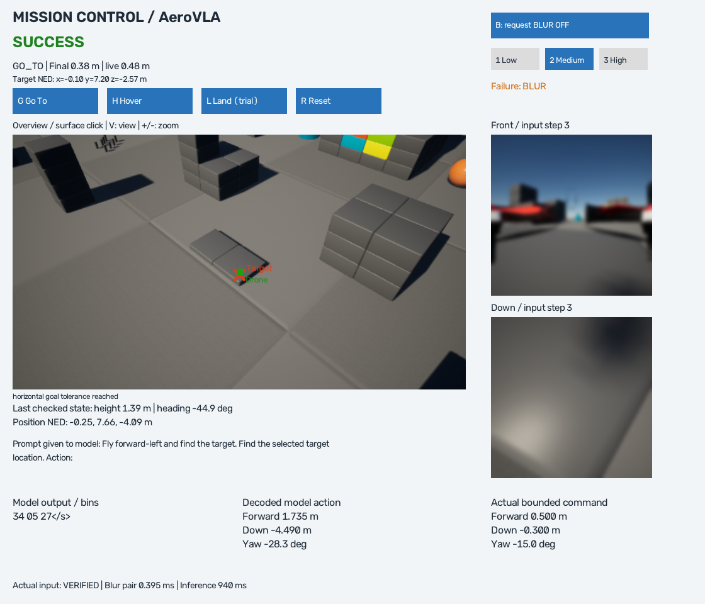
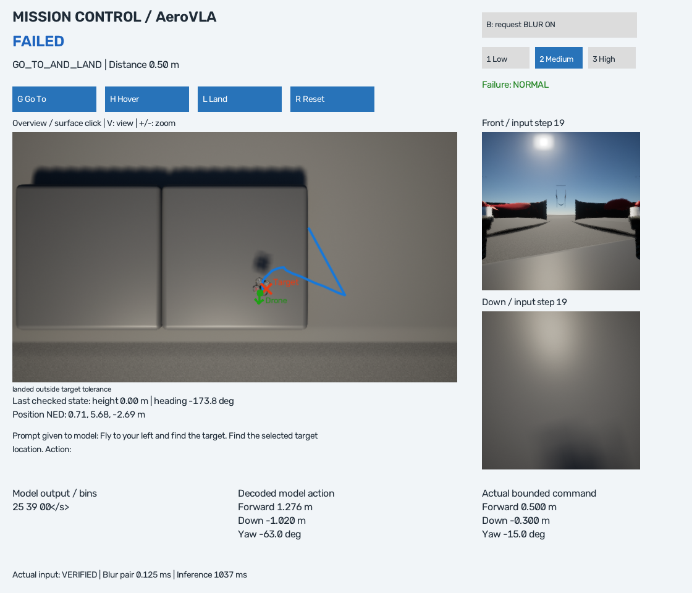

# Interactive Mission Runner

> 2026-10-10: 같은 화면을 동결한 AeroVLA-OFT baseline으로 나는 mode가 생겼다 — [grounding_film Interactive Mission Control](grounding_film_interactive_demo.md) (`.\scripts\run_grounding_film_mission_demo.ps1`). 이 문서는 기존 mode(방향 힌트를 쓰는 AeroVLA)의 것이고, 그 동작은 바뀌지 않았다.

> 2026-10-06 후속 업데이트: [Full Map + Target Grounding Inspector](full_map_grounding.md). 기본 Overview는 scene geometry 전체를 fit하는 Top-down으로 변경했고 F/C/WASD와 방향·visibility Inspector를 추가했다. 아래는 최초 미션 실행기의 검증 기록이며 당시 UI/카메라 기본값과 구분한다.
>
> **현재 동작은 [Model Self-Evaluation](model_evaluation.md) 이후 바뀌었다.** 미션 종류는 하나(G)이고, 모델 행동을 원래 크기로 실행하며, **모델이 LAND를 출력하면 착륙하고 그 지점의 거리로 성공을 판정**한다. H/L 미션, 0.45m 도착 판정, 전진 0.5m·상하 0.3m·회전 15° 제한, 0.8–4m 고도 이탈 실패는 더 이상 없다. 아래 본문에서 이 항목들을 다루는 부분은 **당시 기록**이다. 현재 조작은 바로 아래 표를 따른다.

## 현재 조작 (2026-10-06 이후)

| 조작 | 기능 |
|---|---|
| 맵 클릭 | 평평한 표면의 좌표 목표. 파란 원뿔·주황 공을 클릭하면 그 landmark가 목표가 된다. 블록 위를 클릭하면 그 블록의 종류와 색이 설명 문장이 되고(`The target is the top of a gray block.`), 목표 45m 안에 들어오면 그 면보다 6m 위로 올라간다 |
| N | 이름 있는 landmark를 차례로 선택 (blue cone → orange ball → colored wall) |
| G | 미션 시작. 모델이 LAND를 낼 때까지 비행하고, LAND가 나오면 착륙한 뒤 정지 지점으로 판정 |
| M | prompt 모드를 차례로 바꾼다. **방향 힌트 + 설명**(기본) → **설명만**(방향 문장 없음) → **지시문만**(`Land on top of the large blue cone. Fly around, find it with your camera, then fly straight to it and land.`) |
| R | 끝난 미션 초기화; 드론 위치는 그대로 |
| F / C / WASD / +,- / V | 전체 맵 / 드론 중심 / pan / zoom / 시점 |
| B / 1·2·3 | Gaussian Blur ON/OFF / 강도 |
| Q / Esc / 창 닫기 | 중단 → 착륙 처리 → 종료 |

기본은 **연속 비행**이다: 도착 2초 전에 다음 영상을 찍어 판단하고, 멈추지 않고 다음 구간으로 넘어간다. `.\scripts\run_mission_demo.ps1 -Flight step`은 이전처럼 step마다 멈춘다. 화면 오른쪽 위 `Flight:`에 현재 방식이 표시된다. [근거와 비교](model_evaluation.md#연속-비행).

모델 출력의 숫자 자리에 다른 토큰이 끼면 유효한 토큰 중 확률이 가장 높은 것으로 바꾸고 `Grammar: token …`으로 표시한다. 이전에는 이런 출력에서 미션이 `invalid_action`으로 끝났다. 블록 위 목표에 착륙하면 결과 줄에 고른 면 위인지, 몇 m 아래인지가 함께 나온다. 기본 출발점에서 블록 위에 착륙한 실행은 아직 없다(가까운 시작점에서는 6회 중 5회). 지시문만 준 모드에서 모델은 지시한 물체를 찾아가지 못한다. [근거](model_evaluation.md#깨진-출력-블록-위-목표-지시문만으로-찾아가기).

성공 반경·step 한도는 [mission_limits.json](../configs/mission_limits.json), 고도 범위·행동 배율은 [flight_limits.json](../configs/flight_limits.json), landmark 설명은 [landmarks.json](../configs/landmarks.json)에서 바꾼다. 기체가 구조물에 부딪히면 simulator가 기체를 그 자리에 고정하므로 미션은 `collision`으로 끝나고, 새로 시작하려면 Q로 종료한 뒤 다시 실행한다.

2026-10-06 검증. **맵에서 목표를 클릭하면 AeroVLA가 실제 영상으로 이동하고, 목표 오차와 성공·실패를 한 창에서 확인하는 데모**다. Windows Project AirSim Blocks + WSL2 AeroVLA NF4 구조를 유지했다. 이동·호버는 성공했고, 목표 착륙은 실패했다. 아래 기록은 각각 한 번의 기능 확인이며 성공률이나 Blur 강건성 평가가 아니다.

## How I Can Check It (최초 검증 당시 안내)

이미 준비된 이 PC에서는 저장소 폴더에서 다음 한 줄을 실행한다.

```powershell
.\scripts\run_mission_demo.ps1
```

Simulator와 관찰 창이 자동으로 열린다. 지도는 먼저 보이고, **첫 미션 시작 때만 기존 캐시의 모델을 로딩**한다. 모델이나 환경을 다운로드하지 않는다. 다른 PC의 준비 순서는 [setup](setup.md), 기존 Blur 전용 실행은 [Gaussian Blur demo](gaussian_blur_demo.md)를 따른다. 기존 Simulator가 열려 있으면 닫고 시작한다.

1. Overview에서 녹색 드론과 시작 플랫폼을 찾는다. 필요하면 `+`로 확대한다.
2. 시작 플랫폼의 드론 근처에 있는 평평한 지점을 클릭한다. 처음에는 약 1–2m 거리의 목표를 권장한다. 화면의 `Target NED: x/y/z`와 빨간 X를 확인한다.
3. `G` 또는 Go To 버튼을 누른다. 첫 로딩 중에는 기다린다. 처음에는 Blur를 끈다.
4. Front/Down, 거리, 궤적, raw/decoded/bounded action과 SUCCESS/FAILED를 확인한다. `Q`로 종료한다.

| 조작 | 기능 |
|---|---|
| 맵 클릭 | 해당 프레임의 실제 depth로 표면 목표 선택 |
| G / H / L | 이동 / 이동 후 호버 / 이동 후 착륙 시험 |
| R | 완료된 미션을 초기화; 실행 중에는 거절 |
| V | 수직 Top-down ↔ 기울어진 Elevated |
| + / - | 확대 / 축소; 카메라 높이 18–65m |
| B / 1·2·3 | 기존 Gaussian Blur ON/OFF / LOW·MEDIUM·HIGH |
| Q / Esc / 창 닫기 | 미션 중단 요청 → 착륙 처리 → 종료 |

조작은 다음 안전한 관측 경계에 적용된다. 추론·RPC를 즉시 중단하는 방식은 아니다. 클릭과 시작 요청은 순서대로 처리한다. 완료 후 다른 목표를 클릭하거나 R을 누르면 새 미션을 준비할 수 있다. 당시 H/L의 허용 여부는 이전 미션의 검증 결과와 기능 게이트 설정(`configs/mission_capabilities.json`, 현재는 삭제)에 따랐고, L은 성공하지 않은 시험 기능이었다.

## Map / Overview — ✅

기존 Front/Down의 pose, 256×256 RGB 설정, 차량·물리 설정은 그대로다. 사용자 관찰용 Overview만 RGB + DepthPlanar 640×360, HFOV 80°로 추가했다. 수직/기울어진 시점을 실제 비교한 뒤 주변 Blocks와 시작 플랫폼이 함께 보이는 **Elevated, 높이 50m**를 기본값으로 정했다. 드론의 실제 위치·heading, 빨간 목표 X, 실제 이동 궤적을 투영해 표시한다. 이 지도는 AI 입력에 들어가지 않는다.



화면에는 Overview, Front, Down, 미션 상태, 목표 좌표, 거리, 실제 Blur 상태, prompt, 모델 원문, 해석된 행동, 제한 후 실행 명령이 함께 나온다. 성공/실패 후에는 **Final**이 판정 시점의 오차이고 **live**는 마지막 관측 위치의 현재 오차다. 완료 판정 이후 위치가 변해도 과거 결과를 덮어쓰지 않는다.

## Target Selection — ✅

로컬 Project AirSim SDK의 `list_objects`, `get_object_pose`, `get_3d_bounding_box`, `get_images`, `set_camera_pose`를 조사하고 실제 호출했다. object 조회는 193개 이름과 30개 pose/bounds에서 확인했다. `TemplateCube_Rounded_1`의 실제 중심 `(3.10, 4.00, 0.00)`, 크기 `(10,10,5)`에서 시작 플랫폼 top NED z=-2.50m를 확인했다. SDK에서 직접 제공하는 screen raycast/deprojection은 찾지 못해 **실제 DepthPlanar와 capture pose를 이용한 deprojection**을 구현했다. 임의의 ground plane이나 가짜 landmark 좌표를 사용하지 않는다.

`get_images('Overview', [0, 1])`의 RGB/depth timestamp와 camera pose가 같은지 검증한다. depth는 16FC1, float16, 미터 단위다. 화면 클릭은 원본 640×360 pixel로 환산한 뒤 **표시한 frame ID**를 전달한다. worker가 보존한 최근 네 프레임에서 그 depth/pose만 사용한다. 만료된 프레임은 거절한다. PNG hash도 확인하여 새 metadata와 이전 영상이 섞이지 않게 한다.

NED 좌표이며 z는 아래 방향 양수다. 카메라 x는 광축 앞, y는 영상 오른쪽, z는 영상 아래다.

```text
f = W / (2 tan(HFOV / 2)); cx=W/2; cy=H/2
camera_point = [d, (u-cx)d/f, (v-cy)d/f]
world_point = R(captured_quaternion) camera_point + captured_position
```

DepthPlanar의 d는 광축 방향 거리다. Euler 각도나 가정한 고정 pose 대신 **해당 캡처의 실제 quaternion**을 사용한다. 기체가 움직이면 Overview의 상대 pose를 갱신해 원하는 world 시점에 맞춘다. 실제 캡처 pose로 투영하므로 화면 pixel을 재사용해도 같은 world 목표라고 가정하지 않는다.

실제 목표 예: `(-0.144956, 7.172845, -2.500000)`m. 수직 probe의 두 표본은 플랫폼 top z=-2.50m와 수 mm 이내로 맞았지만 전체 좌표 정확도를 입증한 것은 아니다. 기울어진 50m 시점의 후속 클릭은 z=-2.567388m로, 알려진 플랫폼 top과 약 **6.7cm 차이**가 있었다. float16 depth, raster 해상도, pose 갱신, 표면 경계의 영향을 받는다. 정밀 착륙 좌표로 일반화하지 않는다. sky/0/NaN/Inf depth, 맵 바깥, 급경사(20° 초과 추정), 현재 비행 고도보다 높은 표면은 거절한다. 장애물 회피와 경로 도달 가능성 검사는 없다.

## Mission Types / Success Criteria

[mission limits](../configs/mission_limits.json)를 수정하면 기준을 조절할 수 있다. 현재 XY 0.45m, 고도 0.40m, 속도 0.25m/s, 안정 유지 1초, 최대 60 VLA step / 300초다. `-MaxSteps 15`처럼 launcher에서 step 제한을 낮출 수도 있다.

| 미션 | 성공 조건 | 실제 결과 |
|---|---|---|
| GO_TO | XY 오차 ≤0.45m | ✅ |
| GO_TO_AND_HOVER | XY·고도·속도 기준을 1초 유지 | ✅ |
| GO_TO_AND_LAND | 도착 후 landing; 최종 LANDED + XY≤0.45m + 표면 높이 오차≤0.5m | ❌ |

Hover/navigation goal z는 시작 직후의 실제 비행 고도이고, 클릭한 surface z는 별도로 보존한다. 표면과 비행 고도의 차이가 0.8m 미만이면 시작을 거절한다. 고도가 맞지 않거나 호버 중 위치가 벗어나면 **기존 VLA navigation**으로 돌아가며 목표를 향한 보정 명령을 만들지 않는다. 충돌, 시간/step 초과, invalid action, RPC 실패, 고도 범위 이탈은 실패로 기록한다. Q는 ABORTED다. 종료 착륙으로 FAILED/ABORTED가 SUCCESS로 바뀌지 않는다.

상태: `IDLE → TARGET_SELECTED → NAVIGATING → HOVERING/LANDING → SUCCESS/FAILED`, 수동 종료는 `ABORTED`. 실행 중 재선택과 R reset은 거절한다.

## AeroVLA Integration

**Mission target actually passed: YES. Mission Manager direct steering: NO.** 클릭의 실제 surface XY와 비행 goal z를 `model.infer(..., target_position, instruction)`에 전달한다. 기존 adapter가 body-frame 방향을 계산해 다음 upstream 형식의 prompt를 만든다.

```text
<image>
Fly straight ahead and find the target. Find the selected target location.
Action:
```

실제 방향에 따라 straight ahead / forward-left / right / rear 등이 달라진다. **XYZ, 거리, 지도 영상은 모델의 숫자 token 입력이 아니다.** 현재 target representation은 coarse direction + 일반적인 target 문장이다. 색상 landmark grounding이나 자유 자연어 이해를 검증한 것으로 해석하지 않는다. Front/Down BGR→RGB→224×448 mosaic, NF4 loader, PEFT adapter, 기존 action 변환은 재사용했다.

VLA의 fwd/down/yaw를 기존 범위 전진 ≤0.5m, 상하 ±0.3m, yaw ±15°로 제한한다. 초기 resting platform 기준 clearance 0.8–4m이며 지형 기준 AGL이 아니다. 목표 벡터로 직접 속도를 만드는 controller를 추가하지 않았다. native takeoff, pause/hover, 도착 후 landing과 종료 landing은 별도이다. 추론 뒤 이동 RPC 직전에 collision·고도·시간·미션 상태를 다시 검사한다.

## Live Test — 순서와 실패 보존

| 순서 / 미션 | Blur | 초기→최종 XY 거리 | VLA step | 판정 / 이유 |
|---|---|---|---:|---|
| 1 지도/클릭 | OFF | 실제 depth·pose·scene bounds 확인 | 0 | ✅ |
| 2 GO_TO | OFF | 1.1897→0.2204m | 6 | SUCCESS; XY 기준 도달 |
| 3 HOVER 초기 prototype | OFF | 1.0758→0.5712m | 12 | FAILED; 300초 timeout, 고도 오차 1.6413m |
| 3 HOVER 전환 오류 수정 후 | OFF | 1.1897→0.2881m | 7 | SUCCESS; 고도 오차 0.1005m, 안정 유지 |
| 4 LAND | OFF | 4.6565→0.5044m | 19 | FAILED; 최종 XY 오차가 0.45m 초과 |
| 5 검증된 GO_TO + 기존 Blur | MEDIUM ON | 1.2048→0.3756m | 3 | SUCCESS; 실제 input tensor 3/3 변경 |

초기 호버는 XY만 만족하면 HOVERING으로 전환해 고도가 틀려도 policy를 멈추던 구현 오류가 있었다. 고도 기준도 전환 조건에 넣고 drift 시 VLA로 복귀하도록 고쳤다. 해당 실패 로그는 삭제하지 않았다. **호버 성공 후에만 착륙 시험을 시작했다.** 착륙 목표는 별도의 depth 클릭 `(0.990793, 6.100104, -2.515330)`m이며 시작 위치도 달랐다. 이전 호버와 같은 target/initial condition으로 비교하지 않는다. 거리 감소가 단조롭지 않았고 안정적인 일반 navigation을 입증하지 않는다.

Raw 결과/steps는 `outputs/mission_demo/mission-results.json`, `mission-steps.jsonl`, 이전 run은 `outputs/mission_demo/runs/`에 로컬 보존한다. 각 step에는 timestamp, 실제 position/target/distance, instruction/prompt, raw output, parsed/bounded action, RPC 반환, state, Blur metadata, 실제 GPU tensor hash가 있다. 연결이 끊어져도 마지막 유효 관측과 `last_validated_before_exit` 표시로 실패 결과를 저장한다.

## Landing — Mission Manager fallback / 실패

upstream wrapper는 `LAND`/`<LAND>` 또는 거의 0인 세 행동 값을 stop 신호로 인식한다. 기존 데모는 stop을 hover로 처리한다. 미션에서는 도착 허용 오차 안에서 그 신호가 나온 경우 provenance를 구분하고, 없으면 **AeroVLA navigation + mission-level landing trigger**를 사용한다. 실제 LAND 시험의 마지막 output은 `25 39 00`; 신호가 없어 native `land_async` fallback이었다. XY 진입 후 착륙했지만 최종 오차 0.5044m로 실패했다. AeroVLA가 직접 착륙을 결정했다고 주장하지 않는다.

후속 Blur GO_TO의 종료에서 새 착지 확인 helper가 `land_return=True`, `landed_state=1`을 받고 **프로그램 cleanup FAIL**을 기록했다. 미션 SUCCESS와 cleanup FAIL은 별도 결과다. SimpleFlight에서는 motor가 켜져 있으면 착지 상태가 FLYING으로 남을 수 있다. [Land 구현](https://github.com/iamaisim/ProjectAirSim/blob/main/vehicle_apis/multirotor_api/src/multirotor_api_base.cpp)은 하강 명령 뒤 Z 속도가 약 0인 상태를 1초 확인해 완료하고, [firmware 착지 판정](https://github.com/iamaisim/ProjectAirSim/blob/main/vehicle_apis/multirotor_api/include/simple_flight/firmware/OffboardApi.hpp)은 낮은 throttle과 작은 linear/angular velocity를 요구한다.

최종 helper는 Land 성공 + 별도 finite linear/angular velocity≤0.08 및 위치 이동≤0.02m를 1초 확인한 후 disarm하고, **그 뒤 LANDED=0을 다시 요구**한다. Land 실패 + FLYING 상태에서는 disarm하지 않는다. 이는 직접적인 지형 접촉 센서 판정이 아니라 API 완료와 kinematics에 기반한 접촉 추정이다. 최초 하강 시작 확인의 결과를 upstream이 무시하는 한계도 있다. cleanup 오류를 숨기지 않고 launcher의 실패로 전달한다. 수정 후 모델 없는 실제 takeoff→land→disarm probe는 **PASS**: land True, disarm 전 state 1, 정지 1초, disarm 후 state 0, 최종 z=-2.692682m. 이 기록은 `outputs/mission_demo/cleanup-probe-result.json`에 보존하며 미션 착륙 성공으로 세지 않는다.



## Gaussian Blur Compatibility

OFF에서는 이전 input과 같은 tensor임을 확인했다. B/1/2/3의 기존 handler와 injector를 그대로 사용하고, mission request ID와 Blur revision을 분리했다. Test 5에서 MEDIUM blur 적용 후 실제 GPU `pixel_values`의 원본 대비 차이가 `[true,true,true]`였다. UI 이미지와 실제 model input hash도 일치했다. 이 결과를 NORMAL 대비 성능 개선/저하나 강건성 주장에 사용하지 않는다.

클릭·G/B 요청의 live 자동 확인은 **관찰 창과 동일한 handler가 만든 file protocol**로 수행했다. 물리적 마우스/키 입력을 자동화해서 확인한 것은 아니다. 실제 OpenCV 창의 렌더링/export와 callback 좌표 변환은 확인했다. 사용자가 직접 조작하는 권장 순서는 위 실행 안내다.

## Tests

새 geometry/selection/mission/flight/UI 테스트와 simulator/model stub 기반의 오류 경로 테스트를 추가했다. 기존 Gaussian Blur·input trace·adapter·config·media 테스트를 유지한다. 부분 takeoff 실패의 landing-before-disarm, 연결 실패의 결과 보존, 추론 중 collision/deadline의 명령 차단, 클릭 직후 G의 queue, landed-state compatibility를 검사한다. Worker 소유권 검사 테스트는 자식 프로세스가 실제 시작했다는 ack를 기다려 fork/exec race를 제거했다. 실제 worker의 소유권 검사를 느슨하게 바꾸지는 않았다.

```powershell
wsl -d Ubuntu --exec sh -c '$HOME/uav-vla-smoke/integration/bin/python -m unittest discover -s tests -v'
powershell.exe -NoProfile -File tests/test_mission_control_cli.ps1
```

첫 명령은 이 PC의 준비된 환경 경로를 사용한다. Windows PowerShell 5.1 / PowerShell 7에서 mission 초기화, launcher parse, Blur init/quit, native/WSL argv, worker exit tracking은 모두 통과했다. 전체 회귀 결과는 아래 완료 기록에 적었다.

완료 검증: **기존 24 + 신규 23 = Python 47/47 통과**. PowerShell 5.1 / 7의 네 검사 script도 각각 통과했다. 별도 읽기 전용 코드 검토에서 발견한 부분 takeoff cleanup, 착지 확인 순서, click/start 덮어쓰기, 연결 실패 기록 누락, 추론 후 collision/deadline 검사 누락을 수정하고 재검토했다. 최종 unresolved Important finding은 없다. UI export 두 장은 실제 관측이며 각 1MiB 미만이다. 기존 baseline 설정·model revision·원본 예시를 보존했고, 대용량 파일/개인 경로/credential pattern/문서 링크 검사도 통과했다.

Git 구현: `codex/interactive-mission`, source commit `2a9c934`. 구현과 문서·대표 이미지를 별도 커밋으로 나누며, 최종 `main` commit은 `git log -1 --oneline`으로 확인할 수 있다. 종료 후 simulator 포트와 소유 worker가 남지 않았음을 확인했다. raw 로그와 probe는 로컬에만 남긴다.

## Current Limitation / Next Recommended Task

1. 가까운 시작 플랫폼의 소수 기능 시험만 수행했다. LAND 실패와 초기 HOVER/cleanup 실패를 보존했다. 장거리·복잡한 경로·반복 성공률은 미검증이다.
2. 1초 호버 성공은 장시간 같은 위치를 유지한다는 보장이 아니다. 종료 후 pause는 native hover이며 target steering을 하지 않는다.
3. float16 depth로 클릭 좌표를 만들고, coarse 방향만 모델에 전달한다. 색상/객체 기반 landmark grounding, terrain-aware planning은 없다.
4. Q는 관측 경계에서 처리하므로 긴 모델 로딩/RPC 중에는 대기할 수 있다. Launcher는 종료 deadline과 정확한 worker token/PID 확인을 사용한다.

다음 한 가지 권장 작업: **현재 coarse goal prompt가 목표와 고도 정보를 얼마나 잃는지 분석**한다. 실패 로그와 upstream target representation을 비교하고 그 다음 실험을 설계한다. 이번 단계에서 추가 Failure, Detection, Recovery, 재학습, 대규모 evaluation은 시작하지 않는다.
