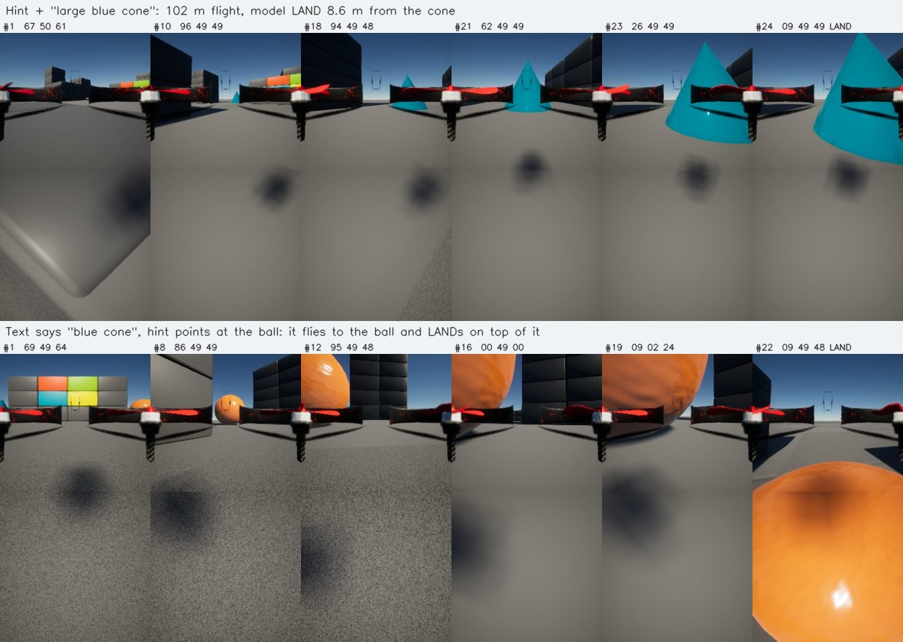
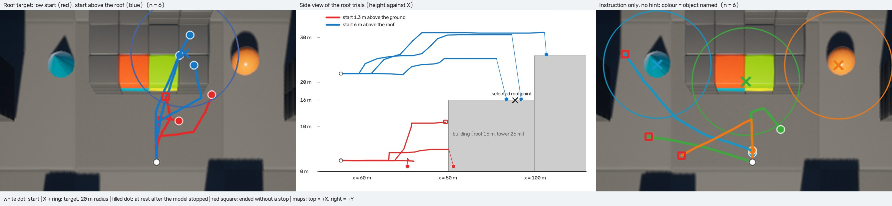

# Model Self-Evaluation — 하네스 수정 후 AeroVLA 자체 평가

2026-10-06 실행. 이전 Near/Medium/Far 미션 실패의 원인을 로그로 확인해 **실행 하네스를 고쳤고**, 고친 상태에서 AeroVLA NF4가 Blocks 맵에서 무엇을 할 수 있는지 처음으로 측정했다.

**요약**

- **하네스는 더 이상 병목이 아니다.** 이동 step당 평균 4.05m를 실제로 움직이고(이전 0.27m), 고도 오차 중앙값은 0.02m다. 69 trial에서 고도 이탈 실패와 프로그램 오류는 0건이다.
- **모델은 방향 힌트를 따라 날아가고 스스로 멈춘다.** 힌트가 실제 목표를 가리킨 35회(초기 거리 20m 초과) 중 33회가 목표 쪽으로 5m 이상 접근했고, 12회는 목표 20m 안에서 모델이 정지했다(10m 안 9회).
- **힌트가 없으면 출발하지 않는다.** 13회 모두 첫 step에서 LAND였다.
- **설명 문장으로 목표를 고르지 않는다.** 설명과 힌트가 서로 다른 landmark를 가리키면 힌트 쪽으로 갔다.
- **결과가 실행마다 갈린다.** 같은 조건이 8m에서 멈추기도, 34m에서 멈추기도, 목표물에 부딪히기도 했다. 충돌 13회, invalid 출력 8회.
- **(추가) invalid 출력은 이동 명령의 숫자 토큰 하나가 원본 OpenVLA의 action 토큰으로 바뀐 것이었다.** 유효한 토큰만 고르는 디코더로 바꿨고, 그 뒤 `invalid_action` 종료는 없다. [상세](#깨진-출력-블록-위-목표-지시문만으로-찾아가기)
- **(추가) 블록 위 목표는 위에서 접근해야 닿고, 먼 출발점에서는 아직 실패한다.** 42m 거리에서 지붕보다 6m 위로 올라가 출발하면 6회 모두 10m 안에서 정지했고 5회는 그 지붕에 착륙했다. 97m 떨어진 기본 출발점에서는 9회 모두 실패했다.
- **(추가) 지시문만으로는 찾아가지 못한다.** "원뿔 위에 착륙해라, 돌아다니며 카메라로 찾아라" 형태에서는 출발은 하지만 지시한 물체 20m 안에서 멈춘 경우가 0/6이다.


69 trial의 실제 궤적이다. 선 색은 평가 대상 목표(파랑 cone, 초록 wall, 주황 ball, 보라 좌표 목표), 흰 점은 시작, X와 원은 목표와 20m 반경, 채운 점은 모델이 스스로 멈춘 지점, 빨간 사각형은 정지 없이 끝난 지점이다. 위쪽이 +X, 오른쪽이 +Y다. 이 지도는 모델 입력이 아니다.

## 무엇이 문제였나

기존 로그(`outputs/full_map/*-run`, `outputs/mission_demo/runs/`)와 [upstream AeroVLA 제어 코드](https://github.com/XuPeng23/AeroVLA/blob/2c5ae0987a484ab92f00dd9d9ed493cb3e98e492/airsim_plugin/AirVLNSimulatorClientTool_AeroVLA.py)를 대조한 결과다.

| 문제 | 근거 | 수정 |
|---|---|---|
| 모델 행동을 축마다 다르게 깎음 | 모델 출력 전진 0–5m(대부분 4.9m)·회전 ±63°를 0.5m·±15°로 잘랐고 실제 이동은 step당 약 0.27m. Far 68m는 60 step × 0.5m = 30m라 도달 불가 | upstream과 같은 의미·크기로 실행. 자르지 않음 |
| 속도 명령이 고도를 잃음 | `move_by_velocity_async(vz=0)`를 쓴 32개 step에서 평균 6.1–6.4cm 하강. Medium 9 step, Far 12 step에서 0.8m 하한에 닿아 `extreme_altitude` | 위치·고도 유지 명령으로 교체 |
| 고도 범위가 미션을 종료시킴 | 이륙 후 여유 1.27–1.41m, 하한 0.8m. 감시(±0.05m)와 변환기(±0.02m)의 허용오차가 달라 그 사이에서는 프로그램이 `runtime_error`로 종료 | 범위를 0.8–30m로 넓히고 실패 대신 목표 고도 제한으로 적용. 정의는 한 곳 |
| 모델의 LAND를 무시 | 저장된 run에서 모델이 LAND를 3회 출력(목표에서 0.67 / 0.78 / 1.01m). hover 한 번으로 처리하고 계속 진행 | LAND가 episode를 끝냄. 착륙 후 그 지점으로 판정 |
| 판정이 정책과 맞지 않음 | GT 좌표 0.45m 안에 들어와야 성공. upstream 판정은 "모델이 멈춘 지점이 목표 20m 이내" | 성공 반경 20m(설정값), 더 엄격한 10m·5m도 함께 보고 |
| G/H/L이 모델과 무관 | 세 미션 모두 같은 prompt. 차이는 0.45m 진입 뒤 Mission Manager의 동작뿐 | 미션 하나로 통합 |
| 목표가 영상에서 식별 불가 | 설명이 항상 "Find the selected target location." | scene의 실제 물체를 landmark로 지정하고 그 설명을 전달. 방향 힌트를 끌 수 있음 |

## 수정한 내용

### 실행기

upstream `move_path()`는 `현재 yaw + 예측 yaw`로 회전한 뒤, **예측 yaw가 0.25rad(약 14°) 미만일 때만** (전진, 상하) 변위를 1m/s로 이동하고, 그보다 큰 회전에서는 제자리에서 고도만 바꾼다. [action adapter](../src/integration/projectairsim_action_adapter.py)가 같은 규칙을 따른다. 이전의 0.5m / 0.3m / 15° 제한은 없다.

Project AirSim에서 각 동작에 쓸 API는 실제 비행으로 골랐다(각 1회 측정, `outputs/model_eval/probe/`).

| 동작 | API | 실측 |
|---|---|---|
| 5m 전진, 1m/s | `move_to_position_async` | 5.22m 이동, 고도 오차 +0.04m, 6.0초 |
| 같은 전진, 기존 방식 | `move_by_velocity_async` | 4.56m 이동, 고도 0.06m 하강 |
| 같은 전진, 2m/s | `move_to_position_async` | 5.66m 이동, 고도 오차 0.20m → 1m/s 유지 |
| 2.5m / 5m 상승 | `move_by_velocity_z_async` (수평 속도 0) | 고도 오차 0.05m / 0.06m |
| 63° 회전 | 같은 명령의 yaw 목표 | 약 1초에 3° 이내 도달. `rotate_to_yaw_async`는 같은 회전에 5.5–6초 |
| 1m 미만 이동 | `move_by_velocity_z_async` 1초 | 0.5m 명령에 0.39m. 위치 제어는 이 거리를 무시해 upstream처럼 1초 속도 이동 사용 |
| 전진 + 상하 동시 | 위치 이동 후 고도 보정 | 보정 전 고도 오차 0.5m → 보정 후 0.08m |

위치·고도 명령의 반환값은 짧은 이동이나 수직 이동에서 실제로 움직였는데도 False가 나온다. 그래서 반환값이 아니라 hover 거부와 실제 상태로 판단한다. 이동 뒤 남은 수직 오차가 0.15m 미만이면 따로 보정하지 않으므로, 모델이 낸 ±0.1m 수준의 상하 값은 일부만 반영된다.

### 고도 범위

[flight_limits.json](../configs/flight_limits.json)의 `minimum_clearance_m` 0.8, `maximum_clearance_m` 30(시작 지면 기준, 맵 최고 구조물보다 약 7m 위). 범위를 넘는 목표 고도는 범위 안으로 제한하고 미션을 끝내지 않는다. 범위 밖에 있는 기체는 한 step에 모델의 상하 범위(5m) 이내로만 되돌린다. 지형 기준 고도가 아니므로 구조물 충돌은 막지 못하고, 충돌은 simulator의 collision 이벤트로 판정한다.

### 종료와 판정

[Mission Manager](../src/mission/manager.py)는 좌표로 비행을 끝내지 않는다.

| 종료 | 조건 | 판정 |
|---|---|---|
| 모델 정지 | 출력에 `LAND`, 또는 세 값이 모두 0에 가까움 | 착륙 실행 후, 정지 시점의 수평 거리가 반경 이내면 SUCCESS |
| `collision` | simulator collision 이벤트 | FAILED |
| `invalid_action` | 출력이 유효한 세 정수도 `LAND`도 아님 | FAILED. 세션은 유지. 문법 디코더(기본)에서는 발생하지 않았다 |
| `max_steps` | step 한도 | FAILED |
| `stuck` | 15 step 넘게 수평 이동 5cm 미만 (upstream 규칙) | FAILED |
| `diverging` | 10 step 연속으로 목표에서 멀어짐 (upstream 규칙; 제자리 회전은 세지 않음) | FAILED |

착륙은 기존 native Land를 쓰되, 높은 곳에서는 20초 제한에 걸리므로 지면 1.5m 위까지 먼저 2m/s로 내려온다(12m에서 착륙까지 13초).

Blocks의 FastPhysics는 구조물에 부딪힌 기체를 그 자리에 고정한다. 후진도 착륙도 되지 않는 것을 확인했다(`probe-collision-result.json`). 그래서 충돌은 그 세션에서 회복할 수 없는 종료이고, 종료 정리에서는 착륙 대신 모터를 끄고 그 사실을 기록한다.

### 목표와 prompt

[landmarks.json](../configs/landmarks.json)의 물체 이름으로 **simulator bounding box를 조회해** 위치를 얻는다. 좌표를 직접 적지 않는다.

| Landmark | 물체 | 전달하는 설명 |
|---|---|---|
| Blue cone | `Cone_5`, 폭 10m | The target is a large blue cone standing on flat gray ground. |
| Orange ball | `OrangeBall`, 지름 10m | The target is a large orange ball resting on flat gray ground. |
| Colored wall | 건물 정면의 색 블록 4개 | The target is a wall of four colored blocks, orange, green, blue and yellow, on a gray building. |

모델에 들어가는 것은 Front/Down RGB와 아래 한 문장뿐이다. 좌표·거리·지도·visibility는 들어가지 않는다.

```text
Fly forward-left and find the target. The target is a large blue cone standing on flat gray ground.
Fly and find the target. The target is a large blue cone standing on flat gray ground.      ← 방향 힌트 OFF
```

방향 힌트는 upstream과 같이 GT 목표 위치와 기체 자세로 계산한 7구간 문장이다. upstream도 이 힌트를 쓴다. 힌트 OFF 문장은 upstream이 목표 거리 0에서 내는 형태와 같다. landmark 설명 문장은 이 저장소에서 쓴 것이고, upstream 학습 데이터의 설명 문체와 같다고 확인하지 못했다.

## 평가 방법

[evaluation_protocol.json](../configs/evaluation_protocol.json)에 정의했고 [evaluate_model.py](../scripts/evaluate_model.py)가 실행한다. trial마다 scene을 다시 로드해 같은 위치·자세에서 시작한다. 디코딩은 greedy지만 **같은 trial을 다시 돌려도 결과가 달라진다.** 회전하는 프로펠러가 Front 영상에 찍히는 등 영상이 매번 조금 다르고, 첫 step의 출력부터 갈리는 경우가 있었다. 그래서 주요 조건은 3–4회 반복했다.

| 항목 | 값 |
|---|---|
| 모델 | OpenVLA-7B NF4 + AeroVLA LoRA (기존 loader 그대로) |
| 시작 `spawn` | (-1, 8), yaw -45°, 시작 플랫폼 위 — 저장소 기본값 |
| 시작 `facing` | (55, 0), yaw 0°, 평지. 첫 Front 영상에 세 landmark가 모두 보임: cone 왼쪽 앞 51m, wall 정면 30m, ball 오른쪽 앞 48m |
| 시작 `facing_cone` / `facing_ball` | 같은 위치에서 cone / ball을 정면에 둔 방향 |
| 시작 고도 | native takeoff 1.3–1.5m. `-high` trial만 10m까지 올린 뒤 시작 |
| Prompt 조건 | `hint+generic`(이전 방식) / `hint+landmark` / `landmark-only`(힌트 없음) / `instruction`(지시문만, 뒤에 추가) |
| 디코더 | 이 절의 69 trial은 제약 없는 greedy(`free`). 뒤에 추가한 실험은 문법 제약(`grammar`, 현재 기본) |
| `conflict` | 설명은 한 landmark, 방향 힌트는 다른 landmark의 좌표 |
| `fixed_hint` | 설명은 landmark, 방향 힌트는 실제 방향과 무관하게 항상 "straight ahead" |
| 한도 | trial당 30–45 step |
| 지표 | 모델 정지 여부와 그 지점의 거리, 비행 중 최소 거리, 충돌 |

## 결과

**69 trial**(trial 정의 30개, 각 1–4회), 모델 decision 654회, 총 비행 1,873m다. 표의 거리는 모두 평가 대상 목표까지의 수평 거리이고, **굵은 값은 모델이 20m 안에서 스스로 멈춘 경우**다. 전체 trial 표는 문서 끝에 있다.

### 1. 실행기: 모델이 낸 만큼 실제로 움직인다

| | 이전 | 수정 후 |
|---|---|---|
| step당 수평 이동 | 약 0.27m | 이동 step 평균 4.05m (회전 step 포함 2.90m) |
| 명령 대비 이동 오차 | 명령 0.5m에 0.27m | 1m 이상 이동 441회의 중앙값 0.16m |
| 고도 | step마다 약 6cm 하강 | 목표 고도 대비 오차 중앙값 0.02m, 90% 지점 0.08m |
| `extreme_altitude` / `runtime_error` | 3개 미션 중 2개 / 추가 1회 | 69 trial 중 0 / 0 |

고도 제한은 36개 step에서 목표 고도를 범위 안으로 잘랐고(모델이 0.8m 아래로 내려가려 한 경우), 미션은 계속됐다. 모델이 올라간 최고 높이는 시작 지면 위 21m였다.

### 2. 이전 좌표 재실행

같은 시작점·같은 좌표·같은 prompt(`hint+generic`)다.

| 목표 (초기 거리) | 이전 결과 | 수정 후 3회 |
|---|---|---|
| Near (2.0m) | 30 step 뒤 1.29m, `max_steps` | **4.5m · 4.8m · 3.1m**에서 모델 정지 |
| Medium (9.5m) | 9 step 뒤 7.63m, `extreme_altitude` | **4.1m · 4.7m · 2.7m**에서 모델 정지 (최소 거리 1.0 · 0.1 · 1.0m) |
| Far (68.0m) | 12 step 뒤 66.0m, `extreme_altitude` | 39.8m에서 정지 · 40 step 동안 정지 없음(최소 0.9m, 종료 시 10.4m) · 12.8m에서 invalid 출력 |

Near는 한 step(최대 5m)보다 가까운 목표라 출발점보다 가까워지지 못했다. Far는 이전에 2m 접근하던 것이 세 번 중 두 번 13m 안까지 갔다. 다만 목표 근처에서 멈춘 적은 없다.

### 3. Prompt 조건 (시작 `facing`, 같은 첫 영상)

| 목표 (초기 거리) | hint+generic | hint+landmark | landmark-only |
|---|---|---|---|
| blue_cone (51 m) | stop 43 m<br>**stop 8 m**<br>stop 47 m | **stop 12 m**<br>**stop 8 m**<br>stop 34 m<br>collision (min 5 m) | stop 51 m<br>stop 51 m<br>stop 51 m |
| colored_wall (30 m) | collision (min 6 m)<br>**stop 9 m**<br>collision (min 6 m) | **stop 19 m**<br>**stop 7 m**<br>**stop 6 m** | stop 30 m<br>stop 30 m<br>stop 30 m |
| orange_ball (48 m) | stop 43 m<br>invalid_action (min 48 m)<br>invalid_action (min 41 m) | stop 32 m<br>stop 30 m<br>collision (min 4 m)<br>stop 33 m | stop 48 m<br>stop 48 m<br>stop 48 m |

- **힌트가 없으면 출발하지 않는다.** 이 격자 9회, 그리고 고도·heading을 바꾼 4회까지 **13회 모두 첫 step에서 `00 49 49 LAND`**였다. 힌트 없는 문장이 upstream에서 "목표 거리 0"일 때만 나오는 형태라서, 모델에게는 도착 신호로 읽히는 것으로 보인다. 이 조건으로는 시각만으로 찾아가는 능력을 잴 수 없다.
- **설명 문장의 효과는 구분되지 않는다.** 20m 안 정지는 generic 2/9, landmark 5/11이다. 같은 칸 안에서도 8m와 47m가 함께 나올 만큼 편차가 크다.
- **목표별 차이가 크다.** 힌트가 실제 목표를 가리키고 초기 거리가 20m를 넘는 35회 기준으로 cone 7/13, wall 4/6, ball 1/13이다. ball 쪽은 13회 중 5회가 invalid 출력으로 끝났다. 원인은 확인하지 못했다.

### 4. 모델은 힌트를 따르고, 설명으로 목표를 고르지 않는다

| Trial | 시작 → 목표 | Prompt | 시작 높이 | 초기 거리 | 실행별 결과 | 끝난 위치에서 가장 가까운 landmark |
|---|---|---|---:|---:|---|---|
| C-say-ball-hint-cone | facing → orange_ball, hint → blue_cone | hint+landmark | 1 m | 48 m | stop 41.6 m · stop 40.1 m · invalid_action (min 45.7 m) | colored_wall 21 m · colored_wall 18 m · blue_cone 5 m |
| C-say-cone-hint-ball | facing → blue_cone, hint → orange_ball | hint+landmark | 1 m | 51 m | stop 66.9 m · collision (min 47.8 m) · invalid_action (min 48.0 m) | orange_ball 1 m · orange_ball 4 m · orange_ball 16 m |
| X-cone-ahead-hint | facing → blue_cone, hint fixed ahead | hint+landmark | 1 m | 51 m | stop 45.1 m · stop 40.0 m · collision (min 36.8 m) | colored_wall 21 m · colored_wall 11 m · colored_wall 6 m |
| X-wall-ahead-hint | facing → colored_wall, hint fixed ahead | hint+landmark | 1 m | 30 m | collision (min 5.8 m) · **stop 10.2 m** · collision (min 5.8 m) | colored_wall 6 m · colored_wall 10 m · colored_wall 6 m |
| X-ball-ahead-hint | facing → orange_ball, hint fixed ahead | hint+landmark | 1 m | 48 m | collision (min 34.4 m) · collision (min 43.4 m) · stop 34.5 m | colored_wall 6 m · blue_cone 18 m · colored_wall 10 m |

- **설명과 힌트가 다르면 힌트 쪽으로 간다.** 6회 중 4회는 힌트가 가리킨 landmark의 16m 안(1.1 · 3.9 · 5.2 · 16.2m)에서 끝났고, 나머지 2회는 3–4 step 만에 멈췄다. 설명된 landmark에는 한 번도 40m 안으로 다가가지 않았다.
- **힌트를 항상 "straight ahead"로 고정하면 직진한다.** 9회 중 8회가 정면의 colored wall 근처에서 끝났다. 설명이 cone이나 ball인 6회 중 설명된 물체의 20m 안에 들어간 경우는 없다(최소 34–45m).

아래 그림의 각 칸은 그 step에 모델이 실제로 받은 입력(위 Front, 아래 Down)과 출력이다. 위 줄은 102m를 날아 cone 옆에서 LAND한 실행이다. 아래 줄은 문장이 "large blue cone"인데 힌트가 가리킨 주황 공 위까지 가서 LAND한 실행이다.



힌트 문장별 실제 행동(힌트가 있는 633 decision)도 같은 방향을 가리킨다.

| 힌트 | decision | 좌회전 / 회전 없음 / 우회전 | 평균 회전 |
|---|---:|---|---:|
| straight ahead | 322 | 21 / 273 / 17 | -1.5° |
| forward-left | 112 | 22 / 73 / 4 | -11.5° |
| forward-right | 108 | 1 / 68 / 35 | +11.0° |
| to your left | 36 | 27 / 8 / 1 | -46.7° |
| to your right | 19 | 0 / 7 / 9 | +33.3° |
| to your left rear | 24 | 23 / 0 / 1 | -57.8° |
| to your right rear | 12 | 2 / 0 / 7 | +35.0° |

회전할 때는 132회 중 123회가 힌트 방향이다. 다만 forward-left / forward-right에서는 회전 없이 직진한 경우가 더 많다(정지를 뺀 203회 중 141회). 좌·우 15–60° 구간에서는 목표를 정면에 두지 않고 비스듬히 지나간다.

### 5. 정지 판단은 목표와 약하게만 연결돼 있다

힌트가 실제 목표를 가리키고 초기 거리가 20m를 넘는 35회를 보면 다음과 같다.

| 항목 | 횟수 |
|---|---:|
| 출발점보다 5m 이상 가까워져서 끝남 | 33 / 35 |
| 비행 중 한 번이라도 20m 안에 들어옴 | 21 / 35 |
| 모델이 스스로 정지 | 21 / 35 |
| ├ 20m 안에서 정지 | 12 |
| ├ 10m 안 / 5m 안에서 정지 | 9 / 1 |
| └ 20m 밖에서 정지 | 9 |
| 충돌 (목표물 자체 포함) | 7 |
| invalid 출력 | 6 |
| step 한도 | 1 |

- 정지 47회 중 44회는 `LAND` 문자열, 3회는 0 행동이었다. 정지 뒤 착륙은 45회 성공했고, cone 바로 옆이나 위에서 멈춘 2회는 착륙이 거부됐다.
- 목표 중심 5m 안은 물체 표면이다. 가까이 간 경우 중 일부는 cone·ball·wall에 그대로 부딪혔다. 모델은 벽 앞에서 전진량을 줄이지만(`96 → 47 → 25`) 멈추지는 않는다.
- invalid 출력은 8회(654 decision 중 1.2%)였다. `71 46`처럼 숫자가 모자라거나 `b7 50 48`처럼 다른 문자가 섞였다. 대화형 러너는 이를 미션 실패로 처리하고 세션은 유지한다.

### 6. 거리·고도·시작 방향

| Trial | 시작 → 목표 | Prompt | 시작 높이 | 초기 거리 | 실행별 결과 |
|---|---|---|---:|---:|---|
| F-cone-landmark | spawn → blue_cone | hint+landmark | 1 m | 102 m | **stop 8.6 m** · **stop 5.5 m** |
| F-ball-landmark | spawn → orange_ball | hint+landmark | 1 m | 95 m | stop 58.1 m · invalid_action (min 23.3 m) |
| E-cone-landmark-high | facing → blue_cone | hint+landmark | 10 m | 51 m | **stop 7.3 m** · collision (min 18.2 m) |
| E-ball-landmark-high | facing → orange_ball | hint+landmark | 10 m | 48 m | invalid_action (min 28.1 m) · invalid_action (min 29.9 m) |
| E-cone-visual-high | facing → blue_cone | landmark-only | 10 m | 51 m | stop 50.8 m · stop 50.8 m |
| S-cone-aligned-landmark | facing_cone → blue_cone | hint+landmark | 1 m | 51 m | collision (min 5.0 m) |
| S-ball-aligned-landmark | facing_ball → orange_ball | hint+landmark | 1 m | 48 m | **stop 17.1 m** |
| S-cone-aligned-visual | facing_cone → blue_cone | landmark-only | 1 m | 51 m | stop 50.8 m |
| S-ball-aligned-visual | facing_ball → orange_ball | landmark-only | 1 m | 48 m | stop 48.3 m |
| S-cone-aligned-landmark-high | facing_cone → blue_cone | hint+landmark | 10 m | 51 m | **stop 2.7 m** |
| S-ball-aligned-landmark-high | facing_ball → orange_ball | hint+landmark | 10 m | 48 m | collision (min 1.7 m) |

- **102m 떨어진 cone까지 두 번 모두 갔다**(8.6m, 5.5m에서 정지). 같은 시작점의 ball은 두 번 모두 실패했다.
- 시작 고도 10m는 6회뿐이라 1.3m 시작과의 차이를 말할 수 없다.
- 목표를 정면에 두고 시작해도 결과는 갈렸다(충돌 2, 20m 안 정지 2).

### 7. 대화형 데모 확인

평가와 별도로 `run_mission_demo.ps1`을 실제로 띄워, 관찰 창과 같은 handler로 조작했다.


| 세션 | 조작 | 결과 |
|---|---|---|
| 1 | 맵 클릭 (5.26, 0.86), G | 10 step에 모델 LAND, 착륙, 목표 7.85m — SUCCESS |
| 1 | 이어서 N(Blue cone), M 두 번, G | 재이륙 후 "to your left" 힌트에도 직진, 11 step에 `diverging` — FAILED |
| 2 | N(Blue cone), G | 102m 비행, 43 step에 모델 LAND, 착륙, **목표 3.59m** — SUCCESS |

두 세션 모두 Q 뒤 land True, LANDED 0, launcher 종료 코드 0이었다. 물리 키 입력을 자동화한 것은 아니다.

## 해석

1. **이전 실패는 하네스 때문이었다.** 같은 모델이 같은 좌표에서 이제 수십 m를 이동하고 스스로 멈춘다.
2. **지금 이 모델이 하는 일은 "힌트 방향으로 날아가다 스스로 멈추기"다.** 힌트를 빼면 출발하지 않고, 힌트와 설명이 다르면 힌트를 따르고, 힌트를 정면으로 고정하면 설명과 무관하게 직진한다. "카메라로 파란 원뿔을 알아보고 찾아간다"는 증거는 이 측정에 없다.
3. **영상은 쓰인다.** 벽 앞에서 감속하고, 물체 바로 위나 옆에서 LAND하는 경우가 반복됐다. 영상이 영향을 주는 곳은 목표 선택이 아니라 속도와 정지 시점으로 보인다.
4. **"목표까지 가서 근처에 착륙"은 일어나지만 믿을 수준은 아니다.** cone은 13회 중 7회, 실제 데모에서도 3.6m에 착륙했다. 같은 조건의 다른 실행은 34m에서 멈추거나 cone에 부딪혔다.

## 다음에 할 일

- **Failure 실험의 기준선으로 쓸 조건을 고정한다.** `facing → colored wall`과 `spawn → blue cone`(hint + landmark)이 가장 안정적이었다. Blur 등과 비교할 때는 실행 간 편차 때문에 조건당 5회 이상, 정지 거리 분포로 비교한다.
- **invalid 출력은 [원인을 확인하고 디코더를 고쳤다](#1-invalid-출력은-토큰-하나가-바뀐-이동-명령이었다).** 양자화(NF4)의 영향인지는 아직 모른다. 같은 저장 프레임으로 더 높은 정밀도와 출력을 비교해야 한다. ball 쪽 실패도 남아 있다.
- **입력 조건을 학습 조건에 가깝게 맞춘다.** Front 영상의 프로펠러, 시작 고도가 후보다. 각각 따로 바꿔 본다.
- **힌트 없는 탐색은 이 checkpoint로는 어렵다.** 지시문만 준 실험에서도 확인했다. 방향 힌트를 GT 좌표가 아니라 영상에서 얻는 방식(설명된 물체를 Front 영상에서 찾는 검출기)부터 설계한다.

## 연속 비행

위 평가는 모두 step 방식이다: 이동 → 정지 → 촬영 → 추론을 반복하므로 step마다 약 1.5초씩 제자리에 떠 있다. 같은 날 **멈추지 않고 이어서 나는 방식**을 추가했다. 모델과 prompt는 그대로이고 실행 순서만 다르다.

### 동작

- **도착 2초 전에 다음 판단을 시작한다.** 현재 목표점까지 남은 거리가 `continuous_lead_s`(2.0초) × 순항 속도 이하가 되면 날면서 촬영·추론하고, 결과가 나오면 진행 중인 명령을 새 목표점으로 교체한다.
- **행동은 촬영 시점의 자세에 적용한다.** 추론하는 약 1초 동안 기체가 1m쯤 더 가므로, 추론이 끝난 시점의 자세에 적용하면 모델이 본 것과 어긋난다.
- **고도는 직전에 명령한 높이를 기준으로 한다.** 순항 중에는 목표 고도보다 0.05–0.2m 처진 채 난다. 매번 실측 고도를 기준으로 삼으면 이 오차가 쌓여 다시 고도가 새기 때문이다.
- **큰 회전은 끝날 때까지 기다린다.** 14° 이상 회전은 upstream 규칙대로 제자리에서 돌고, 도는 중에 찍은 영상은 쓰지 않는다. 판단하는 동안에는 그 자리를 유지한다.
- 모델이 LAND를 내면 즉시 hover한 뒤 착륙한다. 충돌은 대기 중에도 바로 감지한다.

### 실행 API 실측

`outputs/model_eval/probe/`에 남긴 실제 비행 측정이다(각 1회).

| 항목 | 결과 |
|---|---|
| 이동 중 다른 목표점으로 명령 교체 | 이전 명령은 1초 안에 종료되고 속도는 0.80m/s 아래로 내려가지 않음 |
| 5m 구간 4개 연속, 도착 0.6초 전 교체 | 구간마다 0.28–0.38m/s까지 감속 |
| 같은 조건, 1.3초 전 교체 | 최저 0.68–0.75m/s |
| 같은 조건, 2.0초 전 교체 | 최저 0.96m/s, 평균 0.99m/s → 기본값으로 선택 |
| 이동 중 Front/Down RGB + depth 읽기 | 0.09초 |
| 명령이 끝난 뒤 다음 명령이 없을 때 | 스스로 감속해 제자리 유지 |

### step 방식과 비교

가장 안정적이었던 두 조건(hint + landmark)을 방식마다 5회씩, 같은 한도(60 step)로 실행했다.

| | step | 연속 |
|---|---|---|
| **wall (30m)**: 결과 | 7.9 · 9.4 · 8.4m 정지, 충돌 1, invalid 1 | 12.0 · 8.7 · 14.0m 정지, 충돌 1, invalid 1 |
| wall: 20m 안 정지 | 3/5 | 3/5 |
| **cone (102m)**: 결과 | 12.8 · 3.9 · 11.0m 정지, invalid 2 | 17.1m 정지, 충돌 1, invalid 3 |
| cone: 20m 안 정지 | 3/5 | 1/5 |
| 정지해 있던 시간 비율 (wall / cone) | 21% / 18% | 8% / 5% |
| 평균 속도 (wall / cone) | 0.53 / 0.60m/s | 0.81 / 0.90m/s |
| 1m 가는 데 걸린 시간 (wall / cone) | 2.05 / 1.67초 | 1.29 / 1.12초 |
| trial당 decision 중앙값 (wall / cone) | 7 / 23 | 11 / 43 |

- **움직임은 분명히 이어진다.** 정지 시간 비율이 1/3 수준으로 줄고 같은 거리를 약 35% 빨리 간다.
- **도달 결과는 이 표본으로 구분되지 않는다.** wall은 같고, cone은 연속 쪽이 낮게 나왔지만 5회씩이다. 연속 비행은 2초 일찍 다시 판단하므로 같은 거리에 decision이 약 1.9배 든다. decision마다 1–2% 꼴로 나오는 invalid 출력을 그만큼 더 자주 만난다.
- **invalid 출력은 정지가 아니라 숫자 토큰 하나가 바뀐 이동 명령이었다.** `変希 49 49`, `嘉9 49 50`처럼 숫자 자리에 다른 토큰이 낀 형태이고 `LAND`가 붙은 것은 없다. 처음에는 깨진 정지 신호로 보았으나 토큰 확률을 확인한 결과 틀린 해석이었다. [아래 절](#1-invalid-출력은-토큰-하나가-바뀐-이동-명령이었다)에서 원인과 수정을 다룬다.
- 이동 중에 찍은 영상이 모델에 주는 영향은 이 비교만으로 분리되지 않는다.

대화형 데모에서도 연속 비행으로 두 미션을 이어서 실행했다. 좌표 목표는 2.27m에서, 이어서 재이륙한 Blue cone 미션은 93m를 날아 15.9m에서 모델이 정지·착륙했다. 종료는 정상이었다.

### 기본값

| 대상 | 기본 방식 | 바꾸는 법 |
|---|---|---|
| 대화형 데모 `run_mission_demo.ps1` (`run_blur_demo.ps1 -Mode mission` 포함) | 연속 | `-Flight step` |
| 평가 `run_model_evaluation.ps1` | step ([flight_limits.json](../configs/flight_limits.json)의 `continuous: false`) | `-Flight continuous` |
| Blur 데모 | step (변경 없음) | - |

평가 기준선은 지금까지의 69 trial과 비교할 수 있도록 step으로 둔다.

## 깨진 출력, 블록 위 목표, 지시문만으로 찾아가기

2026-10-06 저녁의 대화형 세션에서 블록 위를 목표로 고른 미션 3개가 모두 `invalid_action`으로 끝났다. 그 로그에서 출발해 세 가지를 확인하고 고쳤다. 이 절의 실제 비행은 모두 연속 비행이고 새 디코더(문법 제약)를 쓴다.



왼쪽과 가운데는 42m 떨어진 시작점에서 같은 지붕 목표(높이 16m)로 간 실행이다. 낮은 고도 그대로 간 3회(빨강)와 지붕보다 6m 위로 올라간 뒤 출발한 3회(파랑)다. 가운데는 같은 비행을 옆에서 본 것이다. 오른쪽은 방향 힌트 없이 지시문만 준 6회이고, 선 색은 지시문이 가리킨 물체다.

### 1. invalid 출력은 토큰 하나가 바뀐 이동 명령이었다

| 확인한 것 | 결과 |
|---|---|
| 기록된 invalid 출력 | 18개: 평가 1,097 decision 중 15개(1.4%), 저녁 대화형 세션 3개 |
| 그중 `LAND`가 들어 있는 것 | 0개. 정상 정지는 `16 49 49 LAND`처럼 `LAND`를 붙인다 |
| 형태 | 13개는 숫자 자리에 다른 토큰이 낀 것(`9식 49 49`, `変希 49 49`), 3개는 빈 출력, 2개는 숫자가 2개뿐 |
| 낀 토큰 20개의 vocabulary id | 17개가 31744–31999. 원본 OpenVLA가 로봇 행동에 쓰는 마지막 256개 토큰이다 |
| 세션 마지막 입력(원본 PNG)으로 재실행 | 같은 `9식 49 49`가 나옴. 둘째 자리의 확률은 `식` 0.47, `7` 0.22, `6` 0.07 |
| 유효한 토큰만 고르면 | `97 49 49`, 즉 직진 4.95m |

모델은 계속 직진하려 했고, 하네스가 그 출력을 해석하지 못해 미션을 끝낸 것이다. 앞 절(연속 비행)의 초안에서 이 출력들을 "깨진 정지 신호"로 본 해석은 틀렸고 고쳤다.

AeroVLA의 출력 형식은 `DD DD DD`, 선택적으로 ` LAND`, 그리고 종료 토큰뿐이다. [loader](../src/integration/aerovla_int4_loader.py)가 이제 자리마다 이 형식에 맞는 토큰만 허용한다(`decoder: grammar`). 허용된 것 중 확률이 가장 높은 토큰을 고르고, 바꾼 경우에는 밀려난 토큰과 유효 토큰에 실린 확률 합을 decision마다 기록한다. RT-2가 행동을 낼 때 유효한 action token만 고르게 한 것과 같은 종류의 제약이다. upstream은 제약 없는 greedy 디코딩을 쓰므로 그 방식은 `-Decoder free`로 남겼다.

- 새 디코더로 실행한 34 trial, 757 decision 중 27회에서 토큰이 바뀌었고, `invalid_action`으로 끝난 trial은 0이다.
- **바뀐 토큰이 항상 믿을 만한 것은 아니다.** 유효 토큰의 확률 합이 0.03뿐인 decision도 있었다. 이때 고른 숫자는 추측에 가깝다. 이 값(`minimum_valid_mass`)은 decision마다 남기며, 모델이 흔들리는 순간을 가리키는 신호로 쓸 수 있는지는 따로 봐야 한다.
- **출력은 입력의 미세한 차이에 민감하다.** 평가의 invalid 15개를 저장된 JPEG 프레임(품질 85)으로 다시 넣으면 3개만 같은 출력이 나왔고 10개는 정상 형식의 행동이 됐다. 정상 이동 40개도 27개에서 숫자가 달라졌다(대부분 몇 bin, 일부는 `39 49 92` → `50 15 62`처럼 큼). 같은 조건이 실행마다 갈리는 것과 맞는다.
- NF4 양자화 때문에 생기는 현상인지는 확인하지 못했다.

**디코더만 바꾼 비교.** 연속 비행 비교에 쓴 두 조건을 같은 설정(연속 비행, 60 step 한도)에서 5회씩 다시 실행했다.

| | 제약 없음 (앞 절의 연속 5회) | 문법 제약 |
|---|---|---|
| wall (30m): 결과 | 12.0 · 8.7 · 14.0m 정지, 충돌 1, invalid 1 | 16.8m 정지, 충돌 4 |
| wall: 20m 안 정지 | 3/5 | 1/5 |
| cone (102m): 결과 | 17.1m 정지, 충돌 1, invalid 3 | 6.4 · 11.3 · 10.5m 정지, cone에 충돌 2 (최소 1.3m · 3.4m) |
| cone: 20m 안 정지 | 1/5 | 3/5 |
| `invalid_action` 종료 | 4/10 | 0/10 |
| 충돌 | 2/10 | 6/10 |
| 토큰이 바뀐 decision | - | 345개 중 6개 |

- **invalid로 끝나던 실행이 이제 끝까지 간다.** cone은 5회 모두 12m 안까지 갔고 3회는 그 근처에서 정지했다.
- **충돌은 늘었다.** wall의 충돌 4회에는 토큰이 바뀐 decision이 하나도 없다. 디코더가 만든 충돌이 아니라 모델이 벽 앞에서 멈추지 않은 것이다. cone의 2회는 cone 옆까지 가서 멈추지 않고 맴돌다 부딪혔다.
- **연속 비행에서 벽 충돌이 더 잦을 가능성이 있다.** 이 wall 조건의 충돌을 모두 모으면 step 방식 8회 중 1회, 연속 비행 10회 중 5회다. 이 표본으로는 단정할 수 없다.
- cone의 충돌 2회는 기록상 사유가 `max_steps`다. 한도인 60번째 step 도중에 부딪혔기 때문이다. 같은 step에서 겹치면 충돌이 우선하도록 [판정](../src/mission/manager.py)을 고쳤다.

### 2. 블록 위 목표

저녁 세션의 세 미션은 모두 위의 깨진 출력으로 끝났다(목표까지 35m, 46m, 29m 남은 지점). 디코더를 고쳐도 낮은 고도에서는 지붕에 갈 수 없다.

- **모델은 고도를 거의 바꾸지 않는다.** 앞선 평가의 정상 출력 1,079개 중 1,041개(96%)가 상하 1m 이내였다. 1m 넘게 올라가라는 출력이 38개, 내려가라는 출력은 0개였다.
- **방향 힌트는 수평 방향뿐이다.** "forward-right"에는 목표가 16m 위에 있다는 정보가 없다.
- **판정은 수평 거리다.** 벽 앞에서 멈추면 지붕 안쪽의 점은 20m 밖에 남는다.

가까운 시작점(`facing`, 수평 41.9m)과 먼 시작점(`spawn`, 96.5m, 데모의 기본 출발점)에서 지붕 위의 한 점(95.5, 10.6, 높이 16m)으로 3회씩 실행했다.

| 시작 | 조건 | 실행별 결과 | 20m 안 정지 | 고른 면에 착륙 |
|---|---|---|---:|---:|
| facing 42m | 낮은 고도 그대로 (지면 위 1.3m) | 25.1m에서 정지, 지면에 착륙 · **18.4m**에서 정지, 지면에 착륙 · 높이 11m에서 벽에 충돌 | 1/3 | 0/3 |
| facing 42m | 지붕보다 6m 위로 올라간 뒤 출발 | **2.2m**, 지붕에 착륙 · **7.1m**, 옆의 26m 블록 위에 착륙 · **5.5m**, 지붕에 착륙 | 3/3 | 2/3 |
| facing 30m | Colored wall landmark, 같은 높이로 올라간 뒤 출발 | **2.8m · 6.1m · 3.8m**, 모두 벽 위 지붕에 착륙 | 3/3 | 3/3 |
| spawn 97m | 출발 지점에서 바로 올라감 | 1–3 step 만에 정지, 세 번 모두 96m | 0/3 | 0/3 |
| spawn 97m | 같은 조건, 설명을 일반 문장으로 | 3 step 만에 94m에서 정지 2회 · 45 step 동안 정지 없음(최소 2.5m) | 0/3 | 0/3 |
| spawn 97m | 낮게 가다가 목표 45m 안에서 올라감 | 지붕 점 0.4m 위까지 갔으나 멈추지 않고 옆의 26m 블록에 충돌 · 올라가기 전 54.7m에서 정지 · 22.6m에서 정지 | 0/3 | 0/3 |

- **가까운 시작점에서는 위에서 접근하면 지붕 위까지 가서 스스로 멈춘다.** 6회 모두 10m 안에서 정지했고 5회는 고른 면에 착륙했다.
- **먼 시작점에서는 아직 실패한다.** 9회 중 20m 안 정지는 0회다. 출발 플랫폼 위 22m로 바로 올라간 6회 중 5회는 3 step 안에 모델이 정지를 냈다. Down 영상 한가운데에 플랫폼이 보이는 상태였다. 낮게 가다가 가까워진 뒤 올라가면 지붕 근처까지는 가지만(0.4m, 22.6m) 그 위에서 멈추지 않거나 조금 못 미쳐 멈췄다.
- 위에서 접근한 가까운 시작 3회 중 2회는 건물이 가까워지자 모델이 스스로 더 올라가 고도 상한(30m)까지 갔다(`80 20 51` 등). 낮게 시작한 1회도 벽 앞에서 10m까지 올라갔지만 지붕 높이에 못 미쳐 벽에 부딪혔다.
- 조건당 3회다. 위 그림의 지붕 궤적은 가까운 시작점의 6회다.

데모에는 표의 마지막 방식을 넣었다. **맵에서 고른 면이 기체보다 낮지 않으면, 목표 45m(`approach_distance_m`) 안에 들어왔을 때 그 면보다 6m(`target_clearance_m`) 위까지 제자리에서 올라간다.** 그 전까지는 이륙 고도로 난다. 이름 있는 landmark(cone, ball, wall)는 찾아갈 물체이므로 올라가지 않는다. 착륙 뒤에는 기체가 고른 면 위에 있는지, 몇 m 아래에 있는지를 함께 표시한다. 성공 판정(수평 20m)은 그대로다.

대화형 데모에서 시작 플랫폼 → 같은 지붕 점을 두 번 실행했다. 출발 지점에서 바로 올라간 실행은 28 step 뒤 30.7m에서, 45m 안에서 올라간 실행은 35 step 뒤 21.0m에서 모델이 정지했고 두 번 모두 지면에 착륙했다. **데모의 기본 출발점에서 블록 위에 착륙한 실행은 아직 없다.** 남은 원인은 접근하는 동안의 정지 판단이고, 이것은 [앞에서 본 것](#5-정지-판단은-목표와-약하게만-연결돼-있다)과 같은 모델의 한계다.

색 블록 위를 클릭하면 이전에는 Colored wall landmark가 선택됐다. 위에서 본 벽은 지붕의 일부라서, 이제 클릭은 그 지붕 면을 고르고 Colored wall은 N 키로만 고른다.

### 3. 지시문만으로 찾아가기

"목표를 특징으로 설명하고, 돌아다니며 카메라로 확인한 뒤 바로 가서 착륙하라"는 지시를 그대로 prompt로 만들었다(`instruction` 모드). 방향 문장도, 학습 때의 문장 틀도 없다.

```text
Land on top of the large blue cone. Fly around, find it with your camera, then fly straight to it and land.
```

**저장된 프레임 135장에 문장만 바꿔 넣은 결과.** 시뮬레이터 없이 같은 영상을 썼다. 회전 방향은 목표가 정면에서 15° 넘게 벗어난 75장에서 셌다.

| 문장 | LAND | 이동 | 목표 쪽으로 회전 / 반대로 / 회전 없음 |
|---|---:|---:|---|
| 방향 힌트 + 설명 (학습 형태) | 8 | 124 | 21 / 3 / 41 |
| 힌트 없음 (학습 형태) | 128 | 0 | - |
| 위 지시문 | 16 | 117 | 10 / 8 / 45 |
| 짧은 지시문 `Fly to … and land on top of it.` | 16 | 117 | 18 / 8 / 38 |
| 힌트 자리에 `around` | 14 | 117 | 10 / 13 / 41 |
| 방향 힌트 + `Land on top of …` | 13 | 116 | 25 / 2 / 32 |

- **지시문을 주면 출발은 한다.** 학습 형태에서 힌트만 뺀 문장은 거의 항상 LAND지만, 틀을 벗어난 문장에서는 평균 3m씩 전진한다.
- **어느 쪽으로 도는지는 지시문이 정하지 못한다.** 힌트가 있으면 회전 24회 중 21회가 목표 쪽이고, 위 지시문에서는 18회 중 10회로 반반이다. 짧은 지시문의 18 대 8도 이 표본으로는 우연과 구분되지 않는다. 프레임들이 같은 비행에서 나와 서로 독립이 아니다.

**실제 비행 6회.** `facing` 시작, cone·wall·ball 각 2회, 30 step 한도다.

| 지시한 물체 (초기 거리) | 실행별 결과 | 끝난 위치 |
|---|---|---|
| blue cone (51m) | 4 step 뒤 48.3m에서 정지 · 30 step 동안 정지 없음(최소 7.6m) | 출발점 근처 · cone에서 13m |
| colored wall (30m) | 첫 step에 왼쪽으로 돌아 멀어짐(`diverging`) · 22.0m에서 정지(최소 11.5m) | cone에서 27m · wall에서 22m |
| orange ball (48m) | 2 step 뒤 45.1m에서 정지 · 왼쪽으로 멀어짐(`diverging`) | 출발점 근처 · cone에서 35m |

- **지시한 물체 20m 안에서 멈춘 경우는 0/6이다.** 6회 중 3회는 지시한 물체와 무관하게 왼쪽(cone 쪽)으로 갔다. cone을 지시한 1회가 cone 7.6m 옆을 지나갔지만 멈추지 않았고, wall과 ball을 지시한 실행도 같은 쪽으로 갔으므로 지시문을 따랐다고 볼 수 없다.
- 이 조건에서는 토큰이 바뀐 decision이 89개 중 6개로, 학습 형태 prompt를 쓴 가까운 시작점의 지붕 실험(166개 중 8개)보다 잦았다.
- 대화형 데모에서 같은 모드로 Blue cone을 지시한 1회는 첫 step에 LAND였다(66.5m, 정면에 주황 공이 크게 보이는 위치).

**평가가 어려운 것이 아니라, 이 모델이 그 일을 하도록 학습되지 않았다.**

1. 학습 prompt가 `Fly {방향} and find the target. {설명}` 한 가지이고, 방향은 매 step GT 목표 위치로 계산해 넣는다. 설명만으로 방향을 정하도록 배우지 않았다.
2. 입력이 현재 프레임 한 장이다. 지나온 곳을 기억하지 못하므로 "돌아다니며 찾기"를 이어 갈 수 없다.
3. 자유로운 문장은 학습 분포 밖이다.

이 지시 방식을 실제로 쓰려면 방향을 영상에서 얻어야 한다. 설명된 물체를 Front 영상에서 찾는 검출기가 "forward-left" 같은 힌트를 만들고 AeroVLA가 그 힌트로 비행하는 구조, 또는 목표를 영상에서 찾도록 학습된 다른 모델이 후보다. 이번 작업에서는 만들지 않았다.

### 데모에서 바뀐 것

| 항목 | 내용 |
|---|---|
| M | prompt 모드를 차례로 바꾼다: 방향 힌트 + 설명 → 설명만 → 지시문만 |
| 맵 클릭 | 클릭한 물체의 종류(simulator 물체 이름)와 색(클릭한 지도 픽셀)으로 설명을 만든다. 예: `The target is the top of a gray block.` 평지는 이전처럼 일반 문장을 쓴다 |
| 블록 위 클릭 | 목표 45m 안에 들어오면 그 면보다 6m 위로 올라간다. 착륙 뒤 고른 면 위인지 표시한다 |
| 모델 출력 | 문법이 토큰을 바꾸면 `Grammar: token 31895 -> 7 (p 0.22)`처럼 표시하고 미션은 계속된다 |
| 실행 방식 | `run_blur_demo.ps1 -Mode mission`으로 시작해도 연속 비행이 기본이다. 저녁 세션은 step 방식으로 실행돼 있었다. 화면의 `Flight:`에서 확인할 수 있다 |

## 한계

- **표본이 작다.** 한 맵, 시작점 한두 곳, 조건당 1–3회다. 성공률이 아니라 관찰 기록으로 읽어야 한다.
- **같은 조건이 같은 결과를 내지 않는다.** scene을 다시 로드해도 물리·촬영 시각 차이로 영상이 조금 달라지고, 그 차이로 행동이 갈린다. 위 반복 결과가 그 폭이다.
- **모델이 학습한 조건과 다르다.** 4-bit NF4 양자화(원본은 BF16), 도시가 아닌 Blocks, 약 1.3m의 낮은 시작 고도, Front 영상에 크게 보이는 기체 팔과 프로펠러. 각각이 결과에 준 영향은 분리하지 못했다.
- **방향 힌트는 GT 좌표로 계산한다.** upstream과 같은 방식이지만 카메라만으로 얻는 정보가 아니다.
- **성공 반경 20m는 이 맵에서 느슨하다.** landmark 폭이 10m이고 cone과 wall의 중심 간격이 약 33m다. 그래서 10m·5m 결과를 함께 적었다.
- **landmark 설명 문장은 임의로 썼다.** 다른 문장에서 결과가 달라질 수 있다.
- **장애물 회피가 없다.** 충돌하면 simulator가 기체를 고정하므로 그 trial은 거기서 끝난다.
- **연속 비행 비교는 조건당 5회다.** 이동 중 촬영이 결과에 주는 영향은 더 많은 반복이 있어야 말할 수 있다.
- **지붕 실험은 조건당 3회, 지시문 실험은 물체당 2회다.** 건물 하나, 시작점 두 곳에서 본 결과다.
- **문법 디코더는 확률이 낮은 숫자를 고를 수 있다.** 모델이 유효 토큰에 확률을 거의 주지 않은 decision에서도 행동을 만들어 낸다. 그런 decision은 기록으로 구분할 수 있지만 실행은 그대로 한다.
- **위에서 접근하는 규칙은 하네스가 정한 고도다.** 모델이 목표의 높이를 알아낸 것이 아니고, 목표의 높이와 거리는 GT에서 온다. 45m와 6m는 이 맵의 결과로 정한 값이다. 경로 중간이나 목표 옆의 더 높은 구조물은 피하지 못한다.
- **클릭한 물체의 색 이름은 지도 픽셀 하나로 정한다.** 그림자 속에서는 색을 붙이지 않는다.
- Failure injection(Blur)과 결합한 평가, upstream BF16 모델과의 비교, TravelUAV 환경 평가는 하지 않았다.

## 실행

```powershell
.\scripts\run_model_evaluation.ps1                       # 전체 protocol
.\scripts\run_model_evaluation.ps1 -Only prompt,conflict  # 그룹 또는 trial ID
.\scripts\run_model_evaluation.ps1 -Only A-wall-landmark -Flight continuous -Repeats 5 -MaxSteps 60
.\scripts\run_model_evaluation.ps1 -Only roof,instruction -Flight continuous -Repeats 3   # 블록 위 목표, 지시문만
.\scripts\run_model_evaluation.ps1 -Only F-cone-landmark -Decoder free                    # 제약 없는 디코딩으로 비교
```

Simulator 창은 숨긴 채 실행한다(`-ShowSimulator`로 표시). 결과는 `outputs/model_eval/run/`의 `results.json`, `steps.jsonl`, step별 모델 입력 `frames/<trial>/NN.jpg`에 남는다. 표와 그림은 다음으로 만든다.

```powershell
.\assets\projectairsim-env\Scripts\python.exe scripts\summarize_model_evaluation.py outputs\model_eval\run --figure figure.png
```

대화형 데모는 그대로 `.\scripts\run_mission_demo.ps1`이다. 조작은 [현재 조작](mission_demo.md#현재-조작-2026-10-06-이후)을 따른다.

## Tests

- **Python 94/94 통과**(WSL 환경). 연속 비행의 인계 시점·회전 대기·중단·고도 기준·러너 연동, 출력 문법과 토큰 교체 기록, prompt 모드 3종, 클릭한 물체의 설명, 지붕 접근 고도, 고른 면 착륙 표시, 같은 step의 충돌 우선 판정 테스트 포함. 이전 62개 중 의미가 바뀐 테스트를 다시 썼고, 실행기 API 선택·고도 제한·upstream 회전 규칙·모델 정지 판정·정체/발산 규칙·landmark 조회·힌트 없는 prompt·높은 곳 착륙·invalid 출력·평가 protocol 일관성·요약 표를 추가했다.
- **Windows PowerShell 5.1** 검사 4개(미션 초기화·launcher parse, native/WSL argv, Blur init/quit, worker exit tracking) 통과. PowerShell 7은 이 PC에 없어 다시 돌리지 못했다.
- **Live (문법 디코더 이후):** 평가 34 trial에서 runtime 오류 0건, 26m 블록 모서리에서 끝난 1회의 정리 착륙이 거부됐다. 대화형 데모 2세션(미션 3개)은 land 처리 뒤 launcher 종료 코드 0으로 끝났다.
- **Live (이전):** 평가 69 trial에서 runtime·cleanup 오류 0건. 대화형 데모 2세션(미션 3개) 정상 종료. 연속 비행은 비교 20 trial과 대화형 1세션(미션 2개)을 실행했고, cone 표면 근처에서 끝난 1회의 정리 착륙이 거부된 것 외에 오류는 없었다. `run_blur_demo.ps1 -AutoTest`는 6/6 PASS였고(tensor 변화 `false,false,true,true,false,false`, land True, LANDED 0), 6 step 동안 고도 변화는 2.4cm였다.
- 종료 후 simulator 포트(8989/8990)와 worker 프로세스가 남지 않은 것을 확인했다.

## 전체 trial

`#2`, `#3`은 같은 정의의 반복 실행이다. O/X는 모델이 그 반경 안에서 스스로 멈췄는지다.

<details>
<summary>69 trial 표</summary>

| Trial | 시작 → 목표 | Prompt | 초기 거리 | Step | 종료 | 정지 거리 | 최소 거리 | <=20 m | <=10 m | <=5 m |
|---|---|---|---:|---:|---|---:|---:|:---:|:---:|:---:|
| H-near | spawn → near | hint+generic | 2.0 m | 13 | LAND @ step 13 | 4.5 m | 2.0 m | O | O | O |
| H-medium | spawn → medium | hint+generic | 9.5 m | 9 | LAND @ step 9 | 4.1 m | 1.0 m | O | O | O |
| H-far | spawn → far | hint+generic | 68.0 m | 10 | LAND @ step 10 | 39.8 m | 39.8 m | X | X | X |
| A-cone-generic | facing → blue_cone | hint+generic | 50.8 m | 5 | LAND @ step 5 | 43.1 m | 43.1 m | X | X | X |
| A-wall-generic | facing → colored_wall | hint+generic | 30.1 m | 9 | collision | - | 5.8 m | X | X | X |
| A-ball-generic | facing → orange_ball | hint+generic | 48.3 m | 3 | LAND @ step 3 | 42.8 m | 42.8 m | X | X | X |
| A-cone-landmark | facing → blue_cone | hint+landmark | 50.8 m | 21 | zero action @ step 21 | 12.4 m | 5.8 m | O | X | X |
| A-wall-landmark | facing → colored_wall | hint+landmark | 30.1 m | 4 | LAND @ step 4 | 19.4 m | 19.4 m | O | X | X |
| A-ball-landmark | facing → orange_ball | hint+landmark | 48.3 m | 7 | LAND @ step 7 | 32.4 m | 32.4 m | X | X | X |
| A-cone-visual | facing → blue_cone | landmark-only | 50.8 m | 1 | LAND @ step 1 | 50.8 m | 50.8 m | X | X | X |
| A-wall-visual | facing → colored_wall | landmark-only | 30.1 m | 1 | LAND @ step 1 | 30.1 m | 30.1 m | X | X | X |
| A-ball-visual | facing → orange_ball | landmark-only | 48.3 m | 1 | LAND @ step 1 | 48.3 m | 48.3 m | X | X | X |
| C-say-ball-hint-cone | facing → orange_ball (hint: blue_cone) | hint+landmark | 48.3 m | 3 | LAND @ step 3 | 41.6 m | 41.6 m | X | X | X |
| C-say-cone-hint-ball | facing → blue_cone (hint: orange_ball) | hint+landmark | 50.8 m | 22 | LAND @ step 22 | 66.9 m | 48.2 m | X | X | X |
| F-cone-landmark | spawn → blue_cone | hint+landmark | 102.1 m | 24 | LAND @ step 24 | 8.6 m | 8.6 m | O | O | X |
| F-ball-landmark | spawn → orange_ball | hint+landmark | 95.2 m | 17 | LAND @ step 17 | 58.1 m | 58.1 m | X | X | X |
| E-cone-landmark-high | facing → blue_cone | hint+landmark | 50.8 m | 16 | LAND @ step 16 | 7.3 m | 7.0 m | O | O | X |
| E-ball-landmark-high | facing → orange_ball | hint+landmark | 48.3 m | 6 | invalid_action | - | 28.1 m | X | X | X |
| E-cone-visual-high | facing → blue_cone | landmark-only | 50.8 m | 1 | LAND @ step 1 | 50.8 m | 50.8 m | X | X | X |
| R-cone-landmark-repeat | facing → blue_cone | hint+landmark | 50.8 m | 17 | LAND @ step 17 | 8.5 m | 5.9 m | O | O | X |
| R-ball-landmark-repeat | facing → orange_ball | hint+landmark | 48.3 m | 6 | LAND @ step 6 | 30.0 m | 30.0 m | X | X | X |
| S-cone-aligned-landmark | facing_cone → blue_cone | hint+landmark | 50.8 m | 11 | collision | - | 5.0 m | X | X | X |
| S-ball-aligned-landmark | facing_ball → orange_ball | hint+landmark | 48.3 m | 8 | LAND @ step 8 | 17.1 m | 17.1 m | O | X | X |
| S-cone-aligned-visual | facing_cone → blue_cone | landmark-only | 50.8 m | 1 | LAND @ step 1 | 50.8 m | 50.8 m | X | X | X |
| S-ball-aligned-visual | facing_ball → orange_ball | landmark-only | 48.3 m | 1 | LAND @ step 1 | 48.3 m | 48.3 m | X | X | X |
| S-cone-aligned-landmark-high | facing_cone → blue_cone | hint+landmark | 50.8 m | 13 | LAND @ step 13 | 2.7 m | 2.7 m | O | O | O |
| S-ball-aligned-landmark-high | facing_ball → orange_ball | hint+landmark | 48.3 m | 14 | collision | - | 1.7 m | X | X | X |
| A-cone-generic#2 | facing → blue_cone | hint+generic | 50.8 m | 16 | LAND @ step 16 | 7.5 m | 7.5 m | O | O | X |
| A-wall-generic#2 | facing → colored_wall | hint+generic | 30.1 m | 7 | LAND @ step 7 | 9.4 m | 9.4 m | O | O | X |
| A-ball-generic#2 | facing → orange_ball | hint+generic | 48.3 m | 1 | invalid_action | - | 48.3 m | X | X | X |
| A-cone-landmark#2 | facing → blue_cone | hint+landmark | 50.8 m | 11 | LAND @ step 11 | 34.2 m | 34.2 m | X | X | X |
| A-wall-landmark#2 | facing → colored_wall | hint+landmark | 30.1 m | 14 | LAND @ step 14 | 6.7 m | 6.7 m | O | O | X |
| A-ball-landmark#2 | facing → orange_ball | hint+landmark | 48.3 m | 15 | collision | - | 4.1 m | X | X | X |
| A-cone-visual#2 | facing → blue_cone | landmark-only | 50.8 m | 1 | LAND @ step 1 | 50.8 m | 50.8 m | X | X | X |
| A-wall-visual#2 | facing → colored_wall | landmark-only | 30.1 m | 1 | LAND @ step 1 | 30.1 m | 30.1 m | X | X | X |
| A-ball-visual#2 | facing → orange_ball | landmark-only | 48.3 m | 1 | LAND @ step 1 | 48.3 m | 48.3 m | X | X | X |
| A-cone-generic#3 | facing → blue_cone | hint+generic | 50.8 m | 2 | LAND @ step 2 | 47.2 m | 47.2 m | X | X | X |
| A-wall-generic#3 | facing → colored_wall | hint+generic | 30.1 m | 8 | collision | - | 5.6 m | X | X | X |
| A-ball-generic#3 | facing → orange_ball | hint+generic | 48.3 m | 2 | invalid_action | - | 41.3 m | X | X | X |
| A-cone-landmark#3 | facing → blue_cone | hint+landmark | 50.8 m | 13 | collision | - | 5.0 m | X | X | X |
| A-wall-landmark#3 | facing → colored_wall | hint+landmark | 30.1 m | 9 | LAND @ step 9 | 6.2 m | 6.2 m | O | O | X |
| A-ball-landmark#3 | facing → orange_ball | hint+landmark | 48.3 m | 7 | LAND @ step 7 | 32.7 m | 32.7 m | X | X | X |
| A-cone-visual#3 | facing → blue_cone | landmark-only | 50.8 m | 1 | LAND @ step 1 | 50.8 m | 50.8 m | X | X | X |
| A-wall-visual#3 | facing → colored_wall | landmark-only | 30.1 m | 1 | LAND @ step 1 | 30.1 m | 30.1 m | X | X | X |
| A-ball-visual#3 | facing → orange_ball | landmark-only | 48.3 m | 1 | LAND @ step 1 | 48.3 m | 48.3 m | X | X | X |
| X-cone-ahead-hint | facing → blue_cone | hint+landmark | 50.8 m | 5 | zero action @ step 5 | 45.1 m | 45.1 m | X | X | X |
| X-wall-ahead-hint | facing → colored_wall | hint+landmark | 30.1 m | 8 | collision | - | 5.8 m | X | X | X |
| X-ball-ahead-hint | facing → orange_ball | hint+landmark | 48.3 m | 6 | collision | - | 34.4 m | X | X | X |
| H-near#2 | spawn → near | hint+generic | 2.0 m | 14 | LAND @ step 14 | 4.8 m | 2.0 m | O | O | O |
| H-medium#2 | spawn → medium | hint+generic | 9.5 m | 17 | LAND @ step 17 | 4.7 m | 0.1 m | O | O | O |
| H-far#2 | spawn → far | hint+generic | 68.0 m | 40 | max_steps | - | 0.9 m | X | X | X |
| C-say-ball-hint-cone#2 | facing → orange_ball (hint: blue_cone) | hint+landmark | 48.3 m | 4 | LAND @ step 4 | 40.1 m | 40.1 m | X | X | X |
| C-say-cone-hint-ball#2 | facing → blue_cone (hint: orange_ball) | hint+landmark | 50.8 m | 21 | collision | - | 47.8 m | X | X | X |
| F-cone-landmark#2 | spawn → blue_cone | hint+landmark | 102.1 m | 38 | LAND @ step 38 | 5.5 m | 5.3 m | O | O | X |
| F-ball-landmark#2 | spawn → orange_ball | hint+landmark | 95.2 m | 19 | invalid_action | - | 23.3 m | X | X | X |
| E-cone-landmark-high#2 | facing → blue_cone | hint+landmark | 50.8 m | 10 | collision | - | 18.2 m | X | X | X |
| E-ball-landmark-high#2 | facing → orange_ball | hint+landmark | 48.3 m | 6 | invalid_action | - | 29.9 m | X | X | X |
| E-cone-visual-high#2 | facing → blue_cone | landmark-only | 50.8 m | 1 | LAND @ step 1 | 50.8 m | 50.8 m | X | X | X |
| X-cone-ahead-hint#2 | facing → blue_cone | hint+landmark | 50.8 m | 7 | LAND @ step 7 | 40.0 m | 40.0 m | X | X | X |
| X-wall-ahead-hint#2 | facing → colored_wall | hint+landmark | 30.1 m | 7 | LAND @ step 7 | 10.2 m | 10.2 m | O | X | X |
| X-ball-ahead-hint#2 | facing → orange_ball | hint+landmark | 48.3 m | 9 | collision | - | 43.4 m | X | X | X |
| H-near#3 | spawn → near | hint+generic | 2.0 m | 5 | LAND @ step 5 | 3.1 m | 2.0 m | O | O | O |
| H-medium#3 | spawn → medium | hint+generic | 9.5 m | 7 | zero action @ step 7 | 2.7 m | 1.0 m | O | O | O |
| H-far#3 | spawn → far | hint+generic | 68.0 m | 23 | invalid_action | - | 12.8 m | X | X | X |
| C-say-ball-hint-cone#3 | facing → orange_ball (hint: blue_cone) | hint+landmark | 48.3 m | 13 | invalid_action | - | 45.7 m | X | X | X |
| C-say-cone-hint-ball#3 | facing → blue_cone (hint: orange_ball) | hint+landmark | 50.8 m | 9 | invalid_action | - | 48.0 m | X | X | X |
| X-cone-ahead-hint#3 | facing → blue_cone | hint+landmark | 50.8 m | 8 | collision | - | 36.8 m | X | X | X |
| X-wall-ahead-hint#3 | facing → colored_wall | hint+landmark | 30.1 m | 7 | collision | - | 5.8 m | X | X | X |
| X-ball-ahead-hint#3 | facing → orange_ball | hint+landmark | 48.3 m | 6 | LAND @ step 6 | 34.5 m | 34.5 m | X | X | X |

</details>

원본은 로컬 `outputs/model_eval/`의 `run1`, `run_aligned`, `run_repeat2`, `run_repeat3`, `run_fixed1`–`3`에 있다. 본 평가 전에 같은 코드로 돌린 점검용 1회(`smoke`, wall 충돌)는 집계에 넣지 않았다.
